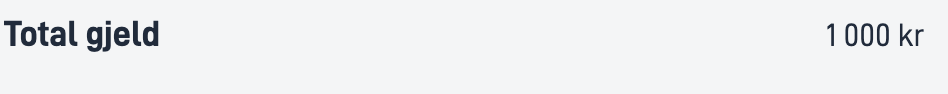

## Usage

The Number component allows users to add formatted numbers, with or without label

### Anatomy

1. **Horizontal**: A number with label structured horizontally

2. **Vertical**: A number with label structured vertically 


<!-- 
Add the following sections if relevant:

### Behavior

(How the component behaves in different contexts)

### Style

(Visual styling (e.g. alignment, padding, dos and don'ts))

### Best Practices

(Industry standards, dos and don'ts)

### Content guidelines

(E.g. punctuation rules, standard labels, etc.)

### Accessibility

(Component-specific best practices for accessibility.)

### Mobile

(How to apply component in mobile environments.)

-->
### Related

- [`Text`](../text/)
- [`Date`](../date/)

## Properties

{}
We are currently updating how we implement components, and the list of properties may not be entirely accurate.
{}

| **Property**                 | **Type** | **Description**                                                                                                                                                                                                                                                                                                                                                                                                                                                                                                                                                                                                                                                                                                                                                                                                                                                                                                                                                                                                                                                                                                                                         |
|------------------------------|----------|---------------------------------------------------------------------------------------------------------------------------------------------------------------------------------------------------------------------------------------------------------------------------------------------------------------------------------------------------------------------------------------------------------------------------------------------------------------------------------------------------------------------------------------------------------------------------------------------------------------------------------------------------------------------------------------------------------------------------------------------------------------------------------------------------------------------------------------------------------------------------------------------------------------------------------------------------------------------------------------------------------------------------------------------------------------------------------------------------------------------------------------------------------|
| `id`                         | string   | Unique Id string for the component                                                                                                                                                                                                                                                                                                                                                                                                                                                                                                                                                                                                                                                                                                                                                                                                                                                                                                                                                                                                                                                                                                                      |
| `value`                      | number   | The number you want to display.                                                                                                                                                                                                                                                                                                                                                                                                                                                                                                                                                                                                                                                                                                                                                                                                                                                                                                                                                                                                                                                                                                                         |
| `textResourceBindings.title` | string   | Label of the date you want to display                                                                                                                                                                                                                                                                                                                                                                                                                                                                                                                                                                                                                                                                                                                                                                                                                                                                                                                                                                                                                                                                                                                   |
| `formatting`                 | object   | Set of options for formatting the number.                                                                                                                                                                                                                                                                                                                                                                                                                                                                                                                                                                                                                                                                                                                                                                                                                                                                                                                                                                                                                                                                                                               |
| `formatting.align`           | string   | string	The alignment for the number (eg. right aligning a series of numbers).<br/><br/> **Enum:**: [left, center, right]                                                                                                                                                                                                                                                                                                                                                                                                                                                                                                                                                                                                                                                                                                                                                                                                                                                                                                                                                                                                                                |
| `formatting.currency`        | string   | Enables currency along with thousand and decimal separators to be language sensitive based on selected app language. They are configured in number property. Note: parts that already exist in number property are not overridden by this prop.<br/><br/> **Enum:**: [AED, AFN, ALL, AMD, ANG, AOA, ARS, AUD, AWG, AZN, BAM, BBD, BDT, BGN, BHD, BIF, BMD, BND, BOB, BOV, BRL, BSD, BTN, BWP, BYN, BZD, CAD, CDF, CHE, CHF, CHW, CLF, CLP, CNY, COP, COU, CRC, CUC, CUP, CVE, CZK, DJF, DKK, DOP, DZD, EGP, ERN, ETB, EUR, FJD, FKP, GBP, GEL, GHS, GIP, GMD, GNF, GTQ, GYD, HKD, HNL, HTG, HUF, IDR, ILS, INR, IQD, IRR, ISK, JMD, JOD, JPY, KES, KGS, KHR, KMF, KPW, KRW, KWD, KYD, KZT, LAK, LBP, LKR, LRD, LSL, LYD, MAD, MDL, MGA, MKD, MMK, MNT, MOP, MRU, MUR, MVR, MWK, MXN, MXV, MYR, MZN, NAD, NGN, NIO, NOK, NPR, NZD, OMR, PAB, PEN, PGK, PHP, PKR, PLN, PYG, QAR, RON, RSD, RUB, RWF, SAR, SBD, SCR, SDG, SEK, SGD, SHP, SLE, SLL, SOS, SRD, SSP, STN, SVC, SYP, SZL, THB, TJS, TMT, TND, TOP, TRY, TTD, TWD, TZS, UAH, UGX, USD, USN, UYI, UYU, UYW, UZS, VED, VES, VND, VUV, WST, XAF, XCD, XDR, XOF, XPF, XSU, XUA, YER, ZAR, ZMW, ZWL] |
| `formatting.position`        | string   | Display the unit as prefix or suffix. Default is prefix.<br/><br/> **Enum:**: [prefix, suffix]                                                                                                                                                                                                                                                                                                                                                                                                                                                                                                                                                                                                                                                                                                                                                                                                                                                                                                                                                                                                                                                          |
| `formatting.unit`            | string   | Enables unit along with thousand and decimal separators to be language sensitive based on selected app language. They are configured in number property. Note: parts that already exist in number property are not overridden by this prop.<br/><br/> **Enum:**: [celsius, centimeter, day, degree, foot, gram, hectare, hour, inch, kilogram, kilometer, liter, meter, milliliter, millimeter, millisecond, minute, month, percent, second, week, year]                                                                                                                                                                                                                                                                                                                                                                                                                                                                                                                                                                                                                                                                                                |
| `direction`                  | string   | Sets the structured direction of label and value.<br/><br/> **Enum:** `"horizontal" \| "vertical"`                                                                                                                                                                                                                                                                                                                                                                                                                                                                                                                                                                                                                                                                                                                                                                                                                                                                                                                                                                                                                                                      |
| `icon`                       | string   | An URL path to the image/icon                                                                                                                                                                                                                                                                                                                                                                                                                                                                                                                                                                                                                                                                                                                                                                                                                                                                                                                                                                                                                                                                                                                           |

## Configuration

### Add component

```json{hl_lines="6-"}
 {
        "id": "number1",
        "type": "Number",
        "textResourceBindings": {
          "title": "Amount"
        },
        "value": "100000",
        "direction": "vertical",
        "icon": "https://www.example.com/icon.png",
        "formatting": {
          "currency": "NOK",
          "position": "suffix",
          "number": {
            "thousandSeparator": " "
          }
        },
      },
```

### Add title and elements

<br>

#### `textResourceBindings.title`

The title for the text is shown as a label and can be added as text directly or referenced via a text key to a [text resource](/nb/altinn-studio/reference/ux/texts/#legge-til-og-endre-tekster-i-en-app).

#### `value`

Displays the value for the label and can be added as a string or an expression.

#### `direction`

Decides if the text should is shown under or next to the label. horizontal for "next to" and vertical for "under". 

#### `formatting`

Set of options for formatting the number. Contains the properties align, currency, position and unit.

#### `icon`

If you want to show an icon before the label, you can add an URL path.

<br>

#### Example

Text with label and icon.

```json{hl_lines=["9-12"]}
...
{
  "id": "text",
  "type": "Text",
  "textResourceBindings": {
    "title": "Name"
  },
  "value": "My name",
  "direction": "horizontal",
  "icon": "https://www.example.com/icon.png"
},
```
