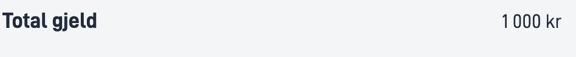

## Bruk

`Number`-komponenten lar brukeren legge til formaterte tall med eller uten ledetekst.

### Anatomi

1. **Horisontal**: Et tall med ledetekst strukturert horisontalt

2. **Vertical**: Et tall med ledetekst strukturert vertikalt


<!-- 
Add the following sections if relevant:

### Behavior

(How the component behaves in different contexts)

### Style

(Visual styling (e.g. alignment, padding, dos and don'ts))

### Best Practices

(Industry standards, dos and don'ts)

### Content guidelines

(E.g. punctuation rules, standard labels, etc.)

### Accessibility

(Component-specific best practices for accessibility.)

### Mobile

(How to apply component in mobile environments.)

-->
### Relatert

- [`Text`](../text/)
- [`Date`](../date/)

## Egenskaper

{}
Vi oppdaterer for øyeblikket hvordan vi implementerer komponenter. Listen over egenskaper kan derfor være unøyaktig.
{}

| **Egenskap**                 | **Type** | **Beskrivelse**                                                                                                                                                                                                                                                                                                                                                                                                                                                                                                                                                                                                                                                                                                                                                                                                                                                                                                                                                                                                             |
|------------------------------|----------|-----------------------------------------------------------------------------------------------------------------------------------------------------------------------------------------------------------------------------------------------------------------------------------------------------------------------------------------------------------------------------------------------------------------------------------------------------------------------------------------------------------------------------------------------------------------------------------------------------------------------------------------------------------------------------------------------------------------------------------------------------------------------------------------------------------------------------------------------------------------------------------------------------------------------------------------------------------------------------------------------------------------------------|
| `id`                         | string   | Komponent-ID-en. Må være unik innenfor alle oppsett/sider i et oppsett-sett. Kan ikke slutte med <bindestrek><tall>.                                                                                                                                                                                                                                                                                                                                                                                                                                                                                                                                                                                                                                                                                                                                                                                                                                                                                                                                                                                               |
| `value`                      | number   | Tallet du vil vise frem.                                                                                                                                                                                                                                                                                                                                                                                                                                                                                                                                                                                                                                                                                                                                                                                                                                                                                                                                                                                                    |
| `textResourceBindings.title` | string   | Ledeteksten til tallet du vil vise frem.                                                                                                                                                                                                                                                                                                                                                                                                                                                                                                                                                                                                                                                                                                                                                                                                                                                                                                                                                                                         |
| `formatting`                 | object   | Sett av valg for formattering av tallet.                                                                                                                                                                                                                                                                                                                                                                                                                                                                                                                                                                                                                                                                                                                                                                                                                                                                                                                                                                                    |
| `formatting.align`           | string   | Sidestilling av tallet (eks. høyrejustering av tallet).<br/><br/> **Enum:**: [left, center, right]                                                                                                                                                                                                                                                                                                                                                                                                                                                                                                                                                                                                                                                                                                                                                                                                                                                                                                                          |
| `formatting.currency`        | string   | Aktiverer valuta, i tillegg til tusen og desimal separatorer, som er språk sensitiv basert på språket satt i appen.<br/><br/> **Enum:**: [AED, AFN, ALL, AMD, ANG, AOA, ARS, AUD, AWG, AZN, BAM, BBD, BDT, BGN, BHD, BIF, BMD, BND, BOB, BOV, BRL, BSD, BTN, BWP, BYN, BZD, CAD, CDF, CHE, CHF, CHW, CLF, CLP, CNY, COP, COU, CRC, CUC, CUP, CVE, CZK, DJF, DKK, DOP, DZD, EGP, ERN, ETB, EUR, FJD, FKP, GBP, GEL, GHS, GIP, GMD, GNF, GTQ, GYD, HKD, HNL, HTG, HUF, IDR, ILS, INR, IQD, IRR, ISK, JMD, JOD, JPY, KES, KGS, KHR, KMF, KPW, KRW, KWD, KYD, KZT, LAK, LBP, LKR, LRD, LSL, LYD, MAD, MDL, MGA, MKD, MMK, MNT, MOP, MRU, MUR, MVR, MWK, MXN, MXV, MYR, MZN, NAD, NGN, NIO, NOK, NPR, NZD, OMR, PAB, PEN, PGK, PHP, PKR, PLN, PYG, QAR, RON, RSD, RUB, RWF, SAR, SBD, SCR, SDG, SEK, SGD, SHP, SLE, SLL, SOS, SRD, SSP, STN, SVC, SYP, SZL, THB, TJS, TMT, TND, TOP, TRY, TTD, TWD, TZS, UAH, UGX, USD, USN, UYI, UYU, UYW, UZS, VED, VES, VND, VUV, WST, XAF, XCD, XDR, XOF, XPF, XSU, XUA, YER, ZAR, ZMW, ZWL] |
| `formatting.position`        | string   | Vis enhet som prefiks eller suffiks. Default er prefiks.<br/><br/> **Enum:**: [prefix, suffix]                                                                                                                                                                                                                                                                                                                                                                                                                                                                                                                                                                                                                                                                                                                                                                                                                                                                                                                              |
| `formatting.unit`            | string   | Aktiverer enhet, i tillegg til tusen og desimal separatorer, som er språk sensitiv basert på språket satt i appen.<br/><br/> **Enum:**: [celsius, centimeter, day, degree, foot, gram, hectare, hour, inch, kilogram, kilometer, liter, meter, milliliter, millimeter, millisecond, minute, month, percent, second, week, year]                                                                                                                                                                                                                                                                                                                                                                                                                                                                                                                                                                                                                                                                                             |
| `direction`                  | string   | Setter den strukturerte retningen av ledetekst og verdi.<br/><br/> **Enum:** [horizontal, vertical] <br/><br/>**Default:** horizontal                                                                                                                                                                                                                                                                                                                                                                                                                                                                                                                                                                                                                                                                                                                                                                                                                                                                                                                       |
| `icon`                       | string   | En URL streng til bilde/ikonet                                                                                                                                                                                                                                                                                                                                                                                                                                                                                                                                                                                                                                                                                                                                                                                                                                                                                                                                                                                              |


## Konfigurering

### Legg til komponent

```json{hl_lines="6-"}
 {
        "id": "number1",
        "type": "Number",
        "textResourceBindings": {
          "title": "Amount"
        },
        "value": "100000",
        "direction": "vertical",
        "icon": "https://www.example.com/icon.png",
        "formatting": {
          "currency": "NOK",
          "position": "suffix",
          "number": {
            "thousandSeparator": " "
          }
        },
      },
```

### Legg til tittel og elementer

<br>

#### `textResourceBindings.title`

Ledetekst for tallet. Denne kan legges til som en hardkodet streng eller som en referanse til en [tekstressurs](/nb/altinn-studio/reference/ux/texts/#legge-til-og-endre-tekster-i-en-app).

#### `value`

Verdien av tallet som skal vises. Kan legges til som en streng eller et uttrykk.

#### `direction`

Bestemmer om tallet vises under eller ved siden av ledeteksten. `horizontal` for ved siden av og `vertical` for under. 

#### `formatting`

Sett av valg for formattering av tallet. Inneholder egenskapene `align`, `currency`, `position` and `unit`.


#### `icon`

Hvis du vil vise et ikon foran ledeteksten kan du legge til en url til ikonet/bildet du vil vise her.

<br>

#### Eksempel

Tall med ledetekst og ikon.

```json{hl_lines=["9-12"]}
...
{
  "id": "text",
  "type": "Text",
  "textResourceBindings": {
    "title": "Name"
  },
  "value": "My name",
  "direction": "horizontal",
  "icon": "https://www.example.com/icon.png"
},
```


