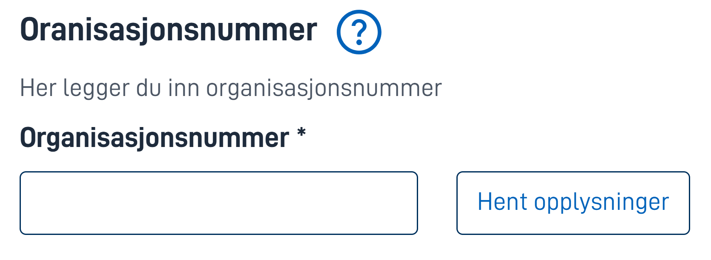
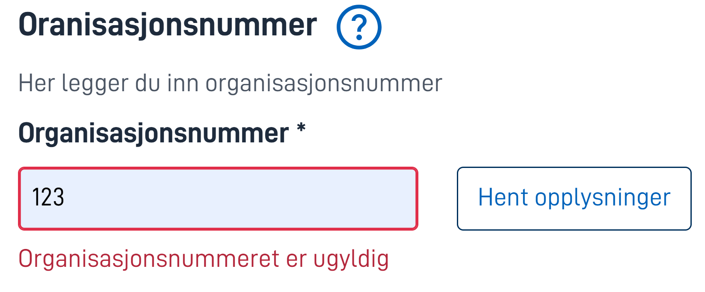

## Usage

The `OrganizationLookup` component takes an organization number as input, verifies that the organization exists, and stores the 
organization number and organization name with a data model binding.

## Anatomy



{}

1. **Heading** - Main title.
2. **Help text** - Click for help pop-up.
3. **Show description** - You can describe it.
4. **Organization number input** - Input field for the organization number.
5. **Fetch** - Button which fetches data based on the inputs.

{}

## Behavior

Before a user interacts with the component, it simply displays the input field.


On a successful fetch the component adds a description to the fields, indicating that the data displayed is fetched from 
the Register of Business Enterprises. The button transforms from a fetch button to a remove button.


The component has built in validation for the input field



## Properties

The following is an autogenerated list of the properties available for {} based on the component's JSON schema file (linked below).

{}
We are currently updating how we implement components, and the list of properties may not be entirely accurate.
{}

| **Property**                                   | **Type** | **Description**                                                                                                    |
| ---------------------------------------------- | -------- | ------------------------------------------------------------------------------------------------------------------ |
| `id`                                           | string   | The component ID. Must be unique within all setups/pages in a configuration set. Cannot end with <hyphen><number>. |
| `type`                                         | string   | "OrganisationLookup"                                                                                                     |
| `dataModelBindings.organisation_lookup_orgnr`  | string   | Where in the data model the result (orgnr) should be stored.                                                         |
| `dataModelBindings.organisation_lookup_name`   | string   | Where in the data model the result (name) should be stored.                                                        |
| `textResourceBindings.title`                   | string   | Prompt text (optional)                                                                                             |
| `textResourceBindings.description`             | string   | Description (optional)                                                                                             |
| `textResourceBindings.help`                    | string   | Help text (optional)    

## Configuration

{}
We are currently updating Altinn Studio Designer with more configuration options!
The documentation is continuously updated, and there may be more settings available than what is described here, and some settings may be in beta version.
{}

## Example

In the following example, we configure the component to add an auditor organization.
We indicate that providing a person is mandatory, and we override the title and description.
We choose not to use the help text.
The result will be store in the data model at `Revisor`.




Add auditor:

```json{hl_lines="6-"}
{
  "$schema": "https://altinncdn.no/toolkits/altinn-app-frontend/4/schemas/json/layout/layout.schema.v1.json",
  {
    "data": {
      "layout": [
        {
          {
            "id": "Revisor-lookup",
            "type": "OrganisationLookup",
            "dataModelBindings": {
              "organisation_lookup_orgnr": "Revisor.Organisasjonsnummer",
              "organisation_lookup_name": "Revisor.Firmanavn"
            },
            "textResourceBindings": {
              "title": "stiftere-og-aksjetegning.organisasjonsnummer.title",
              "description": "stiftere-og-aksjetegning.organisasjonsnummer.description",
            },
            "required": true
          },
        }
      ]
    }
  }
}
```




There is currently no support for the OrganisationLookup component in [Altinn Studio Designer](/altinn-studio/getting-started/).


