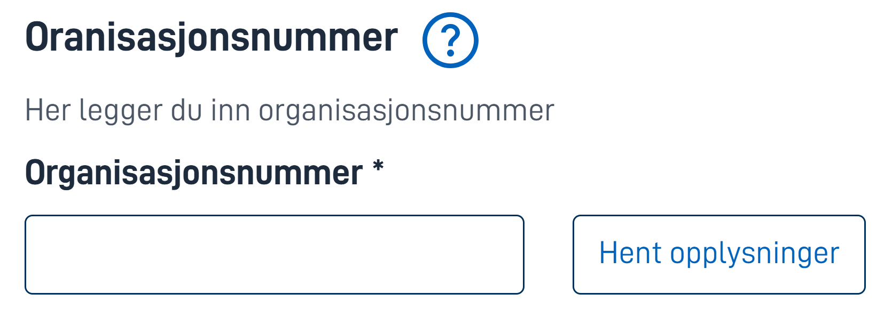
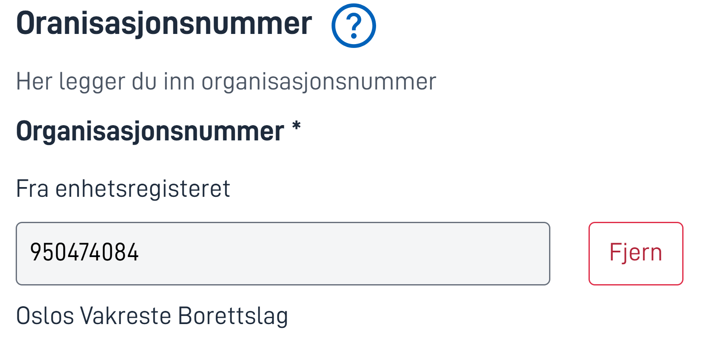
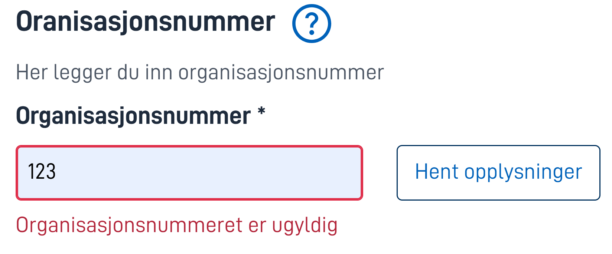

## Bruk

`OrganizationLookup` tar et organisasjonsnummer som inndata, verifiserer at organisasjonen eksisterer, og lagrer organisasjonsnummeret og organisasjonsnavnet ved hjelp av en datamodellbinding.

## Anatomi



{}

1. **Overskrift** – Hovedtittel.
2. **Hjelpetekst** – Klikk for hjelpe-popup.
3. **Vis beskrivelse** – Beskrivelse av komponenten.
4. **Organisasjonsnummerfelt** – Inndatafelt for organisasjonsnummer.
5. **Hent opplysninger** – Hent opplysninger basert på inndata.

{}

## Oppførsel

Før en bruker interagerer med komponenten, vises den slik.


Ved en vellykket henting legger komponenten til en beskrivelse i feltene, som indikerer at dataene som vises er hentet fra Enhetsregisteret. Knappen forvandles fra en hent-knapp til en fjern-knapp.



Komponenten har innebygd validering for inputfeltet



## Egenskaper

Følgende er en liste over tilgjengelige egenskaper for {}.

{}
Vi oppdaterer for øyeblikket hvordan vi implementerer komponenter. Listen over egenskaper kan derfor være noe unøyaktig.
{}

| **Egenskap**                                   | **Type** | **Beskrivelse**                                                                                                      |
| ---------------------------------------------- | -------- | -------------------------------------------------------------------------------------------------------------------- |
| `id`                                           | string   | Komponent-ID-en. Må være unik innenfor alle oppsett/sider i et oppsett-sett. Kan ikke slutte med <bindestrek><tall>. |
| `type`                                         | string   | "OrganisationLookup"                                                                                                 |
| `dataModelBindings.organisation_lookup_orgnr`  | string   | Hvor i datamodellen resultatet (orgnr) skal lagres                                                                  |
| `dataModelBindings.organisation_lookup_name`   | string   | Hvor i datamodellen resultatet (navn) skal lagres                                                                   |
| `textResourceBindings.title`                   | string   | Ledetekst (valgfritt)                                                                                               |
| `textResourceBindings.description`             | string   | Beskrivelse (valgfritt)                                                                                             |
| `textResourceBindings.help`                    | string   | Hjelpetekst (valgfritt)                                                                                             |

## Konfigurasjon

{}
Vi oppdaterer for øyeblikket Altinn Studio med flere muligheter for innstillinger!
Dokumentasjonen oppdateres fortløpende, men det kan være flere innstillinger tilgjengelig enn det som beskrives her og noen innstillinger kan være i betaversjon.
{}

## Eksempel

I følgende eksempel konfigurerer vi opp komponenten for å legge til en revisororganisasjon.
Vi sier at det er påkrevd å oppgi en organisasjon, og vi overstyrer tittel og beskrivelse.
Vi velger å ikke bruke hjelpetekst.
Resultatet vil vi ha i datamodellen på `Revisor`




Legg til revisor:

```json{hl_lines="6-"}
{
  "$schema": "https://altinncdn.no/toolkits/altinn-app-frontend/4/schemas/json/layout/layout.schema.v1.json",
  {
    "data": {
      "layout": [
        {
          {
            "id": "Revisor-lookup",
            "type": "OrganisationLookup",
            "dataModelBindings": {
              "organisation_lookup_orgnr": "Revisor.Organisasjonsnummer",
              "organisation_lookup_name": "Revisor.Firmanavn"
            },
            "textResourceBindings": {
              "title": "stiftere-og-aksjetegning.organisasjonsnummer.title",
              "description": "stiftere-og-aksjetegning.organisasjonsnummer.description",
            },
            "required": true
          },
        }
      ]
    }
  }
}
```




Det finnes for øyeblikket ikke mulighet for å konfigurere OrganisationLookup i [Altinn Studio Designer](/altinn-studio/getting-started/).


