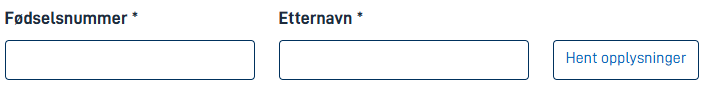
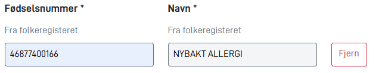
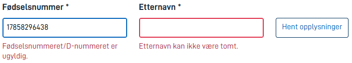
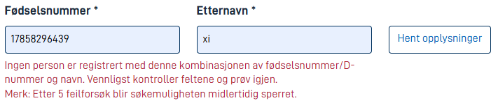
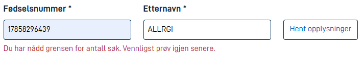
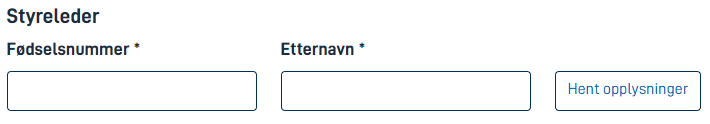

## Usage

<!-- Brief description of the component and how it is used. -->

The PersonLookup component searches the National Population Register based on user provided input for NIN (National identity number) and surname, and stores the result using a data model binding.

## Anatomy

TODO: add figma embed?

The component consists of a main title, help text, description, NIN-input title, NIN-input, surname-input title, surname-input name and a fetch button.

## Behavior

TODO: SCREENSHOTS WITH ENGLISH LANGUAGE

Before a user interacts with the component, it simply displays the input fields.



On a successful fetch the component adds a description to the fields, indicating that the data displayed is fetched from the National Population Register. The button transforms from a fetch button to a remove button.



The component has built in validation for the input fields on blur and on fetch. The NIN-input field validates the format of the National identity number according to the official guidelines for NINs. The surname input field checks that a surname is provided.
The error messages for the input validations are displayed on the PersonLookup component.



Given valid input, but a mismatch between NIN and surname, the component displays an error message after attempting to fetch. There is a limit on the amount of unique failed lookups before the user is temporarily blocked.



When the number of allowed unique failed lookups is exceeded, the components reflects this.



## Properties

TODO: UPDATE COMPONENT SCHEMA

The following is an autogenerated list of the properties available for {} based on the component's JSON schema file (linked below).

{}
We are currently updating how we implement components, and the list of properties may not be entirely accurate.
{}

<!-- The `component-props` shortcode automatically generates a list of component properties from the component's json schema.
The component name can be explicitly given as argument (e.g. `component-props "Grid"`).
If no argument is given, the shortcode pulls the component name from 'schemaname' in the frontmatter.
If the component does not have a JSON schema, comment out the text and shortcode in this section and, if necessary, create a table manually with the most important properties (columns: Property, Type, Description).
-->

{}

## Configuration

{}
We are currently updating Altinn Studio Designer with more configuration options!
The documentation is continuously updated, and there may be more settings available than what is described here, and some settings may be in beta version.
{}

## Example

In the following example, we configure the component to add a board chairman.
We indicate that providing a person is mandatory, and we override the title.
We choose not to use the description or the help text.
The result will be in the data model at `Styre.Styreleder`.






Basic component:


App/ui/layouts/{page}.json


```json{hl_lines="6-"}
{
  "$schema": "https://altinncdn.no/toolkits/altinn-app-frontend/4/schemas/json/layout/layout.schema.v1.json",
  {
    "data": {
      "layout": [
        {
          {
            "id": "Styreleder-lookup",
            "type": "PersonLookup",
            "dataModelBindings": {
              "person_lookup_ssn": "Styre.Styreleder.Foedselsnummer",
              "person_lookup_name": "Styre.Styreleder.Name"
            },
            "textResourceBindings": {
              "title": "styre-og-revisjon.Group-1.title"
            },
            "required": true
          },
        }
      ]
    }
  }
}
```




There is currently no support for the PersonLookup component in [Altinn Studio Designer](/altinn-studio/getting-started/).



