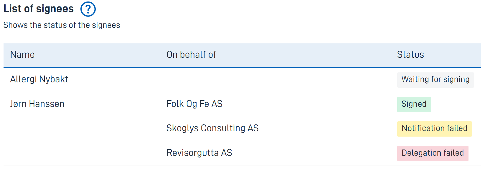

{}
🚧 This documentation is a work in progress.
{}

---

## Usage

The *SigneeList* component allows the instance owner to get an overview of the signing process. It shows whether the delegation and
communication have been successful, and whether the signee has signed yet.

In the case of user delegated signing for an organization, the name of the signee is populated after a person has signed
on behalf of the organization.

### Anatomy

1. **Title** - Component title.
2. **Help** - Click for help pop-up. Optional.
3. **Description** - Description.
4. **SigneeList Table** - Table containing the status of the signees.
    * Column 1 - Name of the signee.
    * Column 2 - Name of organization if signing on behalf of a company
    * Column 3 - Status of the signing process for the signee

## Configuration

### Add component / Example

      {
        //The ID of the component
        "id": "signee-list", 
        //The type, must be set to SigneeList
        "type": "SigneeList",
        //Customize the texts
        "textResourceBindings": {
          //The title
          "title": "Status of signees",
          //The description
          "description": "The signees and their status",
          //The help text pop-up - optional
          "help": "The people who are to sign the signing documents."
          //The summary title of the component. Will be used as title in pdf - optional
          "summaryTitle": "The following have signed"
        }
      },