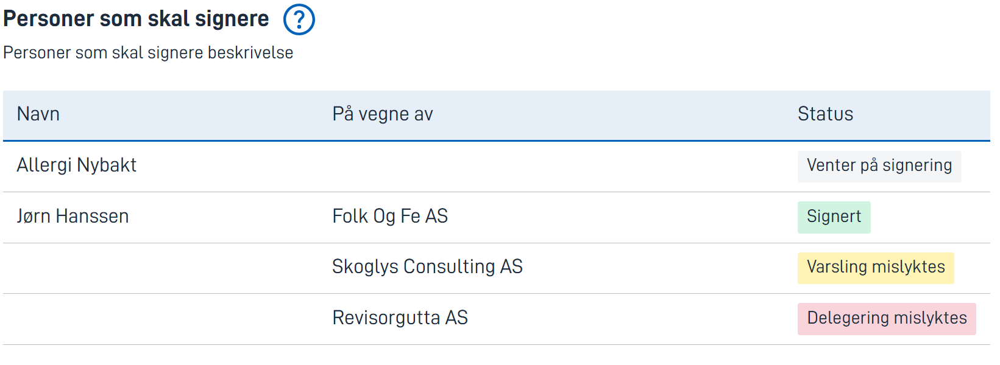

{}
🚧 Denne dokumentasjonen er under arbeid.
{}

---

## Bruk

*SigneeList*-komponenten gir instanseeier og signatarer et overblikk over signeringsprosessen. Den viser hvorvidt delegering 
av rettigheter og kommunikasjon har gått bra, og hvorvidt signataren har signert ennå.

Dersom brukerstyrt delegering er brukt til å delegere signeringsrettigheter til en organisasjon, så vil navnet på signataren
populeres etter at en person har vært inne og signert på vegne av organisasjonen.

### Anatomi

1. **Tittel** - Tittel på komponenten.
2. **Hjelp** - Klikk for en pop-up med ekstra informasjon. Valgfritt.
3. **Beskrivelse** - Beskrivelse av komponenten.
4. **SigneeList-tabell** – Tabell som viser status for signatarene.
    * Kolonne 1 – Navn på signatar.
    * Kolonne 2 – Navn på organisasjon ved signering på vegne av selskap.
    * Kolonne 3 – Status for signeringsprosessen for signataren.

## Konfigurasjon

### Legg til komponenten / Eksempel

      {
        //Komponenten sin ID
        "id": "signee-list", 
        //Komponent-type, må være ´SigneeList´
        "type": "SigneeList",
        //Egendefinerte tekster
        "textResourceBindings": {
          //Tittel
          "title": "Personer som skal signere",
          //Beskrivelse
          "description": "Personer som skal signere beskrivelse",
          //Hjelpetekst pop-up - valgfritt
          "help": "Dette er personer som skal signere"
        }
      },