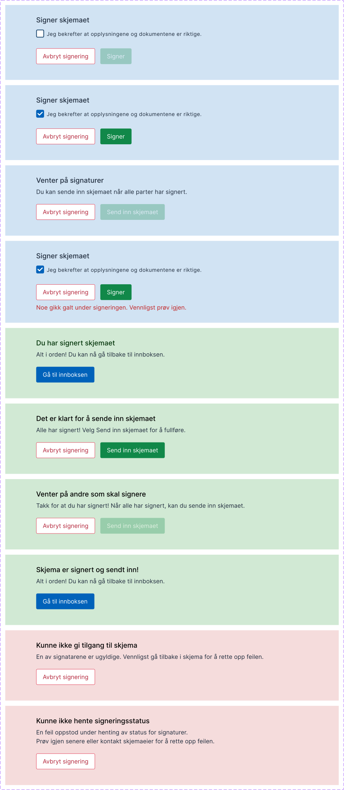

{}
🚧 This documentation is a work in progress.
{}

---

## Usage

The **SigningActions** component takes into account the currently logged in user and the state of the signing step to display
actions that the user may execute. The component may only be used on a signing taks.

### Anatomy

1. The user is a signee, and has not signed yet. As the checkbox is not checked, the sign button is greyed out.
2. The user is a signee, and has not signed yet. The checkbox is checked, so the sign button is active.
3. The user is the instance owner. Not all signees have signed, so the submit button is greyed out. The instance owner can cancel the signing process with the cancel button.
4. The user is a signee, and has not signed yet. Something has gone wrong when attempting to sign, an error message is displayed.
5. The user is a signee, and has signed. The component displays a title and summary confirming this, and a button for navigating to their inbox is displayed
6. The user is the instance owner. Every mandatory signature is completed, so they can now send in the form. They may also cancel.
7. The user is the instance owner and has signed themselves. Not all mandatory signatures are completed, so they may not send in the form. They may cancel.
8. The user is the instance owner and has sent in the form. A button is shown which allow them to navigate to their inbox.
9. The user is the instance owner. One of the signatures in not valid. They must cancel and fix the issue to proceed.
10. The user is any user. The signature status could not be fetched. This could be due to no internet connection.

## Configuration

Add the following to the page layout to include the component:

      {
        "id": "my-id-here",
        "type": "SigningActions"
      }