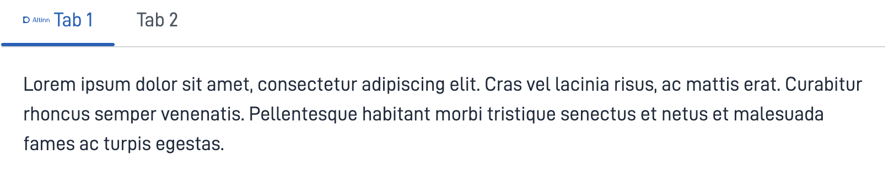

{}
🚧 This documentation is a work in progress.
{}

---

## Usage

The `Tabs` component allows you to organise and switch between different content sections by clicking on the header,
 allowing for a space-efficient and organized way to present information.

### Anatomy



{}
1. **Header**: The clickable section title that users interact with to select or switch the content.
2. **Content Area**: The area that is revealing or hiding information when the header is clicked. 
{} 

<!-- 
Add the following sections if relevant:

### Behavior

(How the component behaves in different contexts)

### Style

(Visual styling (e.g. alignment, padding, dos and don'ts))

### Best Practices

(Industry standards, dos and don'ts)

### Content guidelines

(E.g. punctuation rules, standard labels, etc.)

### Accessibility

(Component-specific best practices for accessibility.)

### Mobile

(How to apply component in mobile environments.)

-->

## Properties

| **Property**    | **Type** | **Description**                                                                                     |
|-----------------|----------|-----------------------------------------------------------------------------------------------------|
| `id`            | string   | Unique ID string for the component.                                                                  |
| `size`          | string   | Sets the size of the tabs. **Enum:**: `"small" \| "medium" \| "large"` <br/> **Default:** `medium`. |
| `defaultTab`    | string   | Configuring a tab to be selected by default.                                                            |
| `tabs`          | Array    | A list of tab objects containing the config(`id, title, icon, children`) for each tab.              |
| `tabs.id`       | string   | Unique ID of the tab in question.                                                                  |
| `tabs.title`    | string   | The title for the tab in question.                                                                      |
| `tabs.icon`     | string   | An URL to the icon for the tab in question.                                                             |
| `tabs.children` | Array    | The content of the tab in question.                                                                             |

<!-- The following is an autogenerated list of the properties available for {} based on the component's JSON schema file (linked below).

{}
We are currently updating how we implement components, and the list of properties may not be entirely accurate.
{}

The `component-props` shortcode automatically generates a list of component properties from the component's json schema.
The component name can be explicitly given as argument (e.g. `component-props "Grid"`).
If no argument is given, the shortcode pulls the component name from 'schemaname' in the frontmatter.

{} -->

## Configuration

### Add component

```json{hl_lines="6-9"}
{
 "data": {
    "layout": [
    {
        "id": "tabs",
        "type": "Tabs",
        "tabs": [
         {
           "id": "tab-1",
           "children": ["test-tab-paragraph"],
           "title": "Tab 1",
           "icon": "/ttd/frontend-test/images/altinn-logo.svg"
         },
         {
           "id": "tab-2",
           "children": ["test-tab-paragraph2"],
           "title": "Tab 2"
         }
       ]
    },
  ]
 }
}
```
<br>

### defaultTab
The ID of the specific tab that you wish to be selected by default.


### Tabs

#### `id`
A string identifier for the tab. Must be unique within the current list of tabs.

#### `title`
The title of the tab can be added as text directly or referenced via a text key to a [text resource](/nb/altinn-studio/reference/ux/texts/#legge-til-og-endre-tekster-i-en-app).

#### `icon`
A URL path to the icon.

#### `children`

Specify which components you want to show when tab is active, by adding their IDs to an array under `children`.

<br>

## Example

`Tabs` with paragraphs as child elements.




```json{hl_lines=["9-12"]}
{
 "data": {
    "layout": [
    {
        "id": "tabs",
        "type": "Tabs",
        "tabs": [
         {
           "id": "tab-1",
           "children": ["test-tab-paragraph"],
           "title": "Tab 1",
           "icon": "/ttd/frontend-test/images/altinn-logo.svg"
         },
         {
           "id": "tab-2",
           "children": ["test-tab-paragraph2"],
           "title": "Tab 2"
         }
       ]
    },
  ]
 }
}
```




