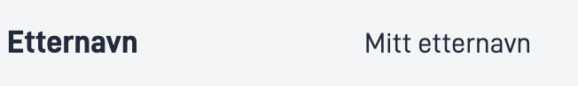
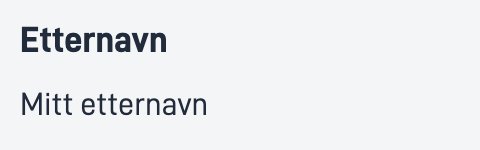

## Usage

The `Text` component allows users to add structured text, with or without label.

### Anatomy

1. **Horizontal**: A text with label structured horizontally
    
2. **Vertical**: A text with label structured vertically 
     


<!-- 
Add the following sections if relevant:

### Behavior

(How the component behaves in different contexts)

### Style

(Visual styling (e.g. alignment, padding, dos and don'ts))

### Best Practices

(Industry standards, dos and don'ts)

### Content guidelines

(E.g. punctuation rules, standard labels, etc.)

### Accessibility

(Component-specific best practices for accessibility.)

### Mobile

(How to apply component in mobile environments.)

-->
### Related

- [`Number`](../number/)
- [`Date`](../date/)
- [`Option`](../option/)

## Properties

{}
We are currently updating how we implement components, and the list of properties may not be entirely accurate.
{}

| **Property**                 | **Type** | **Description**                                                                          |
|------------------------------|----------|------------------------------------------------------------------------------------------|
| `id`                         | string   | Unique Id string for the component                                                       |
| `value`                      | string   | The text you want to display.                                                            |
| `textResourceBindings.title` | string   | Label of the text you want to display                                                    |
| `direction`                  | string   | Sets the structured direction of label and value. **Enum:** `"horizontal" \| "vertical"` |


## Configuration

### Add component

```json{hl_lines="6-"}
{
  "id": "text",
  "type": "Text",
  "textResourceBindings": {
    "title": "Name"
  },
  "value": "My name",
  "direction": "horizontal",
},
```

### Add title and elements

<br>

#### `textResourceBindings.title`

Label for the date. This can be added as a hardcoded string or as a reference to a [text resource](../../texts/#add-and-change-texts-in-an-application).

#### `value`

The value of the text to be displayed. Can be added as a string or an expression.

#### `direction`

Decides if the number should be shown under or next to the label. `horizontal` for showing it next to the label and `vertical` for under.

<br>

#### Example

Text with label.

```json{hl_lines=["9-12"]}
...
{
  "id": "text",
  "type": "Text",
  "textResourceBindings": {
    "title": "Name"
  },
  "value": "My name",
  "direction": "horizontal",
},
```
<!-- 

-->