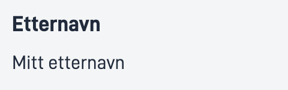

## Bruk

Tekst komponenten lar brukeren legge til strukturert tekst med og uten label.

### Anatomi

1. **Horisontal**: En tekst med label strukturert horisontalt.
    
2. **Vertikal**: En tekst med label strukturert vertikalt.
     

<!-- 
Add the following sections if relevant:

### Behavior

(How the component behaves in different contexts)

### Style

(Visual styling (e.g. alignment, padding, dos and don'ts))

### Best Practices

(Industry standards, dos and don'ts)

### Content guidelines

(E.g. punctuation rules, standard labels, etc.)

### Accessibility

(Component-specific best practices for accessibility.)

### Mobile

(How to apply component in mobile environments.)

-->
### Relatert

- [`Number`](../number/)
- [`Date`](../date/)

## Egenskaper

| **Egenskap**                 | **Type** | **Beskrivelse**                                                                     |
|------------------------------|----------|-------------------------------------------------------------------------------------|
| `id`                         | string   | Unik id streng for komponenten                                                      |
| `value`                      | string   | Teksten du vil vise                                                                 |
| `textResourceBindings.title` | string   | Labelen for teksten du vil vise                                                     |
| `direction`                  | string   | Setter strukturell retning på label og verdi **Enum:** `"horizontal" \| "vertical"` |
| `icon`                       | string   | En Url sti til bildet/ikonet                                                        |

## Konfigurering


```json{hl_lines="6-"}
{
  "id": "text",
  "type": "Text",
  "textResourceBindings": {
    "title": "Name"
  },
  "value": "My name",
  "direction": "horizontal",
  "icon": "https://www.example.com/icon.png"
},
```

<br>

### Legg til tittel og elementer


#### `textResourceBindings.title`

Tittelen for teksten som er vist, blir vist som en label og kan brukes som en tekst direkte eller som en referanse via [tekst ressurs](/nb/altinn-studio/reference/ux/texts/#legge-til-og-endre-tekster-i-en-app).

#### `value`

Viser verdien til labelen og kan legges til som en streng eller et uttrykk.

#### `direction`

Bestemmer om teksten vises under eller ved siden av labelen. Horisontal for "ved siden av" og vertikal for "under". 

#### `icon`

Hvis du vil vise et ikon foran label kan du legge til en url her.

<br>

#### Eksempel

Tekst med label og ikon.

```json{hl_lines=["9-12"]}
{
  "id": "text",
  "type": "Text",
  "textResourceBindings": {
    "title": "Name"
  },
  "value": "My name",
  "direction": "horizontal",
  "icon": "https://www.example.com/icon.png"
},
```
