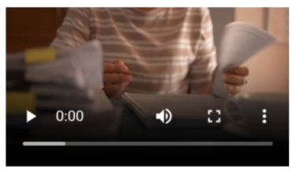

## Usage

The `Video` component is used to display a video player in your application. It can be used standalone or as a media
component in [Cards](../cards).

### Anatomy



A standard video player typically includes:

1. Video display area
2. Play/pause controls
3. Progress bar
4. Volume control
5. Fullscreen toggle

The Video component is a simple wrapper around the [Video element in HTML](https://developer.mozilla.org/en-US/docs/Web/HTML/Element/video),
and visual appearance will vary depending on the browser, operating system, and other factors.
The above screenshot was captured from the Chrome browser.

### Related

- [Cards](../cards) - Can use the Video component as media content
- [Image](../image) - Image component
- [Audio](../audio) - Audio player component

## Properties

The following is a list of the properties available for {}.

{}
We are currently updating how we implement components, and the list of properties may not be entirely accurate.
{}

| **Property**                   | **Type** | **Description**                                                                                                         |
|--------------------------------|----------|-------------------------------------------------------------------------------------------------------------------------|
| `textResourceBindings.altText` | string   | Alternative text displayed for screen readers                                                                           |
| `video.src`                    | object   | An object containing the video files to play. The key is the language code, and the value is the URL to the video file. |

## Configuration

{}
We are currently updating Altinn Studio Designer with more configuration options!
The documentation is continuously updated, and there may be more settings available than what is described here, and
some settings may be in beta version.
{}

### Add component




You can add a component in [Altinn Studio Designer](/altinn-studio/getting-started/) by dragging it from the list of
components to the page area.
Selecting the component brings up its configuration panel.




Basic component:


App/ui/layouts/{page}.json


```json{hl_lines="6-"}
{
  "$schema": "https://altinncdn.no/toolkits/altinn-app-frontend/4/schemas/json/layout/layout.schema.v1.json",
  "data": {
    "layout": [
      {
        "id": "myVideo",
        "type": "Video",
        "textResourceBindings": {
          "altText": "Alternative text for the video (for screen readers)"
        },
        "video": {
          "src": {
            "en": "https://example.com/video.mp4",
            "nb": "/org/app/assets/video.mp4"
          }
        }
      }
    ]
  }
}

```




