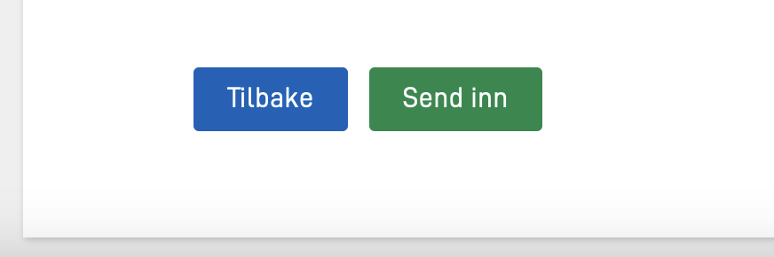

## Eksempel

```json
{
  "$schema": "https://altinncdn.no/toolkits/altinn-app-frontend/4/schemas/json/layout/layout.schema.v1.json",
  "data": {
    "layout": [
      {
        "id": "button-group1",
        "type": "ButtonGroup",
        "children": [
          "nav-buttons",
          "submit-button"
        ]
      },
      {
        "id": "nav-buttons",
        "type": "NavigationButtons",
        "textResourceBindings": {
          "next": "Neste",
          "back": "Tilbake"
        },
        "showBackButton": true
      },
      {
        "id": "submit-button",
        "type": "Button",
        "textResourceBindings": {
          "title": "Send inn"
        }
      }
    ]
  }
}
```

## Konfigurasjon

For å konfigurere en knappegruppe, legg til en ny komponent med typen `ButtonGroup` i layout-filen før knappene du vil gruppere sammen.
Du spesifiserer hvilke knappekomponenter som skal inkluderes i knappegruppen ved å legge til ID-ene deres i knappegruppens `children`-egenskap.
Følgende komponenttyper kan legges til i en knappegruppe:

- `Button` (Send inn-knapp)
- `NavigationButtons`
- `PrintButton`
- `InstantiationButton`
<!-- - `ActionButton` -->
