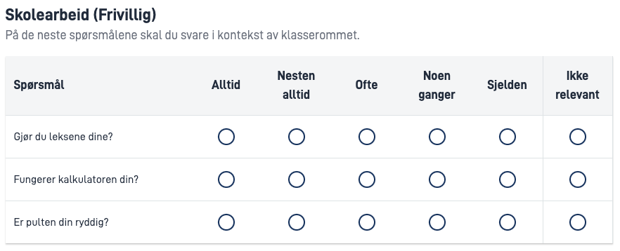

{}
Dette er helt ny funksjonalitet. Oppsett må gjøres manuelt inntil videre. Støtte for oppsett via Altinn Studio kommer
snart.

Merk at Likert-komponenten kun kan benyttes som del av en repeterende gruppe.
{}

## Desktop og mobil visning

Likert komponenten vises som en liste ved smale skjermer og som en tabell ved brede skjermer.
Likert utnytter seg av samme konsept som repeterende grupper.

 skjermstørrelse")

 skjermstørrelse")

## Eksempel

Likert komponenten krever at du har en datamodel med en liste. Denne listen må innholde objekter med spørsmål og svar.
Eksempel på oppsett av datamodel i App\logic\InstantiationHandler.cs:

```c#
public async Task DataCreation(Instance instance, object data)
        {

            if (data is Survey)
            {
                var survey = data as Survey;

                survey.Questions = new List<Question> {
                    new Question {
                        Id = "question-1",
                        Answer = ""
                    },
                    new Question {
                        Id = "question-2",
                        Answer = ""
                    },
                    new Question {
                        Id = "question-3",
                        Answer = ""
                    }
                }
            }

            await Task.CompletedTask;
        }
```

Eksempel på definisjon av likert komponent i layout.json:




```json
[
  {
    "id": "likert-group",
    "type": "Likert",
    "textResourceBindings": {
      "title": "Skolearbeid",
      "description": "På de neste spørsmålene skal du svare i kontekst av klasserommet.",
      "questions": "likert-row-title"
    },
    "dataModelBindings": {
      "questions": "Questions",
      "answer": "Questions.Answer"
    },
    "optionsId": "likertOptions",
    "required": false,
    "readOnly": false
  }
]
```




```json
[
  {
    "id": "likert-group",
    "type": "Group",
    "textResourceBindings": {
      "title": "Skolearbeid",
      "description": "På de neste spørsmålene skal du svare i kontekst av klasserommet."
    },
    "maxCount": 99,
    "children": ["likert-row"],
    "dataModelBindings": {
      "group": "Questions"
    },
    "edit": {
      "mode": "likert"
    }
  },
  {
    "id": "likert-row",
    "type": "Likert",
    "textResourceBindings": {
      "title": "likert-row-title"
    },
    "dataModelBindings": {
      "simpleBinding": "Questions.Answer"
    },
    "optionsId": "likertOptions",
    "required": false,
    "readOnly": false
  }
]
```




{}
Likert-komponenten fungerer likt som RadioButtons og CheckBoxes.
{}

OptionsId knyttes opp mot kodeliste-fil (likertOptions.json)

```json
[
  {
    "label": "Alltid",
    "value": "1"
  },
  {
    "label": "Nesten alltid",
    "value": "2"
  },
  {
    "label": "Ofte",
    "value": "3"
  },
  {
    "label": "Noen ganger",
    "value": "4"
  },
  {
    "label": "Sjelden",
    "value": "5"
  }
]
```

For å binde opp tekst for hver rad må man opprette en binding mellom datamodellen og likerten sin tekstResourcebinding.
Dette kan gjøres i tekst-ressursfilene:

```json
[
  {
    "id": "question1",
    "value": "Gjør du leksene dine?"
  },
  {
    "id": "question2",
    "value": "Fungerer kalkulatoren din?"
  },
  {
    "id": "question3",
    "value": "Er pulten din ryddig?"
  },
  {
    "id": "likert-row-title",
    "value": "{0}",
    "variables": [
      {
        "key": "Questions[{0}].Id",
        "dataSource": "dataModel.default"
      }
    ]
  }
]
```

### Filtrer ut spørsmål med start og end

Du kan velge å filtrere rader du ikke ønsker å inkludere i likerten ved å benytte start og stop:



```json
{
  "filter": [
    {
      "key": "start",
      "value": "1"
    },
    {
      "key": "stop",
      "value": "10"
    }
  ]
}
```




```json
{
  "edit": {
    "mode": "likert",
    "filter": [
      {
        "key": "start",
        "value": "1"
      },
      {
        "key": "stop",
        "value": "10"
      }
    ]
  }
}
```




### Skillelinje

Om du ønsker å ha en visuell skillelinje mellom svarkolonnene kan du gjøre dette ved å sette `columns`-egenskapen på komponenten.






`columns`-egenskapen settes som en liste med objekter der du angir hvilke svarkolonner du vil ha skillelinje på ved å bruke disse egenskapene:

| **Egenskap**    | **Type**   | **Beskrivelse**                                        |
| --------------- | ---------- | ------------------------------------------------------ |
| value           | string/int | Verdien på svarkolonnen.                               |
| addLeftDivider  | boolean    | Legger til en skillelinje på venstresiden av kolonnen. |
| addRightDivider | boolean    | Legger til en skillelinje på høyresiden av kolonnen.   |





```json
{
  "id": "ComponentId",
  "type": "Likert",
  ...
  "columns": [
    {
      "value": "6",
      "addLeftDivider": true
    }
  ]
}
```



