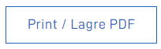
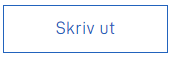

The PrintButton component can be added to the form layout where you want an option to open the browsers built-in print dialog.
When the button is clicked the print dialog window will pop up. Commonly there is an option to "Print to PDF" if preferable.



`FormLayout.json` example

```json
{
  "id": "printButtonInfo",
  "type": "PrintButton"
}
```
The default text on the PrintButton is "Print / Save as PDF".
The text can be overridden by setting the text resource key:
```json
{
  "id": "general.print_button_text",
  "value": "Skriv ut"
}
```



The PrintButton supports grid alignment if necessary.
