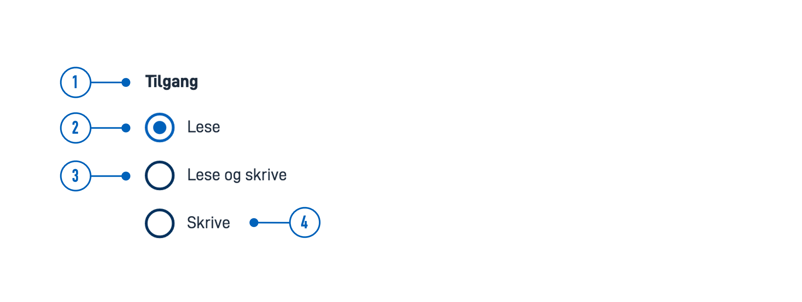
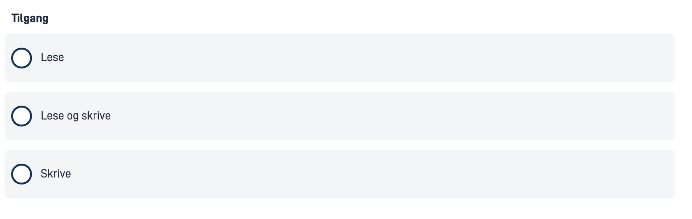

{}
🚧 This documentation is a work in progress.
{}

---

## Usage

Radio buttons are often used in forms to collect input from the user where they need to choose only one of several options from a list.

### Anatomy



{}
1. **Title** - Question or instruction.
2. **Current Selection** - Indicates the selected option.
3. **Option** - Enables this option and disables the current selection.
4. **Label** - Text label associated with the radio button.
{}

### Style

* Radio buttons should always have an associated label on the right side.

### Best Practices

- List options in a logical order:
  - most likely to least likely to be selected
  - simplest to most complex operation
  - least to most risk
- Preselect one option. Choose the safest, most secure, and private option first. If safety and security are not important, choose the most likely or convenient option.
- If users should have the option to avoid making a selection, add a "None" (or equivalent) option.
- If you cannot have a list of all possible options, add an "Other" option.
- Avoid alphabetical sorting as it is language-dependent and not localizable.
- Avoid overlapping options. For example, Select age: 0-20, 20-40 — What do you choose if your age is 20?
- Include all relevant options. For example, Select age: Below 20, Above 20 — What do you choose if you are 20?

### Content guidelines

* Keep labels short and descriptive.
* Start all labels with a capital letter.
* Do not include punctuation after labels.

### Related

* For a more compact way to display multiple options with single selection, use [Dropdown](../dropdown).
* If users can choose multiple options from a list, use [Checkboxes](../checkboxes/).
* For a more compact way to display multiple options with multiple selection, use [MultipleSelect](../multipleselect/).

## Properties

The following is an autogenerated list of the properties available for {} based on the component's JSON schema file (linked below).

{}
We are currently updating how we implement components, and the list of properties may not be entirely accurate.
{}

<!-- The `component-props` shortcode automatically generates a list of component properties from the component's json schema.
The component name can be explicitly given as argument (e.g. `component-props "Grid"`).
If no argument is given, the shortcode pulls the component name from 'schemaname' in the frontmatter. 
If the component does not have a JSON schema, comment out the text and shortcode in this section and, if necessary, create a table manually with the most important properties (columns: Property, Type, Description).
-->

{}

## Configuration

{}
We are currently updating Altinn Studio Designer with more configuration options!
 The documentation is continuously updated, and there may be more settings available than what is described here, and some settings may be in beta version.
{}

### Add component




You can add a component in [Altinn Studio Designer](/altinn-studio/getting-started/) by dragging it from the list of components to the page area.
Selecting the component brings up its configuration panel.




Basic component:


App/ui/layouts/{page}.json


```json{hl_lines="6-9"}
{
  "$schema": "https://altinncdn.no/toolkits/altinn-app-frontend/4/schemas/json/layout/layout.schema.v1.json",
  {
    "data": {
      "layout": [
        {
          "id": "radio-buttons",
          "type": "RadioButtons"
        }
      ]
    }
  }
}
```

















### Show as card (`showAsCards`)

Displays each radio button on a light gray background when checked (`true`).









App/ui/layouts/{page}.json


```json{hl_lines="4"}
{
  "id": "komponent-id",
  ...
  "showAsCard": true
}
```















<!-- ## Examples -->
