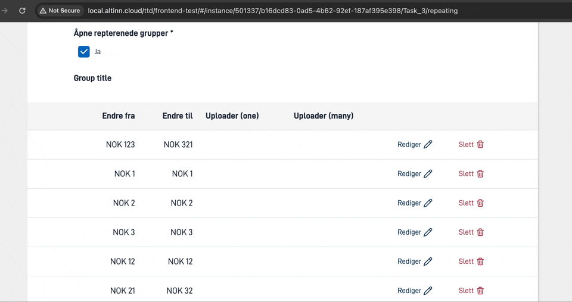
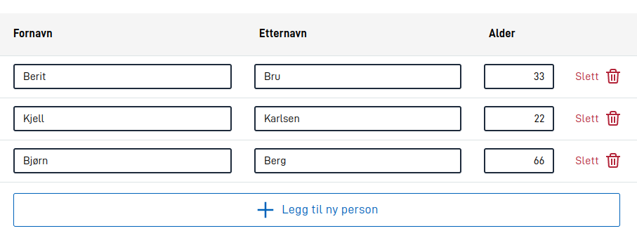
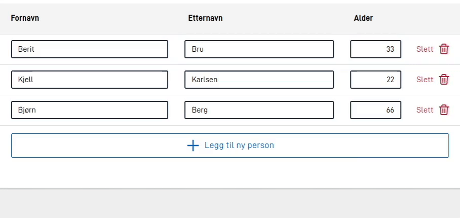
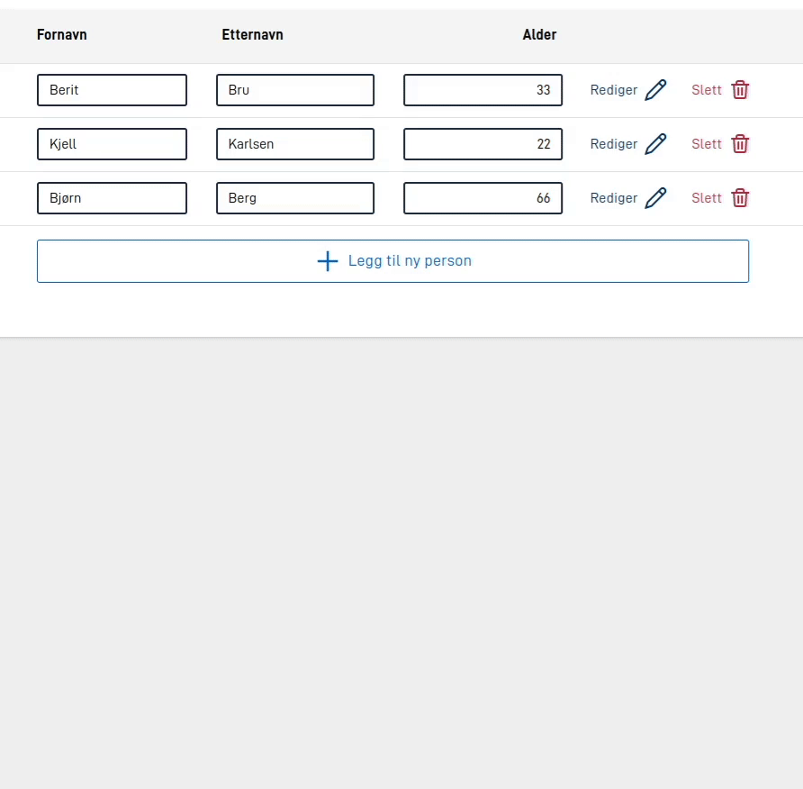

## Separate title for table view

Items in repeating groups that are not in editing mode are shown as a table. This table view has limited space for long prompts. A shorter prompt for table views can be set by defining `tableTitle` in `textResourceBindings` for each component in the repeating group.

Example:

```json
{
  ...
  "type": "Input",
  "textResourceBindings": {
    "title": "Enter your full name",
    "tableTitle": "Name"
  },
  ...
},
```

## Widths, alignment and overflow for columns

Using the `tableColumns` property makes it is possible to configure the width, text alignment, and number of lines to show in a cell for columns.

- `width` - set to a string value containing a percentage, ex: `"25%"`, or `"auto"` (default).
- `alignText` - choose between `"left"`, `"center"` or `"right"` to align text in table cell accordingly.
- `textOverflow` - is used to control behaviour when text content is too large for a table cell.
    - `lineWrap` - set to `false` in order to turn of linebreaking. Default is `true`.
    - `maxHeight` - sets number of lines before overflowing text is hidden with an ellipsis (...). `"maxHeight": 0` results in turning off linebreaking.
- `editInTable` - set to `true` to enable editing of the component in the table view. Default is `false`. See more about this in the [section describing this functionality](#showing-components-directly-in-the-table).
- `showInExpandedEdit` - set to `false` to hide the component in the expanded edit view. Default is `true`. See more about this in the [section describing this functionality](#showing-components-directly-in-the-table).

Example:

```json
{
  ...
  "tableHeaders": [
    "streetAdress",
    "postalNumber",
    "city"
  ],
  "tableColumns": {
    "streetAdress": {
      "width": "20%",
      "alignText": "left",
      "textOverflow": {
        "lineWrap": true, 
        "maxHeight": 1
      }
    },
    "postalNumber": {
      "alignText": "right"
    },
    "city": {
      "width": "auto",
      "alignText": "left",
      "textOverflow": {
        "lineWrap": true,
        "maxHeight": 3
      }
    }
  },
  ...
}
```


## Sticky table headers




The table headers can be made sticky by setting the `stickyHeaders` property to `true`. This will make the headers stick
to the top of the table when scrolling. This is useful for tables with a lot of rows, where the headers are not visible
when scrolling down.






## Showing components directly in the table

It is possible to show components directly in the table view. This is done by setting `editInTable` to `true` for the
component in question, via the [tableColumns](#widths-alignment-and-overflow-for-columns) property. This is useful for
components and groups that are not very complex, and where it is not necessary to show the component in the expanded edit view.
Visually, this can make the repeating group functionality resemble some configurations of
the [Grid component](../../../../components/grid), but allows the user to add/remove rows from the table - and allows
for storing the data in a repeating structure in the data model.



There are several levels of configuration to allow editing in the table. It is possible to allow a combination of
editing in the table and editing in the expanded edit view. It is also possible to hide some components in the expanded
edit view and only allow editing in the table.

### Editing all fields in table
If you want to set up a repeating group where all possible fields should be editable in the table, there is a shortcut
for this. By setting [`edit.mode` to `onlyTable`](../edit#mode), all fields in the table will be editable. Note that not
all components that can be shown in a repeating group are supported in the table. See a full list of components that are
supported in table mode in the documentation for the [Grid component](../../../../components/grid).



The example above shows a repeating group configuration where all fields are editable in the table. Note that the
button for editing a row disappears in this mode, since all fields are editable directly in the table.

### Editing some fields in table
It is also possible to set up a repeating group where some fields are editable in the table, while others are only
editable in the expanded edit view. This is done by setting `editInTable` to `true` for the components that should be
editable in the table, and `showInExpandedEdit` to `false` for the components that should be hidden in the expanded
edit view. See details on how to set this up in
the [documentation for `tableColumns` above](#widths-alignment-and-overflow-for-columns).



The example above shows a repeating group configuration where some fields are only editable in the
table (first name and last name), one component is editable in both the table and the expanded edit view (age), and
the last component is only editable in the expanded edit view (address).

The Group component configuration for the example above is as follows:




```json
{
  "id": "myRepeatingGroup",
  "type": "RepeatingGroup",
  "children": ["fornavn", "etternavn", "alder", "fullt-navn", "adresse"],
  "tableHeaders": ["fornavn", "etternavn", "alder"],
  "tableColumns": {
    "fornavn": {
      "editInTable": true,
      "showInExpandedEdit": false
    },
    "etternavn": {
      "editInTable": true,
      "showInExpandedEdit": false
    },
    "alder": {
      "editInTable": true
    }
  },
  "textResourceBindings": {
    "add_button": "person"
  },
  "dataModelBindings": {
    "group": "RepGroup.Personer"
  }
}
```




```json
{
  "id": "myRepeatingGroup",
  "type": "Group",
  "children": ["fornavn", "etternavn", "alder", "fullt-navn", "adresse"],
  "tableHeaders": ["fornavn", "etternavn", "alder"],
  "tableColumns": {
    "fornavn": {
      "editInTable": true,
      "showInExpandedEdit": false
    },
    "etternavn": {
      "editInTable": true,
      "showInExpandedEdit": false
    },
    "alder": {
      "editInTable": true
    }
  },
  "maxCount": 99999,
  "textResourceBindings": {
    "add_button": "person"
  },
  "dataModelBindings": {
    "group": "RepGroup.Personer"
  }
}
```



