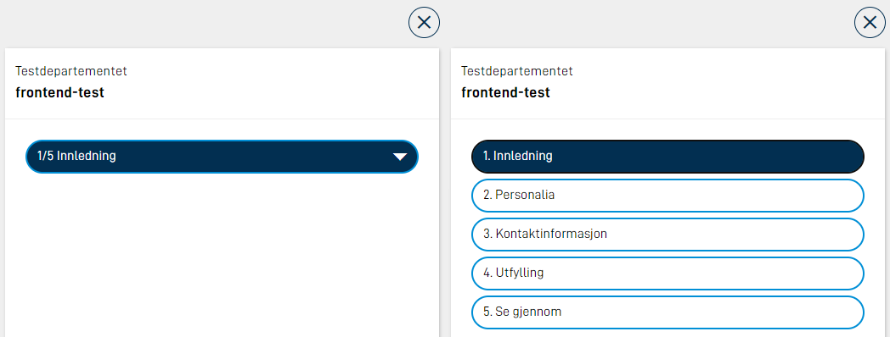

Navigering til neste og forrige side skjer via navigasjonsknapper. Disse må legges til manuelt i hver layout-fil. 

## Legge til knapper for navigering

Knapper for navigering legges inn i alle layout-filer der det er behov. Om man ønsker at den skal dukke opp nederst på siden, må den legges inn nederst i layout-filen. Eksempel vises under

```json
{
  "id": "nav-page2",
  "type": "NavigationButtons",
  "textResourceBindings": {
    "next": "next",
    "back": "back"
  },
  "showBackButton": true
}
```


| Parameter            | Beskrivelse                                                                                                                           |
| -------------------- | ------------------------------------------------------------------------------------------------------------------------------------- |
| id                   | Unik ID, tilsvarende som for alle andre skjemakomponenter.                                                                            |
| type                 | Må være `"NavigationButtons"`                                                                                                         |
| textResourceBindings | Setter man parametre `next` (og evt. `back`) her, vil man kunne overstyre med egne tekster som vises på knappen(e). Se eksempel over. |
| showBackButton       | Valgfri. Gjør at 2 knapper (tilbake/neste) vises i stedet for bare en (neste).                                                        |

## Rekkefølge

Rekkefølgen på sidene defineres i `Settings.json` for layout-settet. Dette gjøres på følgende vis:


App/ui/*/Settings.json

```json
{
  "pages": {
    "order": ["side1", "side2"]
  }
}
```

Dersom du ønsker å dynamisk skjule enkelte sider, kan dette gjøres med [Dynamiske uttrykk](/nb/altinn-studio/reference/logic/expressions/#viseskjule-hele-sider).

## Gruppering av sider

Dersom du ønsker å gruppere sider eller å vise sidene i en side-meny, kan du bruke side-grupper som et alternativ til tradisjonell rekkefølge. Da erstatter du `pages.order` med egenskapen `pages.groups` som vist nedenfor:


App/ui/*/Settings.json

```json
{
  "pages": {
    "groups": [
      {
        "name": "group.info",
        "type": "info",
        "order": ["info1", "info2"]
      },
      {
        "name": "group.form",
        "markWhenCompleted": true,
        "order": ["side1", "side2", "side3"]
      },
      {
        "order": ["oppsummering"]
      }
    ]
  }
}
```

| Parameter         | Beskrivelse                                                                                                           |
| ----------------- | --------------------------------------------------------------------------------------------------------------------- |
| name              | Tekstressurs som angir navnet på side-gruppen. Påkrevd dersom `order` inneholder mer enn én side.                     |
| type              | Valgfri. `"info" \| "default"`.                                                                                       |
| markWhenCompleted | Valgfri. Markerer sider i gruppen som ferdig utfylt når alle valideringsfeil er rettet (og brukeren har sett siden).  |
| order             | Hvilke sider som inngår i gruppen.                                                                                    |


### Synligjør prosess-steg i navigasjons-menyen

Du kan også vise den øvrige prosessen i navigasjons-menyen. Det kan konfigureres for hele appen i `layout-sets.json` med egenskapen `uiSettings.taskNavigation`, eller per layout-sett med egenskapen `pages.taskNavigation` i `Settings.json` for layout-settet. Eksempel:


App/ui/layout-sets.json

```json
{
  ...
  "uiSettings": {
    "taskNavigation": [
      {
        "name": "task.form",
        "taskId": "Task_1"
      },
      {
        "taskId": "Task_2"
      },
      {
        "type": "receipt"
      }
    ]
  }
}
```

| Parameter | Beskrivelse                                                               |
| --------- | ------------------------------------------------------------------------- |
| name      | Valgfri. Tekstressurs som angir navnet på prosess-steget.                 |
| taskId    | Hvilket prosess-steg det gjelder. Obligatorisk hvis ikke `type` er satt.  |
| type      | `"receipt"`. Obligatorisk hvis ikke `taskId` er satt.                     |


## Fremdriftsindikator

Det er mulig å aktivere en fremdriftsindikator som viser øverst i høyre hjørne av appen, som indikerer til brukeren
hvor langt man har kommet i utfyllingen av en applikasjon med flere sider.


{}
Alle sider i gjeldende [prosess-steg](../../../configuration/process) teller mot det totale antall sider som vises i
fremdriftsindikatoren. Hvis det er satt opp [sporvalg](../tracks) eller flere
[dynamisk skjulte sider](../../../logic/expressions#viseskjule-hele-sider) vil antallet kunne variere mye og oppføre seg
forvirrende for brukeren. Sjekk at fremdriftsindikatoren gir mening og verdi for brukeren før den aktiveres.
{}

### Konfigurasjon

For å sette opp fremdriftsindikatoren, legg til denne linjen i `Settings.json`-filen:


App/ui/*/Settings.json

```json {hl_lines=9}
{
  "$schema": "https://altinncdn.no/toolkits/altinn-app-frontend/4/schemas/json/layout/layoutSettings.schema.v1.json",
  "pages": {
    "order": ["student-info", "school-work", "well-being"],
    "showProgress": true
  }
}
```

## Navigasjonsbar

Navigasjonsbar gir enkel tilgang til alle sider i en applikasjon.

{}
Navigasjonsbar lister opp alle sider i appen, og egner seg derfor ikke til bruk ved sporvalg.
{}


På store skjermer vil alle sider listes opp. Dersom det ikke er plass på en linje, vil listen brytes og fortsette på neste linje. På mindre skjermer vil alle sider være skjult i en meny. Den siden som er aktiv vil vises i menyen. Når menyen klikkes på, vil en liste over alle sider vises.



Navigasjonsbar legges inn i alle layoutfiler der den skal brukes. Eksempel på konfigurasjon:

```json
{
  "id": "navbar-page1",
  "type": "NavigationBar"
}
```

Det er også mulighet å konfigurere komponenten NavigationBar til å vise alle sider i en meny også på større skjermer. Dette gjøres ved å legge til "compact": true. Eksempel på konfigurasjon:

```json
{
  "id": "navbar-page1",
  "type": "NavigationBar",
  "compact": true
}
```

### Endre tekster på navigasjonsbarknapper

Teksten på navigasjonsbarknappene vil som standard bruke filnavnet på siden uten filendelsen. F.eks om man har `side1.json` og `side2.json` vil navigasjonsknappene hete `side1` og `side2`. For å overstyre disse tekstene, kan du legge til tekster i `resources.XX.json`, hvor `id` er navnet på filen uten filendelse. Eksempel:

```json
{
  "id": "side1",
  "value": "Første side"
},
{
  "id": "side2",
  "value": "Siste side"
},

```

## Validering ved sidebytte

Det er mulig å sjekke valideringsfeil i det brukeren prøver å bevege seg til neste side, dersom det er valideringsfeil vil det stoppe brukeren fra å navigere.



I versjon 4 av app frontend, har `NavigationButtons`-komponenten egenskapene `validateOnNext` og `validateOnPrevious` som kan konfigureres. Eksempel:

```json {linenos=false,hl_lines=[5,6,7,8]}
{
  "id": "nav-buttons1",
  "type": "NavigationButtons",
  "textResourceBindings": {...},
  "validateOnNext": {
    "page": "current",
    "show": ["All"]
  }
}
```

Hvor `page` kan være en av: `current | all | currentAndPrevious`, og `show` inneholder et sett med validerings-typer som skal sjekkes; dette kan være én eller flere av:

- `Schema`
- `Component`
- `Expression`
- `CustomBackend`
- `Required`
- `AllExceptRequired`
- `All`

Tilsvarende, har `NavigationBar`-komponenten egenskapene `validateOnForward` og `validateOnBackward`:

```json {linenos=false,hl_lines=[4,5,6,7]}
{
  "id": "nav1",
  "type": "NavigationBar",
  "validateOnForward": {
    "page": "current",
    "show": ["All"]
  }
}
```



I versjon 3 av app frontend kan du legge til en trigger på navigasjonsknappen:

```json {linenos=false,hl_lines=[7]}
{
  "id": "nav-buttons1",
  "type": "NavigationButtons",
  "textResourceBindings": {
    "next": "Neste",
  },
  "triggers": ["validatePage"],
}
```

Det er tre ulike triggere som kan brukes ved side-navigasjon:

| Trigger                           | Beskrivelse                                                                                                                                                                               |
| --------------------------------- | ----------------------------------------------------------------------------------------------------------------------------------------------------------------------------------------- |
| `validatePage`                    | Kjører validering på komponentene i den nåværende siden. IDen til siden som trigget valideringen sendes med til backend i headeren `LayoutId`.                                            |
| `validateAllPages`                | Kjører validering på alle komponentene i alle sider i skjemaet. Hindrer ikke brukeren å navigere dersom det ikke finnes valideringsfeil på nåværende eller tidligere sider i rekkefølgen. |
| `validateCurrentAndPreviousPages` | Kjører validering på alle komponentene i nåværende og tidligere sider i rekkefølgen.                                                                                                      |


