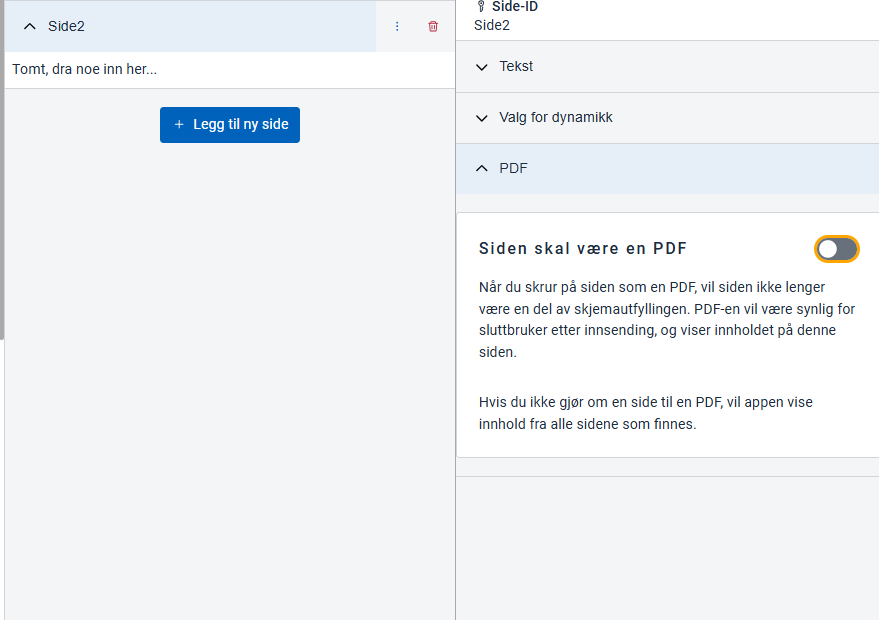
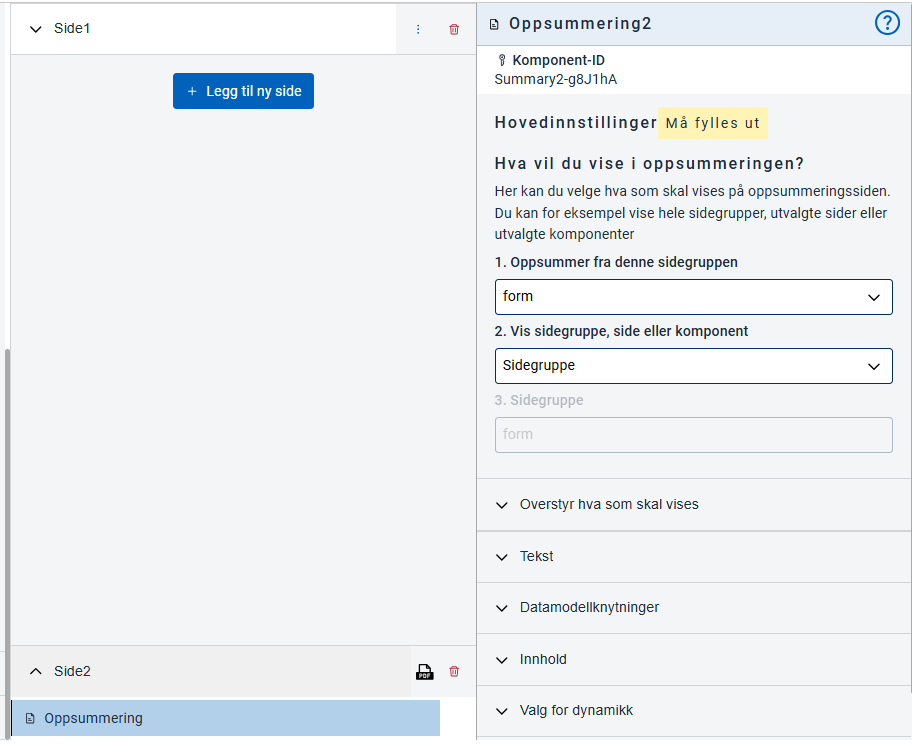
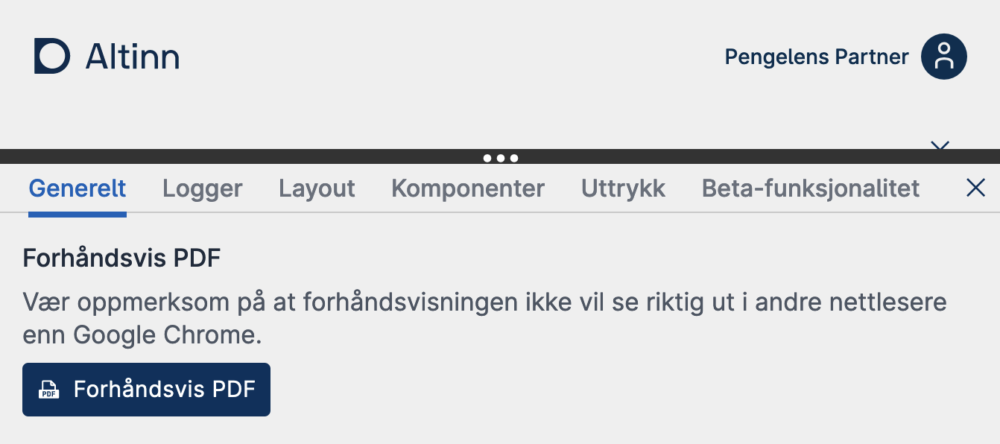

{}
## New PDF generation
### Enable feature
As of version 7.5 of the nuget packages (Altinn.App.Api and Altinn.App.Core) a new way of generating PDFs launched as a preview. This feature can be toggled on/off by adding the following section and feature toggle in _appsettings.json_.

```json
  "FeatureManagement": {
    "NewPdfGeneration": true
  }
```

This will call the new PDF service which accepts a URL pointing back to an automatic generated page in the app. The rendered page is then used as the foundation for the PDF. The `IPdfFormatter` as documented below is still relevant if you need custom logic for excluding components/pages from PDF.

### Settings
While the default settings for the new service should be enough for most applications they can be overridden by adding a PdfGeneratorSettings section in _appsettings.json_ (default settings shown below).

```json
  "PdfGeneratorSettings": {
    "ServiceEndpointUri": "https://{org}.apps.{hostName}/{appId}/#/instance/{instanceId}",
    "AppPdfPageUriTemplate": "https://{org}.apps.{hostName}/{appId}/#/instance/{instanceId}?pdf=1",
    "WaitForSelector": "#readyForPrint",
    "WaitForTime": 5000
  }
```

If the WaitForSelector is set, the WaitForTime will be ignored. The WaitForSelector ensures that the page will be completely rendered before the PDF is generated.

{}

There are two different methods of configuring the generation of PDFs:

1. [Automatically based on your form layouts](#automatic-configuration)
2. [Manually by defining a custom PDF layout (v7.5+ only)](#custom-layout-configuration)

It is also possible to get a [preview](#preview-in-the-browser) of what the PDF will look like in the browser while developing (v7.5+ only).

## Automatic configuration

This method is used by default unless you specify a [custom PDF layout file](#custom-layout-configuration).
This method extracts all of your pages and components in the order they appear, and displays them in the PDF document.

### Excluding pages and components

Often, you will need to exclude certain pages or components that are not relevant to the PDF document.
This is can be configured in two different ways:

1. By modifying the `Settings.json` file for your layout set.
2. Programmatically by implementing it in code. This allows for dynamic exclusion depending on the form data.

Depending on the version you are using, the programmatic method is set up differently, but the logic is the same. See below how to set this up for the version you are on:




1. Create a class that implements the `IPdfFormatter` interface found in the `Altinn.App.Core.Features.Pdf` namespace.  
    You can name and place the file in any folder you like within your project, but we suggest you use meaningful namespaces like in any other .Net project.
2. Register you custom implementation in the _Program.cs_ class.
    ```C#
    services.AddTransient<IPdfFormatter, PdfFormatter>();
    ```
    This ensures your custom code is known to the application and that it will be executed.



Modify the `PdfHandler.cs` file under `App/logic/Print`.




{}

### 1. Settings.json

Add a list of page names to exclude called `excludeFromPdf` under `pages`:

```json {linenos=false,hl_lines=["5"]}
{
   "$schema": "https://altinncdn.no/toolkits/altinn-app-frontend/4/schemas/json/layout/layoutSettings.schema.v1.json",
   "pages": {
      "order": ["page1", "page2"],
      "excludeFromPdf": ["page2"]
   }
}
```

### 2. Programmatically

```cs
public async Task<LayoutSettings> FormatPdf(LayoutSettings layoutSettings, object data)
{
  if (data.GetType() == typeof(Skjema))
  {
    layoutSettings.Pages.ExcludeFromPdf.Add("page2");
  }
  return await Task.FromResult(layoutSettings);
}
```
<br>

**Note**: You only need to choose one of the above methods.
{}

{}

### 1. Settings.json

Add a list of component IDs to exclude called `excludeFromPdf` under `components`:

```json {linenos=false,hl_lines=["7"]}
{
   "$schema": "https://altinncdn.no/toolkits/altinn-app-frontend/4/schemas/json/layout/layoutSettings.schema.v1.json",
   "pages": {
      "order": ["page1"]
   },
   "components": {
      "excludeFromPdf": ["image-component-id"]
   }
}
```

### 2. Programmatically

```cs
public async Task<LayoutSettings> FormatPdf(LayoutSettings layoutSettings, object data)
{
  if (data.GetType() == typeof(Skjema))
  {
    layoutSettings.Components.ExcludeFromPdf.Add("image-component-id");
  }
  return await Task.FromResult(layoutSettings);
}
```
<br>

**Note**: You only need to choose one of the above methods.
{}

{}
If you need to exclude one or more components from a specific entry in a repeating group, this is done by specifying the index of the group element in addition to the component ID.

The required format is: `componentId-<groupIndex>`.

### 1. Settings.json

```json {linenos=false,hl_lines=["7"]}
{
   "$schema": "https://altinncdn.no/toolkits/altinn-app-frontend/4/schemas/json/layout/layoutSettings.schema.v1.json",
   "pages": {
      "order": ["page1"]
   },
   "components": {
      "excludeFromPdf": ["ownerId-1"]
   }
}
```

### 2. Programmatically

```cs
public async Task<LayoutSettings> FormatPdf(LayoutSettings layoutSettings, object data)
{
  if (data.GetType() == typeof(Skjema))
  {
    layoutSettings.Components.ExcludeFromPdf.Add("ownerId-1");
  }
  return await Task.FromResult(layoutSettings);
}
```
<br>

**Note**: You only need to choose one of the above methods.
{}

## Custom layout configuration

{}

This method is only available in version 7.5 and higher.

{}

### Using Altinn Studio

You can add a custom PDF layout in Studio by converting a page to a PDF layout in the page configuration:



If you add a [Summary]( "Summary") component to this page, you can specify what parts of the layout you want to include in the PDF.



### Manual configuration
This method lets you fully customize the generated PDF by using a layout file to specify what it should contain.

To use this method you need to create a new layout file for the PDF and set `pdfLayoutName` in `Settings.json` to point to that file:
```json {linenos=false,hl_lines=["5"]}
{
   "$schema": "https://altinncdn.no/toolkits/altinn-app-frontend/4/schemas/json/layout/layoutSettings.schema.v1.json",
   "pages": {
      "order": ["page1"],
      "pdfLayoutName": "myPdfLayout"
   }
}
```

This layout file is configured in exactly the same way as any other layout file, except that not all component types are allowed. The component types that can be used for a PDF layout file are the following:

- `Summary`
- `Group`
- `InstanceInformation`
- `Header`
- `Paragraph`
- `Image`
- `Panel`

{}

The automatic layout includes a front page with instance information like sender, receiver, date sent, and reference number. This information should also be included in your custom layout. The example below shows how to include this information in exactly same way as in the automatic method:

```json {linenos=false,hl_lines=["5-17"]}
{
   "$schema": "https://altinncdn.no/toolkits/altinn-app-frontend/4/schemas/json/layout/layout.schema.v1.json",
   "data": {
      "layout": [
         {
            "id": "pdf-instance",
            "type": "InstanceInformation",
            "elements": {
               "dateSent": true,
               "sender": true,
               "receiver": true,
               "referenceNumber": true
            },
            "pageBreak": {
               "breakAfter": "always"
            }
         },
         ...
      ]
   }
}
```

{}

{}

You can specify that a component should start on a new page or that a page break should occur immediately following a component using the `pageBreak` property. This property can be applied to any component. In the example below it is applied to a header to have a different section start on a new page:

```json {linenos=false,hl_lines=["12-15"]}
{
   "$schema": "https://altinncdn.no/toolkits/altinn-app-frontend/4/schemas/json/layout/layout.schema.v1.json",
   "data": {
      "layout": [
         {
            "id": "pdf-header",
            "type": "Header",
            "textResourceBindings": {
               "title": "This is a new section"
            },
            "size": "L",
            "pageBreak": {
               "breakBefore": "always",
               "breakAfter": "avoid"
            }
         }
      ]
   }
}
```

**Note**: The value of `breakBefore` and `breakAfter` can either be `auto` (default), `always`, `avoid`, or an [expression](/altinn-studio/reference/logic/expressions/) returning any of these values.
{}

{}

It is possible to exclude child components from a group by using the `excludedChildren` property on a `Summary` component pointing to a `Group` component. This is done by adding the child component ID to the list of excluded components like in the following example:

```json {linenos=false,hl_lines=["10"]}
{
   "$schema": "https://altinncdn.no/toolkits/altinn-app-frontend/4/schemas/json/layout/layout.schema.v1.json",
   "data": {
      "layout": [
         {
            "id": "pdf-group-summary",
            "type": "Summary",
            "componentRef": "some-group-component",
            "excludedChildren": [
               "some-child-component"
            ]
         }
      ]
   }
}
```

{}

## Preview in the browser

{}

This preview is only applicable to the new PDF generation method (v7.5+). See [above](#new-pdf-generation) for more information.

{}

It is possible to get a preview of what the generated PDF will look like in the browser while you are developing. Follow the instructions below:

1. **Important**: Use Google Chrome to preview the PDF.<br>The PDF generator uses a version of Chrome to generate the
   PDF, and other browsers will not produce the correct result.
2. Start your app locally or open your app in the test environment, and start an instance.
3. Open the developer tools by clicking the button in the bottom right corner, or use the keyboard shortcut `Ctrl+Shift+K`/`⌘+Shift+K`.
   <br><br>
   
4. Click the `Forhåndsvis PDF` (Preview PDF) button in the developer tools panel.
   <br><br>
   

## PDF footer

{}

This feature is only compatible wth version 8.3.8 and higher.

{}

### Prerequisites

In order to use the PDF footer feature, your application needs to add support for globalization timezones.
This is done by adding the following lines to the `Dockerfile`:

```Dockerfile
  # Add globalization timezone support
  RUN apk add --no-cache icu-libs tzdata
  ENV DOTNET_SYSTEM_GLOBALIZATION_INVARIANT=false
```

The lines must be added after the "FROM" section ending with "AS final".

### Configuration

You can add a footer to the generated PDF by adding `"DisplayFooter": true` to the `PdfGeneratorSettings`
section in the `appsettings.json` file.

```json
  "PdfGeneratorSettings": {
    "DisplayFooter": true
  }
```

### Content

The footer will contain the following information:

- The name of the app
- The name of the organization
- The date and time the PDF was generated
- The Altinn reference ID
- The page number

   
