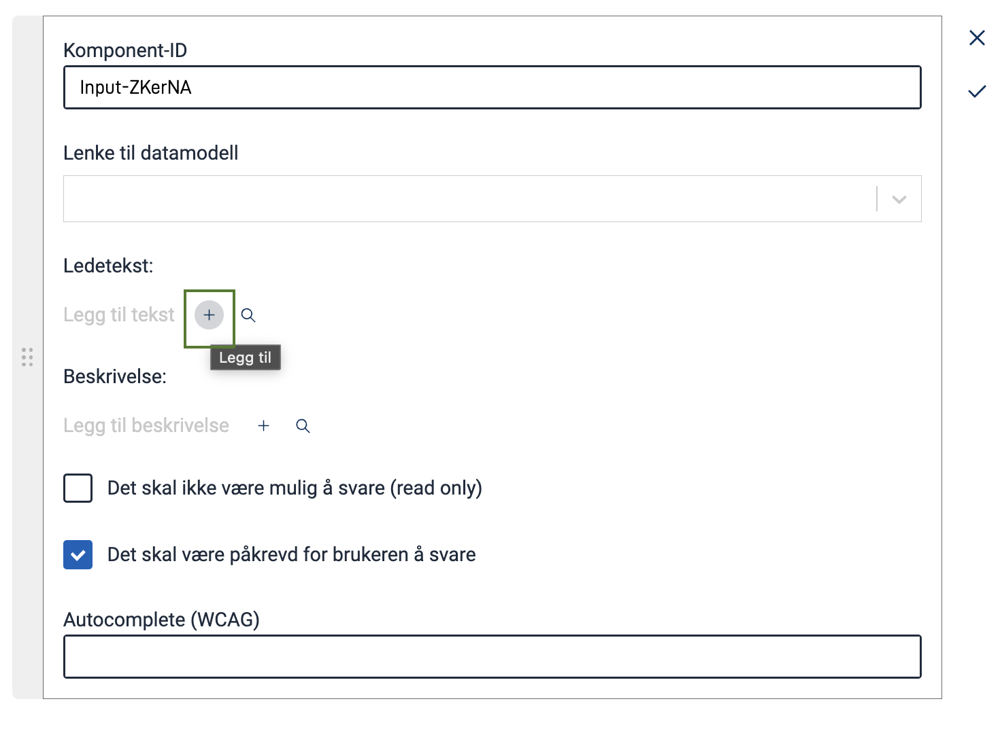
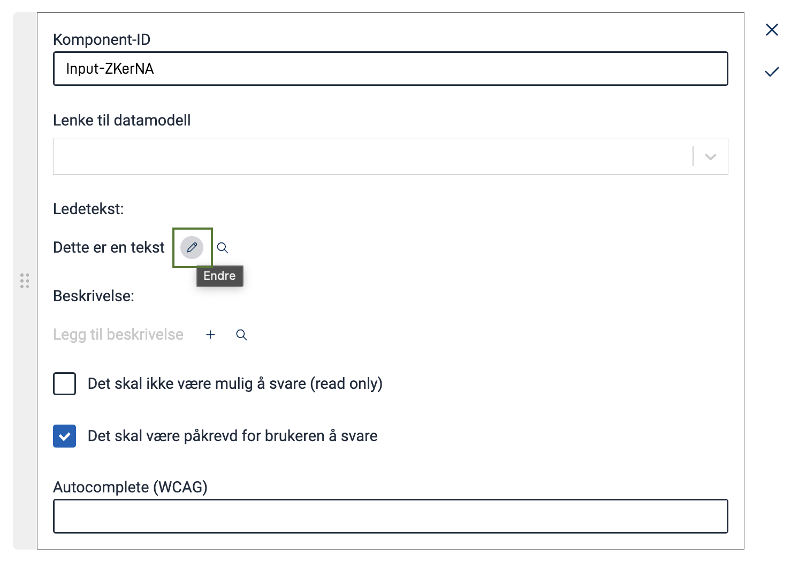
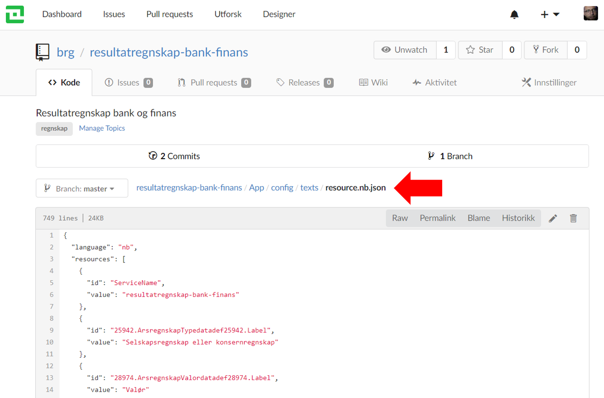
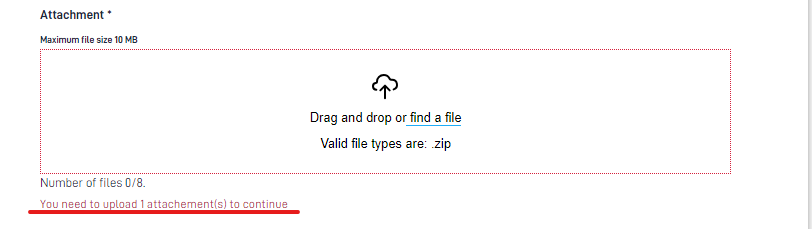
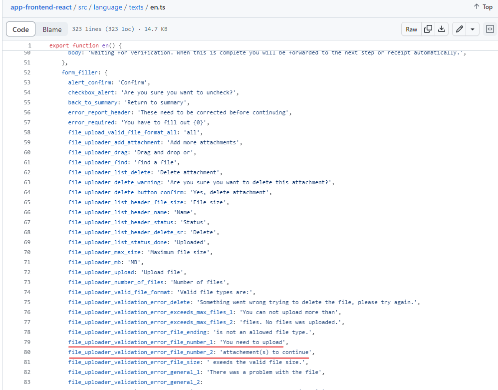
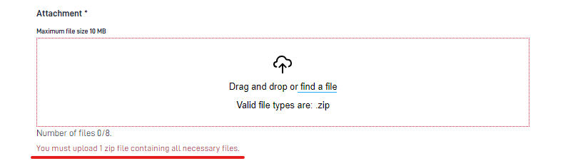
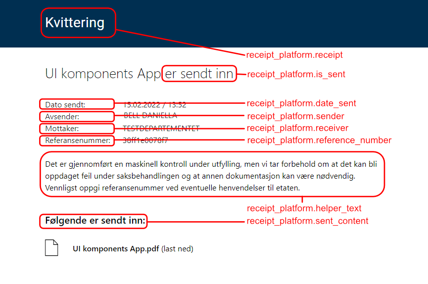

Texts are stored in resource files in the directory `App/config/texts`. Texts can be from common libraries, the data
model or manually added by developers.

The text resources are available when you edit UI components in the schema via Altinn Studio, and they are shown to the
end user when the form is loaded in a browser.

Texts are stored in JSON-format and one file per language. The filename format for texts should
be `resource.[language].json` e.g: _resource.nb.json_.

Texts can be edited locally, directly in the JSON-files, or via the Altinn Studio text editor.

## Formatting of texts

All texts can be formatted with markdown. Below you can see the most commonly used syntax.

A more thorough explanation of the markdown syntax can be found here:
[Markdown Cheatsheet](https://github.com/adam-p/markdown-here/wiki/Markdown-Cheatsheet).

### Bold and italic texts

Its very easy to make words or sentences bold or italic with markdown.

```markdown
This is in _italic_ using underscores.
This is also in *italic* using asterisk.
```

```markdown
This is in __bold__ using double underscores.
This is also in **bold**, using double asterisk.
```

### Line breaks

With markdown this is done with `\n`, which denotes a _new line_. To actually display the text as a new paragraph,
two line breaks must be used. F.ex.;

```markdown
This is a text.\n\nThis is a text on the next line. 
```

Alternatively you could use html instead:

```markdown
This is a text.<br/>This is a text on the next line. 
```

### Links

Simple links can use markdown syntax:

```markdown
Open the [Altinn front page](https://altinn.no).
```

For more properties on the link, you can use HTML syntax:

```html
Go to the <a href="https://altinn.no" class="same-window">Altinn front page</a>.
```

By specifying to open a link in the same window, the user will be navigated away from the form when clicking on the
link, but the current state of the form is maintained in the instance data should the user return to it later.

### Headings

```markdown
# This is a big heading (H1)

## This is a smaller heading (H2)

### An even smaller heading (H3)

#### A tiny heading (H4)
```

## Add and change texts in an application

You have two options when you want to modify texts in an application, either via Altinn Studio or directly in the repository.

### Using Altinn Studio

#### Text editor

In the top navigation bar in Altinn Studio, select _Text_ to be able to edit texts. An overview of the texts that already exist in the application are listed.

On this page you can edit the existing texts and add new ones. New texts can be added by clicking the _New text_ button.
A unique key is automatically generated, this can be changed by clicking the pencil-icon next to the key. Texts are
automatically saved when changed.

You can select the languages you want to display for easy translation from the right-hand panel. You can also add new
languages to translate your app to in this panel.


#### Directly from component editor

When configuring a component in the Form Editor (choose "Create" tab from the top menu), you can directly add/edit/translate
the texts connected to that component.

Add a text by clicking the `+`-icon for the relevant text type (Label or Description).


Edit an existing text for the component by clicking the pencil-icon.


Add an existing text to your component by clicking the search-icon and select the text from the list of available texts.


### Changing texts directly in the repository

This is the recommended way to update texts if there are many changes you want to make. The texts can be changed directly in the repository, or by cloning the repository and using your preferred text editor.

The texts are stored in `App/config/texts`.



## Change default texts and error messages in an application

It is possible to change the default texts and error messages that are displayed in the app. 
Here are the keys with its default value in [English](https://github.com/Altinn/app-frontend-react/blob/main/src/language/texts/en.ts), 
[Norwegian Bokmål](https://github.com/Altinn/app-frontend-react/blob/main/src/language/texts/nb.ts) and [Norwegian Nynorsk](https://github.com/Altinn/app-frontend-react/blob/main/src/language/texts/nn.ts) 

Default texts that have a number need to be handled in a different way. For example `file_uploader_validation_error` displays an error message if it is required to add at least one attachment. 
This default error message will be displayed as "You need to upload 1 attachement(s) to continue'.



These default texts consist of two strings, one before the number: `You need to upload` and one text resource after the number: `attachment(s) to continue`.
Currently, it is only possible to edit the text surrounding the number, not the number itself.



Add the text key and the new value in `App/configuration/texts/resource`. Note that the key needs to refer to the superior group and then the text key separated with a  `.` 

```json
    {
      "id": "form_filler.file_uploader_validation_error_file_number_1",
      "value": "You must upload",
    },
    {
      "id": "form_filler.file_uploader_validation_error_file_number_2",
      "value": "zip file containing all necessary files.",
    }
```

This will result in an error message displaying this:



{} 
If you would like to find more information about how to change default texts you can go to
[Customize Views of Steps](/altinn-studio/reference/configuration/process/customize/)
{}

## Variables in texts

Variables in texts can be included by following the syntax below. It is important that the order of the variables in the variables array is the same order as the parameters in the text.

```json
{
  "id": "good.text.id",
  "value": "Hello, {0}! Here is a second variable {1}.",
  "variables": [
    {
      "key": "<datamodelField>",
      "dataSource": "dataModel.<dataModelName>"
    },
    {
      "key": "<settings key>",
      "dataSource": "applicationSettings"
    },
    {
      "key": "<instance value key>",
      "dataSource": "instanceContext"
    }
  ]
}
```

### Data sources

It is currently possible to fetch values from 3 different data sources.

1. Data model  
   By defining `dataModel.<dataModelNavn>` as the data source you can fetch values from the fields in the form that the user is filling out. Data can be fetched from fields regardless if they are visible or not. If the user changes data
   in a field referenced in a variable, the text will be updated when the user stops typing in the field.
2. Application Settings  
   By defining `applicationSettings` as the data source you can fetch values from a specific section
   in `appsettings.{environment}.json` files with the key `FrontEndSettings`. This is a dynamic list you can extend
   without making changes to the code. This makes it possible to have different values in different environments. Keep in mind the difference in capitalization of the first letter in the keys `FrontEndSettings` and `applicationSettings`.
   ```json
   "FrontEndSettings": {
     "HomeBaseUrl": "https://www.testdirektoratet.no"
   },
   ```
3. Instance  
   By defining `instanceContext` as the data source you will be able to access certain properties from the active instance. The properties that are currently available are:
   1. `instanceOwnerPartyId` contains the party ID of the instance owner.
   2. `instanceId` contains the ID of the active instance.
   3. `appId` contains the ID of the application, which the active instance belongs to.
   
### Default value

If a variable is not found in the data source, the path to that field in the data source is displayed. However, if you want to display something other than this path,
you can add a `defaultValue` option to each variable.

Setting the `defaultValue` to an empty string will ensure that no text is displayed if the field in the data source cannot be found.

```json
{
  "id": "good.text.id",
  "value":  "{0}",
  "variables": [
    {
      "key": "someField",
      "dataSource": "dataModel.default",
      "defaultValue": " "
    }
  ]
}
```

### Complete example:

```json
{
  "id": "common.submitinfo",
  "value": "You are submitting for: {0} with organisation number: {1}. The organisations party id is {2}. [Link to our page]({3}).",
  "variables": [
    {
      "key": "skattepliktig.organisasjonsnavn",
      "dataSource": "dataModel.default",
      "dataValue": "Mattilsynet"
    },
    {
      "key": "skattepliktig.organisasjonsnummer",
      "dataSource": "dataModel.default"
    },
    {
      "key": "instanceOwnerPartyId",
      "dataSource": "instanceContext"
    },
    {
      "key": "homeBaseUrl",
      "dataSource": "applicationSettings"
    }
  ]
}
```

### Variables in text - repeating groups

To make variables in text work with repeating groups, you need to make a slight modification to the example above.

This is achieved by adding `[{0}]` _after_ the repeating group when you specify a field in the data model in the `key`-parameter. E.g:

```json {hl_lines=[6,10]}
{
  "id": "common.submitinfo",
  "value": "You are submitting for: {0} with organisation number: {1}.",
  "variables": [
    {
      "key": "skattepliktig[{0}].organisasjonsnavn",
      "dataSource": "dataModel.default"
    },
    {
      "key": "skattepliktig[{0}].organisasjonsnummer",
      "dataSource": "dataModel.default"
    }
  ]
}
```

It is possible to combine variables from fields in repeating groups with variables from fields that are _not_ in repeating groups. However, it is not recommended to combine variables from fields in _different_ repeating groups, unless you are sure that the order of the items in the groups will be identical.

## Adding help texts

Help texts are short texts that give a concrete description of what the end user is expected to fill in the field which the help text is connected to.

The keys that define the help texts are defined in `FormLayout.json`.
In the repository this file is located in `App/ui/`.

Below is an example of a _FormLayout.json_ without help texts.

```json
{
  "data": {
    "layout": [
      {
        "id": "616071dc-90b1-4ce5-8d18-492844828a41",
        "type": "Header",
        "textResourceBindings": {
          "title": "appName"
        }
      },
      {
        "id": "08d707a9-2475-4d23-bf76-f209fb434ec2",
        "type": "TextArea",
        "textResourceBindings": {
          "title": "tilleggsopplysninger.label",
          "description": "tilleggsopplysninger.desc"
        },
        "dataModelBindings": {
          "simpleBinding": "omsetningsoppgaverTilleggsopplysninger.value"
        }
      },
      {
        "id": "bd6589b6-e2ab-49ba-b39a-dd3f8b63e5de",
        "type": "Button",
        "textResourceBindings": {
          "title": "Send inn"
        }
      }
    ]
  }
}
```

If you want to add help texts to any of these components you have to

1. Add the help text in the resource file [as described here](#add-and-change-texts-in-an-application).
2. Open the `FormLayout.json`-file.
3. Add the binding to the new help text with the key `"help"` and value equal the newly added text resource.

This is how the file looks after adding help texts:

```json {linenos=false,hl_lines=[20]}
{
  "data": {
    "layout": [
      {
        "id": "616071dc-90b1-4ce5-8d18-492844828a41",
        "type": "Header",
        "textResourceBindings": {
          "title": "appName"
        }
      },
      {
        "id": "08d707a9-2475-4d23-bf76-f209fb434ec2",
        "type": "TextArea",
        "textResourceBindings": {
          "title": "tilleggsopplysninger.label",
          "description": "tilleggsopplysninger.desc",
          "help": "tilleggsopplysninger.help"
        },
        "dataModelBindings": {
          "simpleBinding": "omsetningsoppgaverTilleggsopplysninger.value"
        }
      },
      {
        "id": "bd6589b6-e2ab-49ba-b39a-dd3f8b63e5de",
        "type": "Button",
        "textResourceBindings": {
          "title": "Send inn"
        }
      }
    ]
  }
}
```

## Change application title

When you create an application you have a text resource with the label `appName`.
This it the title of the application that will be displayed in several places in our solution, e.g. when an end user is
filling out a form or when elements are displayed in the message box in altinn.no.

The title of the application is located in two places in the application repository:
1. In the text resource with the key `appName`.
2. In `applicationmetadata.json` in the `title` property. This file is located at `App/config/`.

App owners are encouraged to add titles in Norwegian Bokmål, Norwegian Nynorsk and English. If a title is missing in the text resources the
repository name will be used as a fallback, and may be shown to the end user.

If you change `appName` from an IDE (e.g. Visual Studio Code), it is important to also update the title
in `applicationmetadata.json`. If the title is changed from Altinn Studio on the "About" page or "Languages" page,
the `applicationmetadata.json` file is automatically updated.

### Application title configuration example

In `App/config/applicationmetadata.json`:

```json
"title": {
    "nb": "Automatisk deploy applikasjonen",
    "nn": "Automatisk deploy applikasjonen",
    "en": "Auto deploy application"
  },
```

In `App/config/texts/resource.nb.json`:

```json
{
  "language": "nb",
  "resources": [
    {
      "id": "appName",
      "value": "Automatisk deploy applikasjonen"
    },
    ...
  ]
}
```

In `App/config/texts/resource.nn.json`:

```json
{
  "language": "nn",
  "resources": [
    {
      "id": "appName",
      "value": "Automatisk deploy applikasjonen"
    },
    ...
  ]
}
```

I `App/config/texts/resource.en.json`:

```json
{
  "language": "en",
  "resources": [
    {
      "id": "appName",
      "value": "Auto deploy application"
    },
    ...
  ]
}
```

## Change app owner text

The application name and app owner is displayed at the top in the application.


The application owner is fetched by default from the texts defined
in [altinn-orgs.json](https://github.com/Altinn/altinn-cdn/blob/master/orgs/altinn-orgs.json).
If you want to change this name, you can add the key `appOwner` in the text resources. This wil override the value
coming from CDN.

Example:

```json
{
  "language": "en",
  "resources": [
    {
      "id": "appOwner",
      "value": "Test Ministry"
    },
    ...
  ]
}
```

## Change texts on the archive receipt page

The texts on the receipt page can be overridden by specifying the texts in the application's `config/texts/resource.[language].json` file(s).

{}
Overriding any of the texts in the receipt will affect all the receipts for the given application.
This means that forms that are already submitted will also get the updated texts on their receipt page. The generated PDF will not be affected by this.
{}

You can also use markdown and variables in the receipt texts. Currently, you can only fetch variables from `Instance` (See [Data Sources](#data-sources) for details)

These are the text IDs that can be used to override the default texts for archived receipt:

```json
receipt_platform.attachments
receipt_platform.date_sent
receipt_platform.helper_text
receipt_platform.is_sent
receipt_platform.receipt
receipt_platform.receiver
receipt_platform.reference_number
receipt_platform.sender
receipt_platform.sent_content

```

If you, for example, want to change the help text, you can add the following to the `config/texts/resource.en.json` file in your application:

```json
{
  "language": "en",
  "resources": [
    {
      "id": "receipt_platform.helper_text",
      "value": "My custom help text"
    }
  ]
}
```

The image below shows which key controls which text in the UI



**Note:** These text changes will **not** be visible in your local test environment, they will only be visible in the test environment **TT02**.
To view the changes, navigate to the "Archive" page and press the "See submitted form" button.   
These modified texts are only applicable to the platform receipt and will not have any effect on the receipt that is presented to a user after they have completed a form. See [receipt](../../configuration/process/customize/#receipt) for information on how to customize both texts and the layout of this receipt.



