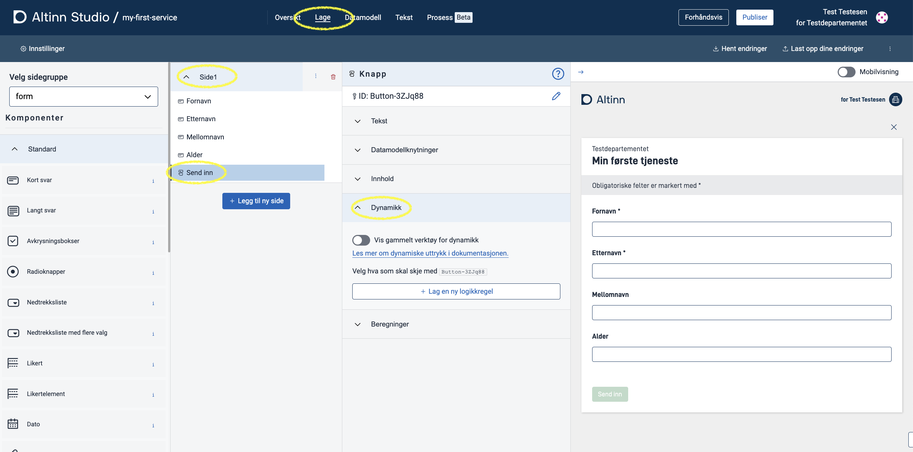
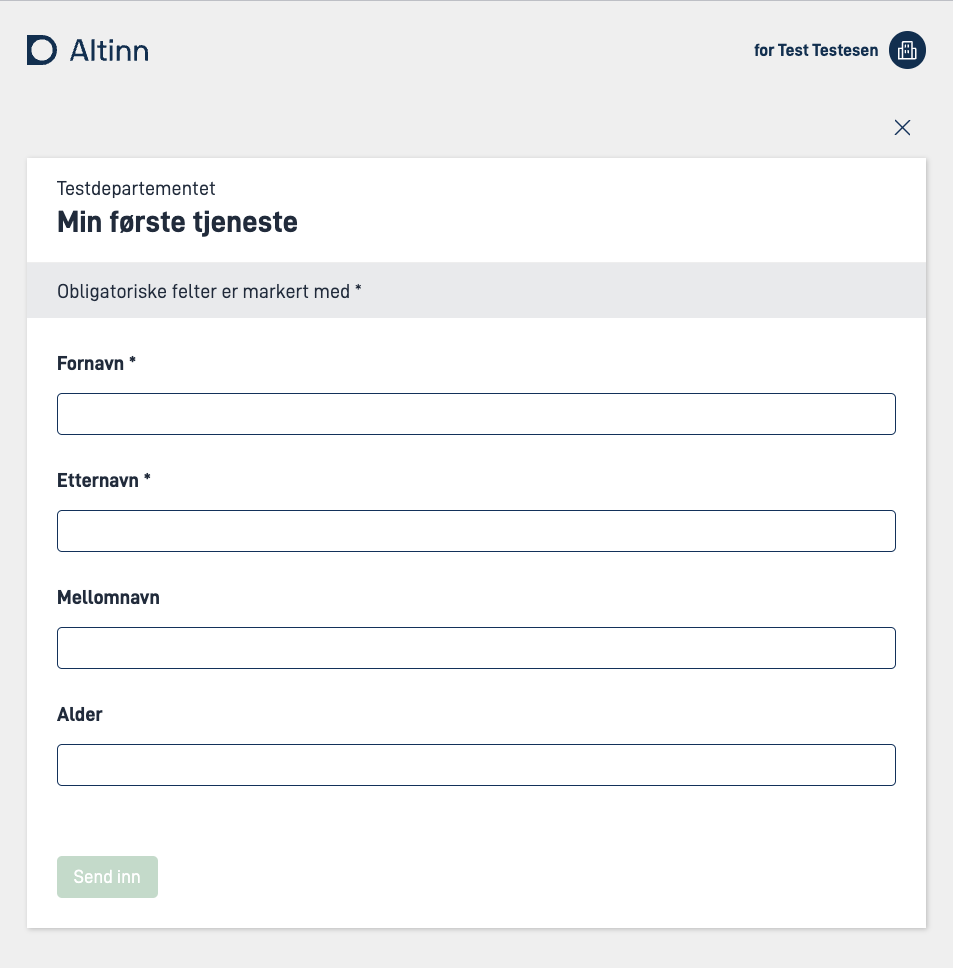
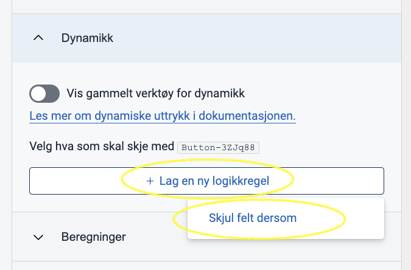
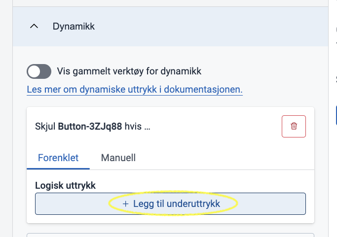
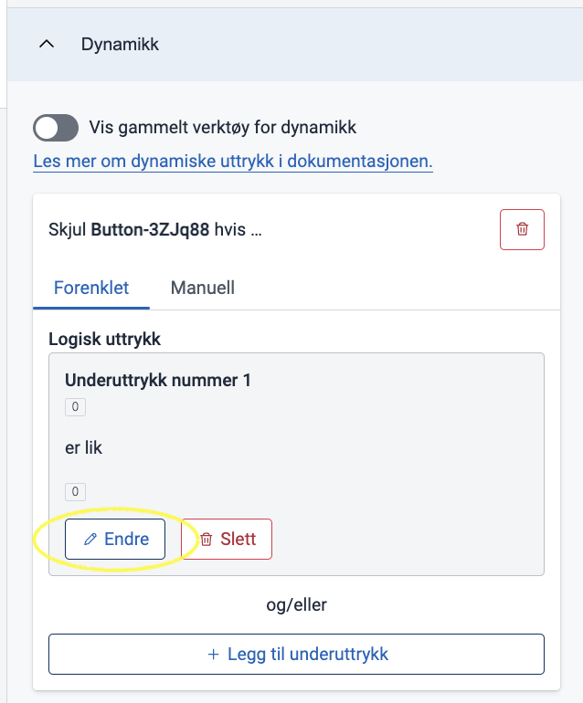
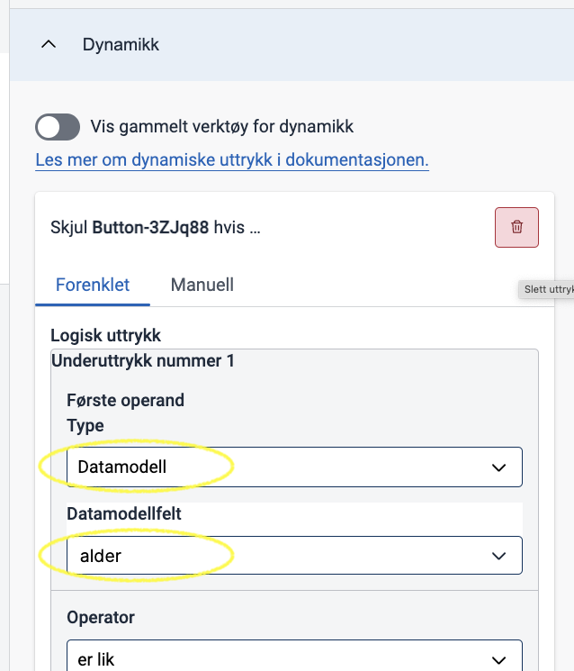
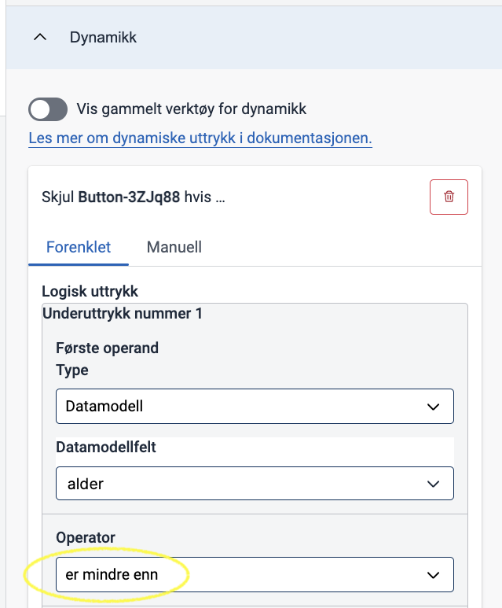
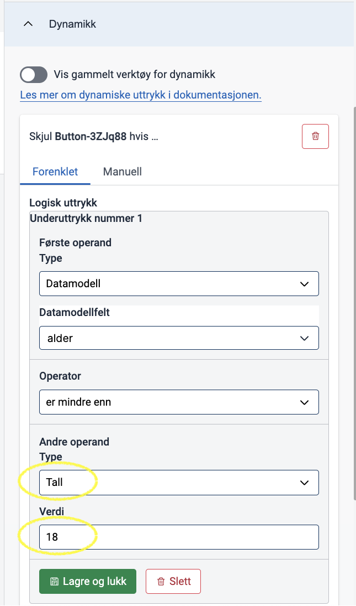
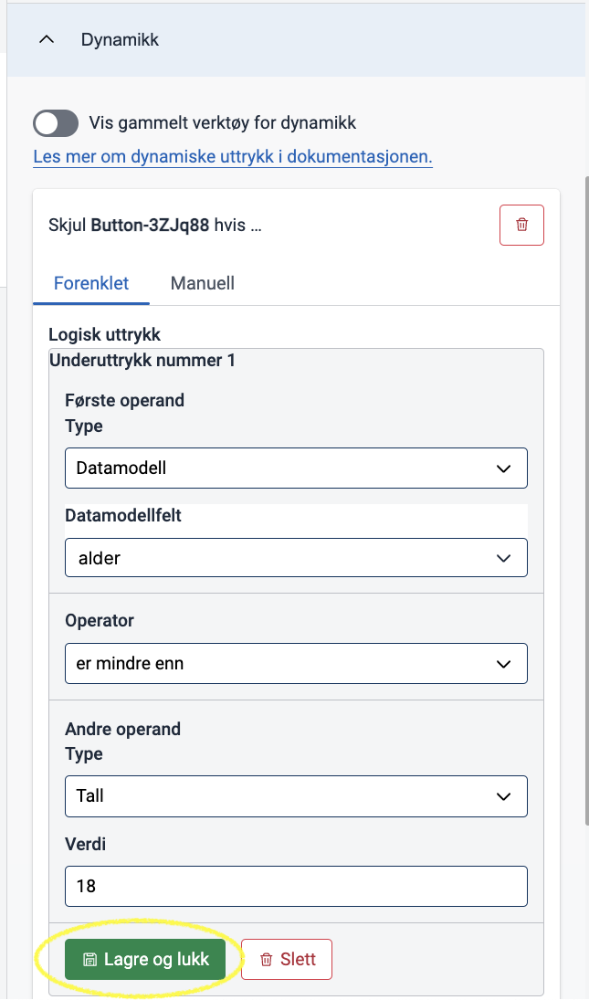
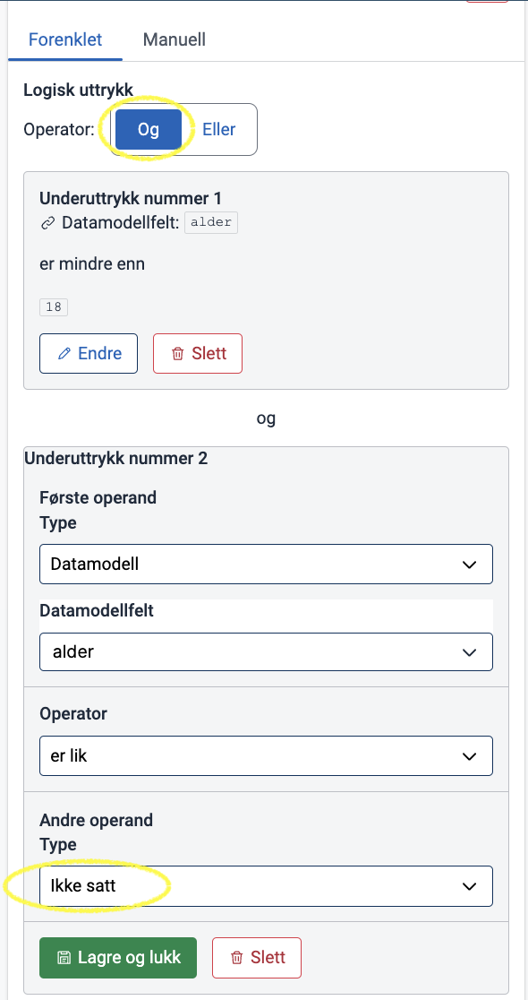

Denne dokumentasjonen vil beskrive hvordan du kan sette opp dynamikk i skjema ved å sette opp uttrykk med 
dynamikkverktøyet i Altinn Studio.

Uttrykk er et begrep i Altinn-tjenester som lar tjenesteutviklere dynamisk tildele verdier til ulike elementer.
[Les mer her](../../../../app/development/logic/expressions) om hva
uttrykk kan brukes til og hvordan syntaksen fungerer.

## Terminologi

I Altinn Studio kalles konseptet for _logikk_, der et uttrykk omtales som en _logikkregel_.

{}
En enhet som består av et boolsk komponentfelt og det faktiske uttrykket som vil bli evaluert til å være en
boolsk verdi når det beregnes i en kjørende app. Det enkleste uttrykket kan bestå av et enkelt underuttrykk,
mens et mer avansert uttrykk kan bestå av flere underuttrykk kombinert med en operator.
{}

{}
En komponent i et skjema har mange forskjellige egenskaper som kan konfigureres. Det er disse vi snakker om her. 
Eksempler på egenskaper på en komponent som kan settes dynamisk via uttrykk er:
- Feltet skal skjules (`hidden`)
- Feltet skal være skrivebeskyttet (`readOnly`)
- Det skal være påkrevd å fylle ut feltet (`required`)
{}

{}
Et begrep som brukes for å omtale den mest elementære enheten i et uttrykk. Et underuttrykk består
av en funksjon og to verdier, der en verdi kan være et enkelt element eller et sammensatt element der den første delen
av elementet definerer en kilde hvor den etterfulgte verdien kan bli funnet.

F.eks.: 

```
["equals", "a", "b"]
```

er et underuttrykk, som sjekker om verdien `"a"` og verdien `"b"` _er like_ ved
hjelp av _funksjonen_ `"equals"`. Dette underuttrykket evaluerer til den boolske verdien "usann" (`false`), fordi "a" og 
"b" er ulike.
{}

{}
Verdi som skal brukes i et underuttrykk. Kan være:
  - _Tall_: En fastsatt tallverdi
  - _Tekst_: En fastsatt tesktverdi
  - _Sann/usann_
  - _Komponent_: Verdi som er satt i en bestemt skjemakomponent
  - _Datamodell_: Verdi som er satt i et bestemt datamodellfelt
  - _Instanskontekst_: Verdi som er hentet fra et bestemt felt fra metadata om tjenesten. 
  - _Ikke satt_: Tomt felt, ingen verdi er satt.

{}

{}
Funksjon som sier hvordan de to operandene skal sammenlignes. F.eks:
  - Er lik
  - Er ikke lik
  - Er større enn
  - Er mindre enn
{}

{}
Brukes til å sette sammen flere underuttrykk.
- **OG**: Alle underuttrykkene må være oppfylt samtidig.
- **ELLER**: Minst ett av underuttrykkene må være oppfylt.
{}

## Bygging av uttrykk i Altinn Studio

Fremgangsmåten under tar utgangspunkt i at du er:
- Inne på "Lage"-siden for en tjeneste
- Har åpnet en side i skjemaet og valgt en komponent du ønsker å konfigurere dynamikk for
- Har åpnet "Dynamikk"-seksjonen i konfigurasjons-panelet



Eksempelet som brukes i veiledningen under baserer seg på følgende skjema:



**Oppgaven**:
> **I dette skjemaet ønsker vi kun å tillate innsending dersom bruker har fylt ut feltet "Alder", og verdien er større eller lik
> 18. I alle andre tilfeller ønsker vi derfor å skjule "Send inn"-knappen.**

### Grunnleggende uttrykk

1. Klikk på "Lag en ny logikkregel" og velg hva som skal skje med komponenten. I eksempelet med en knappe-komponent er det eneste alternativet 
   "Skjul felt dersom":
   

2. Velg "Legg til underuttryk" for å begynne å bygge opp uttrykket

   

   Et nytt underuttrykk blir da lagt til.

3. Klikk på "Endre" for å redigere underuttrykket
   

4. Vi skal nå sjekke om _verdien i feltet "Alder"_ er mindre enn 18. 
   - I _Første operand_ skal vi velge datamodellfeltet `alder` som verdi. Dette gjør vi ved å velge "Datamodell" fra 
     listen som heter "Type", og feltet "alder" fra listen som heter "Datamodellfelt".
     
   - I _Operator_ skal vi velge funksjonen "er mindre enn".
     
   - I _Andre operand_ skal vi velge verdien vi skal sammenligne mot. I dette tilfellet et _tall_ (velg "Tall" i Type-listen)
     som har verdi `18` (skriv inn 18 i Verdi-feltet).
     

5. Klikk på "Lagre og lukk" for å lagre underuttrykket.
  

6. Vi skal nå sjekke om feltet "Alder" er tomt. Klikk på "Legg til underuttrykk" og påse at det nye underuttrykket er satt
  opp med en _OG_-kobling til det første uttrykket for å sikre at begge må oppfylles. Følg stegene i punkt 4 på nytt, men:
  - I _Operator_, velg "Er lik" i stedet for "Mindre enn"
  - I _Andre operand_, velg "Ikke satt" i stedet for "Datamodell" i type-listen. Det skal ikke settes opp noe mer på den 
    andre operanden.
    

7. Test dynamikk i forhåndsvisningen og se at:
   - "Send inn"-knappen er skjult når det ikke står noe i "Alder"-feltet
   -  Dersom du skriver inn f.eks. 20 i feltet "Alder", så dukker "Send inn"-knappen opp
   -  Dersom du skriver inn f.eks. 12 i felter "Alder" så blir "Send inn"-knappen borte


<!-- {}

Det er også mulighet for å legge til uttrykk ved å skrive dem direkte i syntaksen som forventes av konfigurasjonen
i en kjørende Altinn-applikasjon. Denne funksjonaliteten vil tilbys i Studio UI hvis uttrykket
manuelt legges til feltet gjennom gitea eller en redigerings-IDE, og hvis uttrykket er skrevet på en måte som ikke kan
tolkes av Studios uttrykksverktøy. Dette gjelder [nøstede uttrykk](#Nøsting) samt uttrykk som er skrevet på en forenklet
måte, for eksempel uten å inkludere funksjonen, der det vil bli tolket av app-frontenden implisitt.


Denne alternative uttrykksbyggingen kan også tilgjengliggjøres når som helst mens du bygger uttrykket ditt i Studio
verktøyet. Vær obs på at du ikke når som helst kan gå tilbake til å redigere i uttrykksverktøyet da switchen vil gå i
kun lese modus når uttrykket er i en tilstand hvor det ikke kan tolkes av verktøyet.

Se at switchen er tilgjengelig for å redigere i fritekst:


Trykk på switchen for å kunne redigere uttrykket ditt i fritekst:


Endringer som fører til et ugyldig (eller ikke-tolkbart) uttrykk vil gjøre switchen kun lesbar:


{} -->

## Begrensninger

Som nevnt er det noen begrensninger i Studio-verktøyet for konfigurasjon av uttrykk.

### Tilgjengelige komponentfelter

For det første er det bare noen komponentfelter som Studio kan tolke og bygge tilknyttede
uttrykk for. På et senere utviklingsstadium vil vi gjøre det mulig å bygge og tolke uttrykk knyttet til

- tekstreseursbindinger på komponenter
- prosess

### <a name="Nøsting"></a>Nøsting

For det andre er Studio begrenset til å bygge uttrykk med bare ett nivå av nøsting. Dette betyr at en verdi i et
underuttrykk kun kan være enten en implisitt eller eksplisitt verdi, og ikke et underuttrykk. Hvis verdien er et
underuttrykk, vil du ende opp med et "komplekst" uttrykk som i eksempelet ovenfor.

### Eksisterende boolske egenskaper går tapt når uttrykk legges til

Hvis du har definert noen av de booleanske egenskapene/feltene på komponenten til å ha en boolsk verdi, `true`
eller `false`,
og du kobler et uttrykk til det, vil ikke Studio huske denne verdien. Dette betyr at hvis du legger til et uttrykk på et
felt som opprinnelig hadde en boolsk verdi, og deretter sletter uttrykket, vil feltet forsvinne fra komponenten og bli
vurdert til sin
standardverdi.

## Hva er et gyldig uttrykk sett fra Studios synspunkt

For å tillate lagring av et uttrykk i layoutfilen, vil Studio bare visualisere **Lagre**-knappen når noen gitte
betingelser gjelder:

1. Du har valgt en komponentegenskap/felt som uttrykket skal være tilknyttet til
2. Du har valgt en funksjon for det første deluttrykket i uttrykket ditt

Når disse betingelsene er oppfylt, kan du lagre uttrykket uten å fylle inn noen av verdiene. Dette vil legge til et
uttrykk som ser slik ut i den gitte komponentfeltet:

```json
"[KOMPONENTEGENSKAP]": [
"[FUNKSJON]",
null,
null
]
