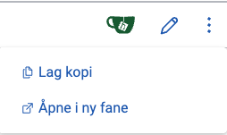
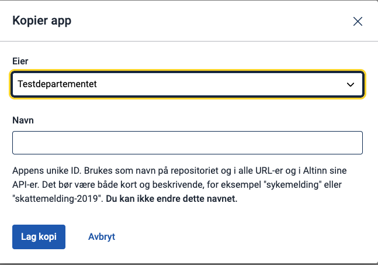

Du kan lage en kopi av en eksisterende app i Altinn Studio. Dette gjør du fra dashboardet.

**Merk:** For å lage en kopi må du ha rettigheter til å opprette nye repos i organisasjonen. Medlemmer av teamene **Owners** og **Developers** har disse rettighetene. Mangler du skrivetilgang, må du ta kontakt med administratoren for organisasjonen din.

## Kopiere en app
{.floating-bullet-numbers-sibling-ol}

1. Klikk på **...**-ikonet til høyre i raden til appen du vil kopiere.
2. Velg **Lag kopi** fra menyen.
3. Skriv inn navnet du vil den nye appen skal ha. Navnet brukes til å identifisere appen, og brukes også som navn på repo og i URL-er og API-er. Navnet bør være kort og beskrivende, som for eksempel "sykmelding" eller "lokalvalg-2025".

   

   _Du kan ikke endre navnet etter at appen er publisert._

4. Klikk på **Lag kopi**. Du blir automatisk sendt til den nye appen, og kan nå begynne å utvikle.
