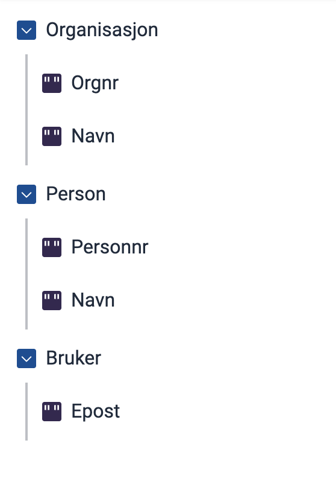

## 1. Opprett en ny fil

   Gå til mappen  `App/models` i appen din og opprett en ny fil med navn `[datamodellnavn].prefill.json`

   Hvis datamodellen din heter _appModel_ skal du ha disse filene:
   - `appModel.cs` 
   - `appModel.schema.json` 
   - `appModel.prefill.json`  &larr; *den nye filen*

## 2. Legg inn grunnkonfigurasjon

   Kopier denne konfigurasjonskoden inn i den nye filen:

   ```json
   {
      "$schema": "https://altinncdn.no/schemas/json/prefill/prefill.schema.v1.json",
      "allowOverwrite": true,
      "ER": {},
      "DSF": {},
      "UserProfile": {}
   }
   ```

## 3. Konfigurer hvilke data som skal fylles ut automatisk

   De tre gruppene i koden speiler de tre kildene som er tilgjengelige:
   - `ER` - Enhetsregisteret
   - `DSF` - Folkeregisteret
   - `UserProfile` - Brukerens Altinn-profil

   Du velger hvilke av kildene du ønsker å bruke. Hvis en (eller flere) av kildene ikke skal brukes, lar du dem stå tomme.

   Inne i gruppen for den aktuelle kilden legger du til linjer som forteller:
   - Hvilket felt (fra kilden) du vil hente data fra
   - Hvilket felt i skjemaet som skal fylles ut

   Formatet er `"datafelt": "skjemafelt"`, der:
   - `datafelt` er navnet på feltet _fra kilden_
   - `skjemafelt` er navnet på feltet i skjemaets datamodell.

   Se [fullstendig liste over tilgjengelige datafelt for alle kildene](/nb/altinn-studio/v10/develop-a-service/prefill/reference/sources).

## Eksempler

Alle eksemplene tar utgangspunkt i datamodellen vist under:



### Hent organisasjonsnummer fra Enhetsregisteret (ER)

Dette fyller ut feltet `Organisasjon.Orgnr` med organisasjonsnummeret 
Enhetsregisteret:

```json
"ER": {
  "OrgNumber": "Organisasjon.Orgnr"
}
```

### Eksempel: Hent personnummer fra Folkeregisteret (DSF)

Dette fyller ut feltet `Person.Personnr` med personnummer fra Folkeregistret.

 ```json
"DSF": {
  "SSN": "Person.Personnr"
}
```

### Eksempel: Hent e-post fra brukerens Altinn-profil

Dette fyller ut feltet `Bruker.Epost` med e-post hentet fra brukerens Altinn-profil.

```json
"UserProfile": {
  "Email": "Bruker.Epost"
}
```
