Denne dokumentasjonen beskriver _hvordan_ du kan bygge uttrykk knyttet til komponentfelt ved hjelp av dynamikkverktøyet i Altinn Studio. I Altinn Studio kalles konseptet for _logikk_, der et uttrykk omtales som en _logikkregel_.

## Slik bygger du uttrykk i Altinn Studio

Når du bygger uttrykk i uttrykkspanelet i Studio, kan du legge til ett uttrykk for hver av de følgende tilstandene:
- `hidden`
- `required`
- `readOnly`

For gruppekomponenter kan også følgende felter ha tilknyttede uttrykk:

- `edit.addButton`
- `edit.deleteButton`
- `edit.saveButton`
- `edit.saveAndNextButton`

Hvis alle disse feltene har uttrykk, får du en informasjonsmelding om at du har nådd grensen for uttrykk.

Når du går videre med å konfigurere et uttrykk for komponenten din i uttrykksverktøyet i Altinn Studio for første
gang, følg denne veiledningen:

### Grunnleggende uttrykk

1. **Velg et komponentfelt å legge til uttrykket på**

   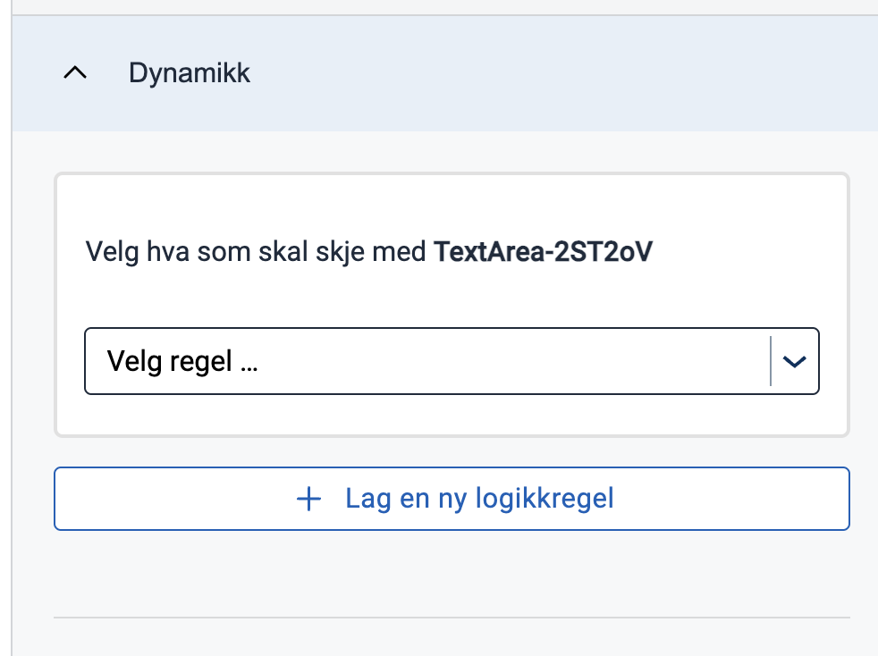

2. **Velg en funksjon som det første underuttrykket skal bruke**

   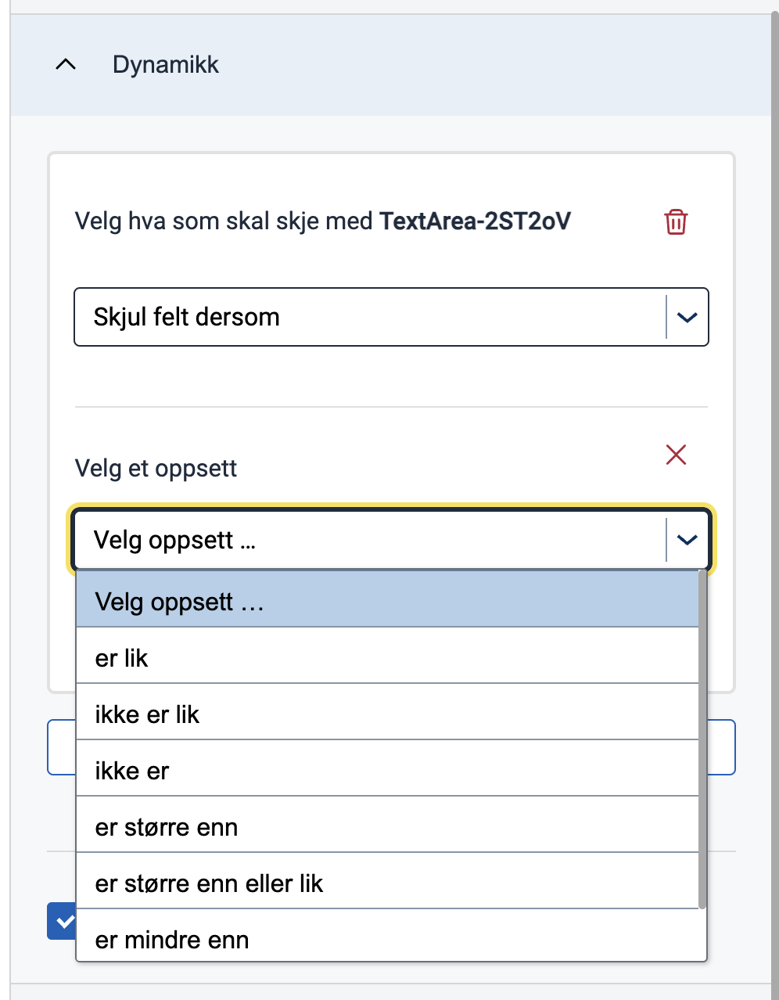
   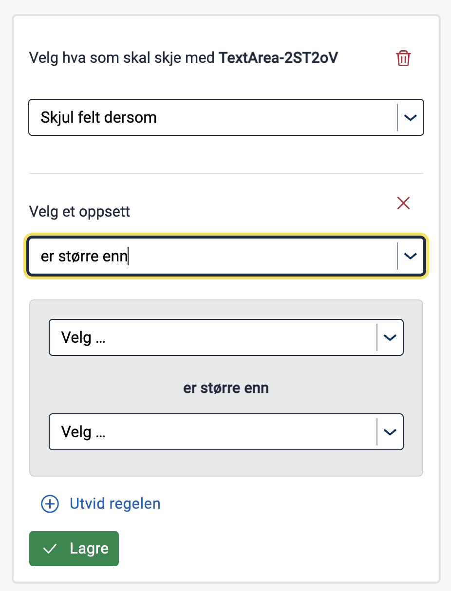

3. **Velg en datakilde til den første delen av underuttrykket**

   Denne datakilden kan enten være en faktisk kilde som gir deg tilgang til et sett med tilgjengelige verdier å velge fra etterpå, eller en type for en verdi. De tilgjengelige datakildene som gir deg et sett med gitte verdier er:

    - Datamodell: Felt fra den nåværende valgte datamodellen.
    - Komponent: Alle komponent-IDer som er til stede på tvers av layouter.
    - Applikasjonsinnstillinger: Alle tilpassede konfigurasjonsverdier lagt til i `appsettings.json`.
    - Instanskontekst: En av de følgende verdiene som finnes på instansobjektet i Altinn-lagring: `instanceId`, `InstanceOwnerPartyId` eller `appId`.

   De tilgjengelige datakildene som er typer:

    - Streng: Lar deg tilordne en hvilken som helst tilpasset streng som verdien.
    - Tall: Lar deg tilordne et hvilket som helst tilpasset tall som verdien.
    - Boolsk: Lar deg tilordne verdien som `true` eller `false`.
    - Null: Tildeler automatisk verdien som `null`.

   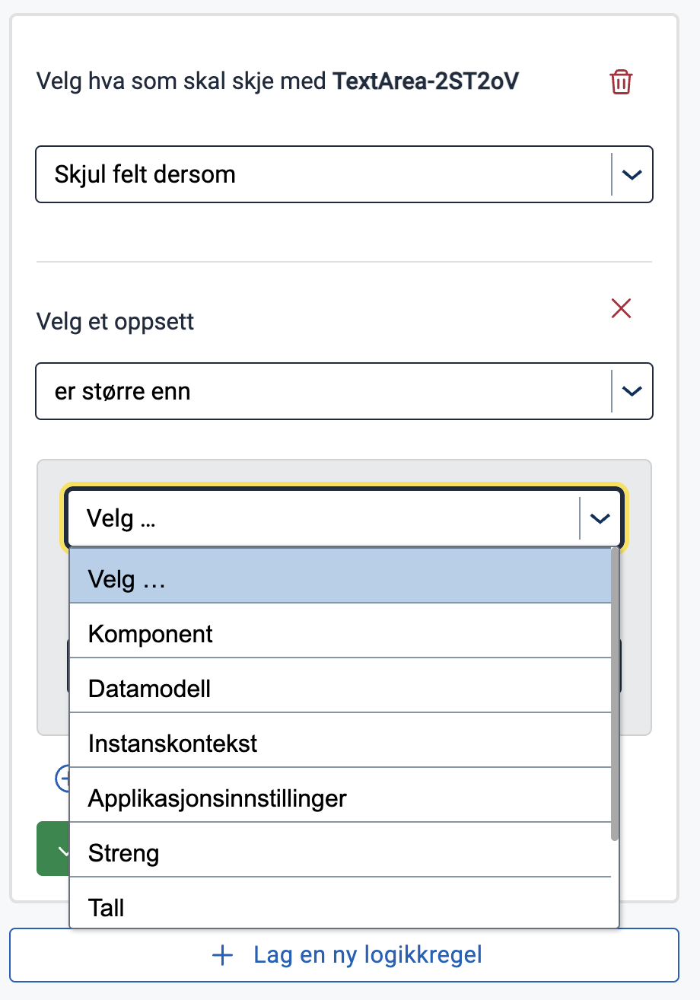

   **ADVARSEL**: `Application Settings` som datakilde er ennå ikke implementert.

4. **Velg en verdi for den første delen av underuttrykket**

   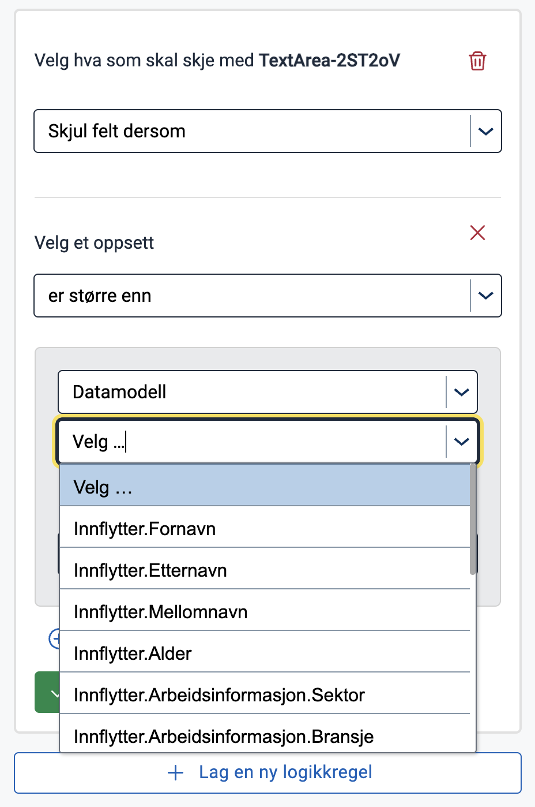
   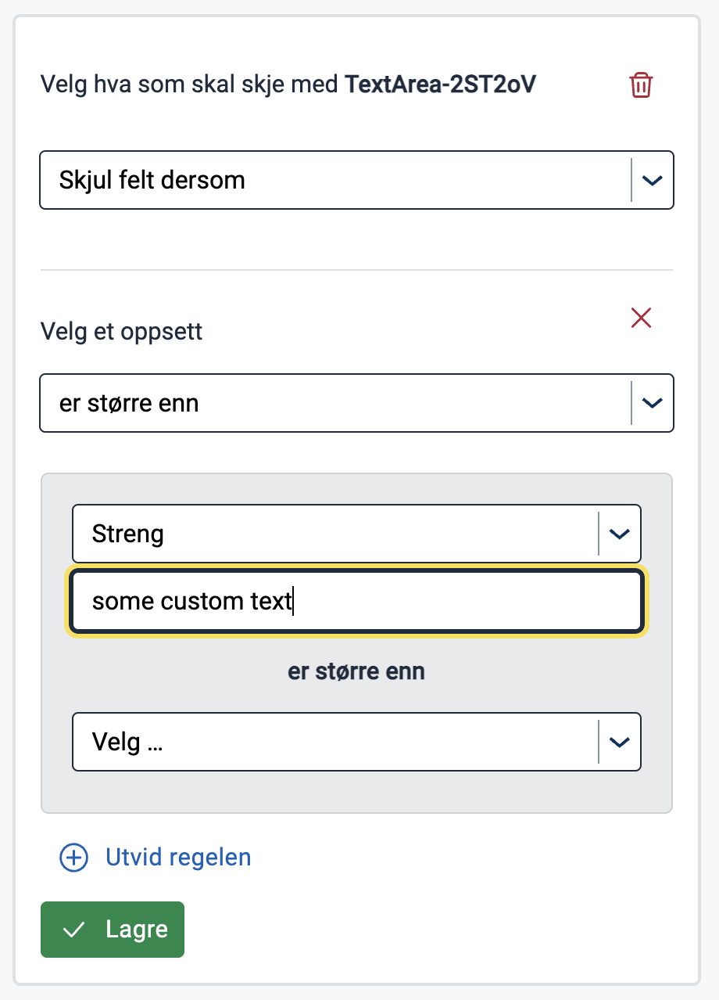

5. **Velg en sammenlignbar datakilde og verdi for det andre elementet i underuttrykket ditt**

   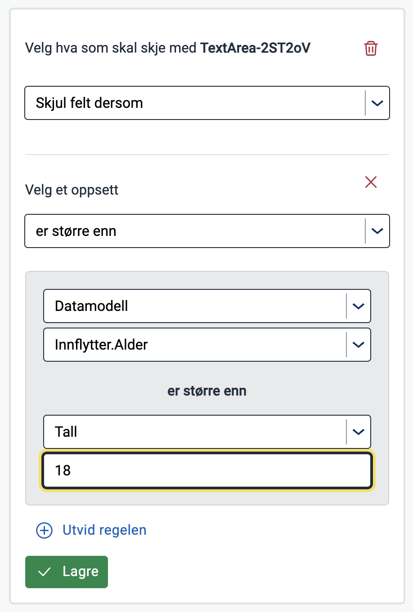

6. **Lagre uttrykket eller fortsett å legge til underuttrykk**

   Når du lagrer uttrykket, kobles det til komponentegenskapen du valgte og vises i en forhåndsvisningsmodus.
   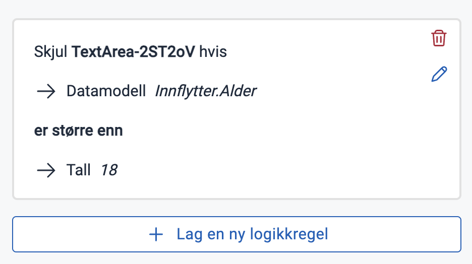

   I redigeringsmodus kan du fortsette å legge til underuttrykk ved å utvide regelen og sette operatøren, som skal
   evaluere deluttrykkene sammen, til enten `and` eller `or`.
   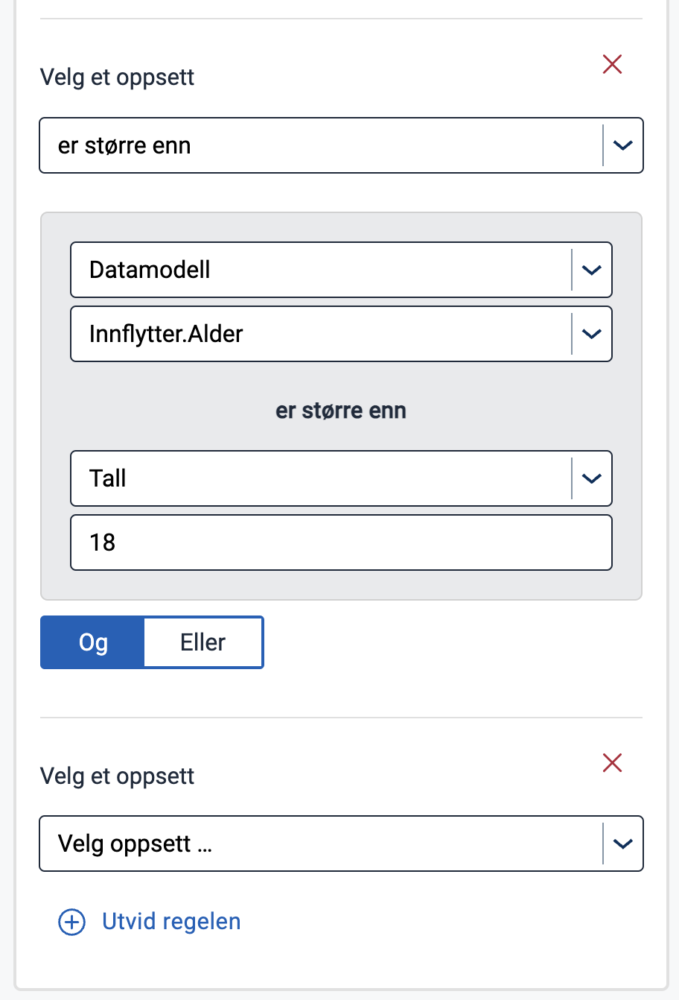

   Deretter gjentar du disse trinnene fra punkt 2 - legg til en funksjon i det nye underuttrykket og så videre.
   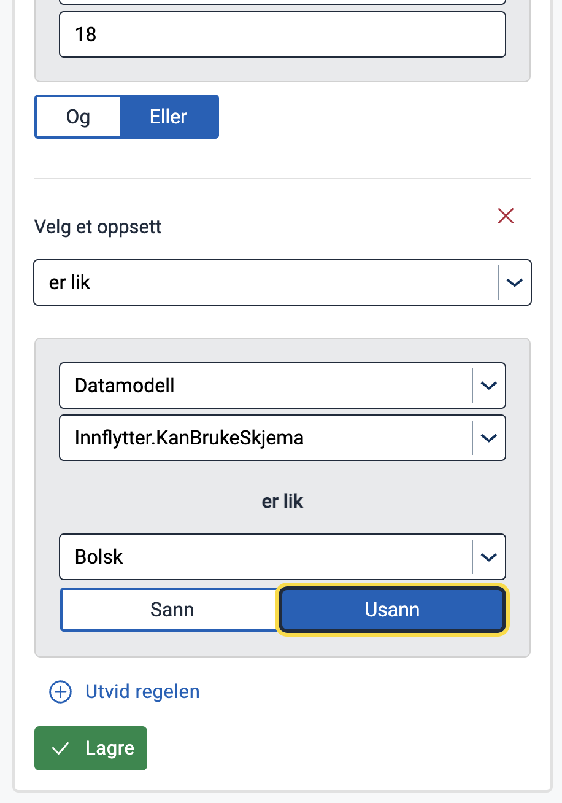

   Deretter kan du lagre det komplette uttrykket, med et vilkårlig antall underuttrykk, og visualisere det i
   forhåndsvisningsmodus.
   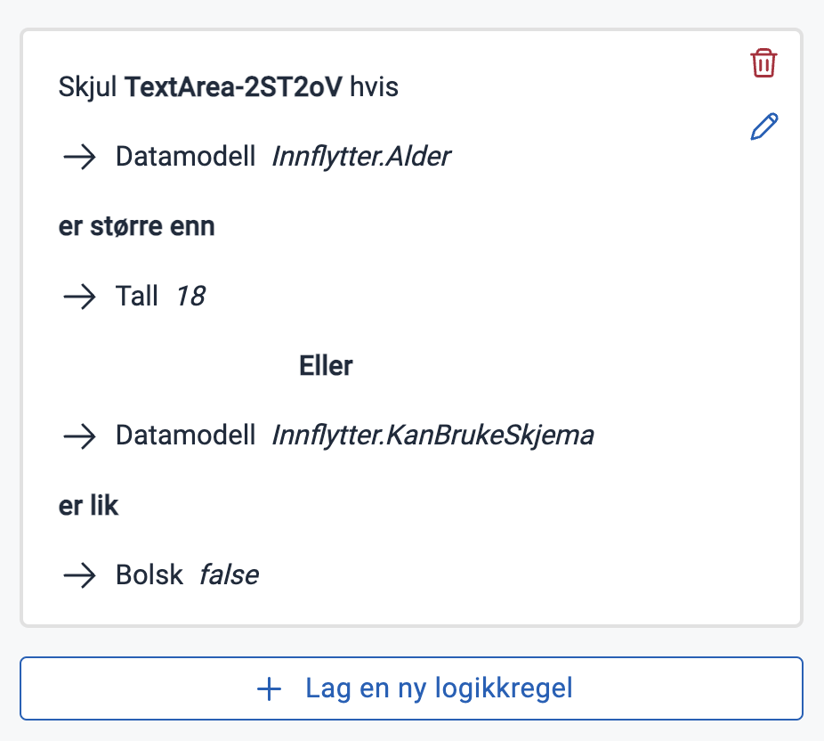

### "Komplekse" uttrykk

Du kan også legge til uttrykk ved å skrive dem direkte i syntaksen som konfigurasjonen i en kjørende Altinn-applikasjon forventer. Denne funksjonaliteten tilbys i Studio UI hvis uttrykket legges til feltet manuelt gjennom gitea eller en redigerings-IDE, og hvis uttrykket er skrevet på en måte som ikke kan tolkes av Studios uttrykksverktøy. Dette gjelder [nøstede uttrykk](#Nøsting) samt uttrykk som er skrevet på en forenklet måte, for eksempel uten å inkludere funksjonen, der app-frontenden tolker det implisitt.

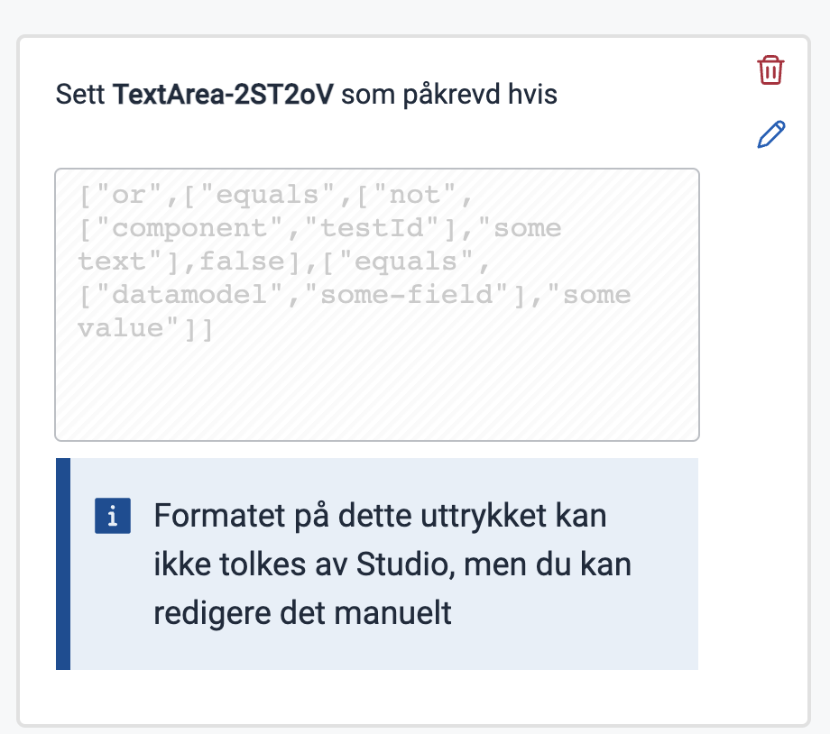

Du kan også bruke denne alternative uttrykksbyggingen når som helst mens du bygger uttrykket ditt i Studio-verktøyet. Merk at du ikke når som helst kan gå tilbake til å redigere i uttrykksverktøyet, da switchen går i kun lesemodus når uttrykket er i en tilstand hvor verktøyet ikke kan tolke det.

Se at switchen er tilgjengelig for å redigere i fritekst:
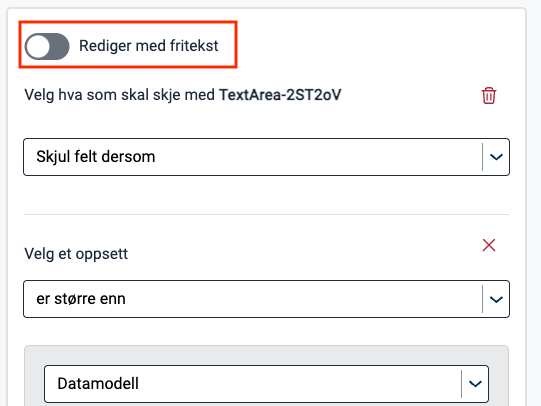

Trykk på switchen for å kunne redigere uttrykket ditt i fritekst:
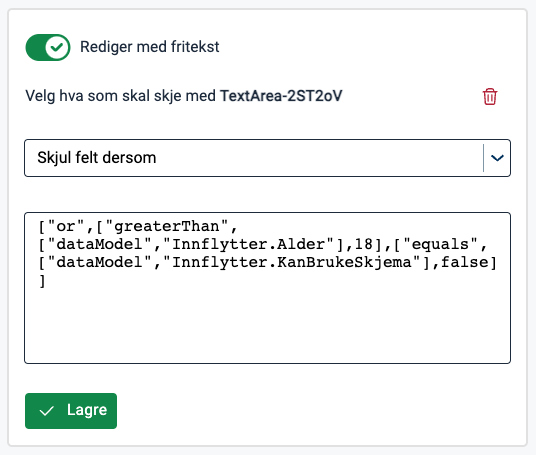

Endringer som fører til et ugyldig (eller ikke-tolkbart) uttrykk gjør switchen kun lesbar:
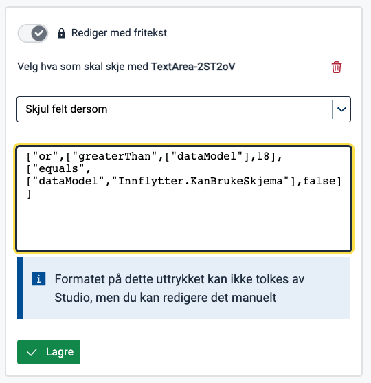

## Begrensninger

Som nevnt er det noen begrensninger i Studio-verktøyet for konfigurasjon av uttrykk.

### Tilgjengelige komponentfelter

For det første er det bare noen komponentfelter som Studio kan tolke og bygge tilknyttede uttrykk for. På et senere utviklingsstadium er det mulig å bygge og tolke uttrykk knyttet til

- tekstressursbindinger på komponenter
- prosess

### <a name="Nøsting"></a>Nøsting

For det andre er Studio begrenset til å bygge uttrykk med bare ett nivå av nøsting. Dette betyr at en verdi i et underuttrykk kun kan enten være en implisitt eller eksplisitt verdi, og ikke et underuttrykk. Hvis verdien er et underuttrykk, ender du opp med et "komplekst" uttrykk som i eksempelet ovenfor.

### Eksisterende boolske egenskaper går tapt når uttrykk legges til

Hvis du har definert noen av de booleanske egenskapene/feltene på komponenten til å ha en boolsk verdi (`true` eller `false`), og du kobler et uttrykk til det, husker ikke Studio denne verdien. Dette betyr at hvis du legger til et uttrykk på et felt som opprinnelig hadde en boolsk verdi, og deretter sletter uttrykket, forsvinner feltet fra komponenten og vurderes til sin standardverdi.

## Hva er et gyldig uttrykkssett fra Studios synspunkt

For å tillate lagring av et uttrykk i layoutfilen, viser Studio bare **Lagre**-knappen når noen gitte betingelser gjelder:

1. Du har valgt en komponentegenskap/felt som uttrykket skal være tilknyttet til
2. Du har valgt en funksjon for det første deluttrykket i uttrykket ditt

Når disse betingelsene er oppfylt, kan du lagre uttrykket uten å fylle inn noen av verdiene. Dette legger til et uttrykk som ser slik ut i det gitte komponentfeltet:

```json
"[KOMPONENTEGENSKAP]": [
"[FUNKSJON]",
null,
null
]
