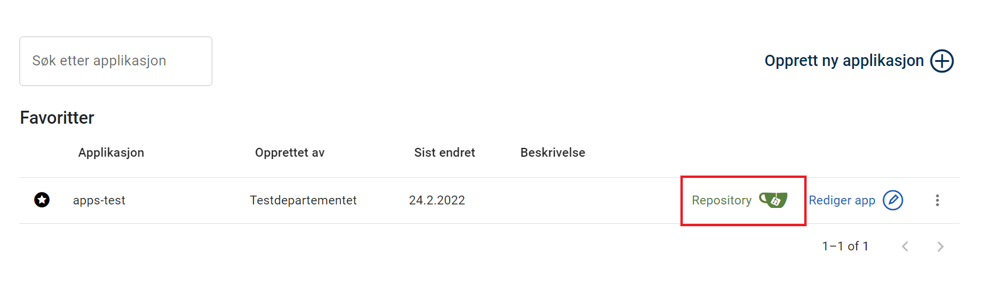
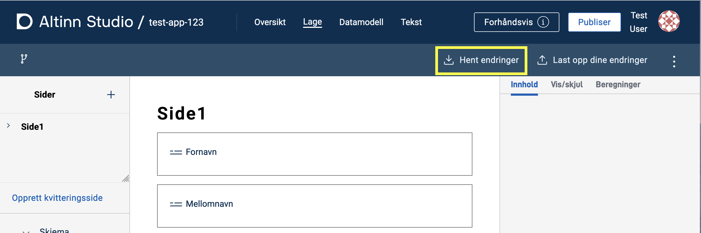
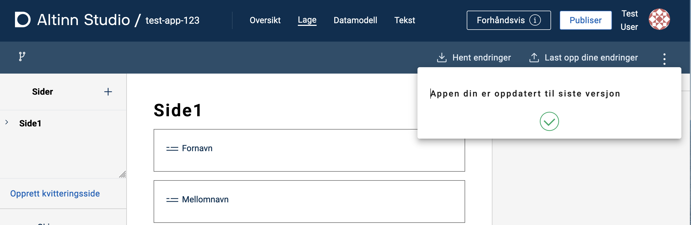
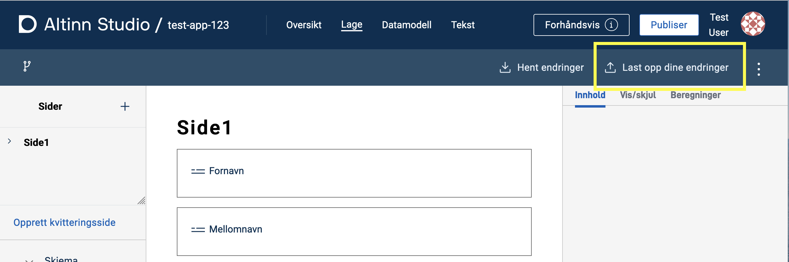
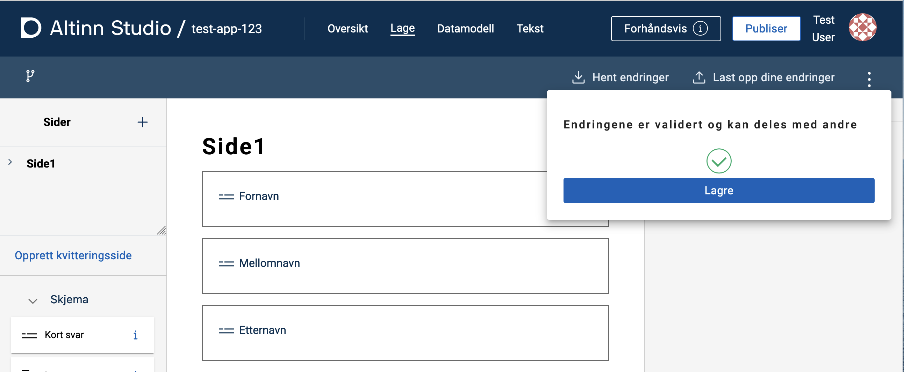

Når du utvikler en applikasjon må du jobbe både i Altinn Studio og i et lokalt utviklingsmiljø.
Her er en oversikt over hvordan du kommer i gang med lokal utvikling. 

## Slik kloner du applikasjonen til et lokalt utviklingsmiljø

1. Finn applikasjonen du vil jobbe med lokalt i Dashboardet i Altinn Studio
2. Åpne repositoriet. Klikk på **Repository**-knappen
    
    *Bytt ut dette bildet.*
3. Kopier lenken til repoet (den blå firkanten), enten manuelt eller ved å klikke på knappen markert med en rød sirkel.
    
    *Vurder å bytte dette bildet.*
4. Åpne en terminal i ditt lokale utviklingsmiljø:
    - Gå til ønsket lokasjon for applikasjonsrepoet.
    - Skriv kommandoen `git clone` og lim inn URLen du kopierte i forrige steg.
    ```cmd
    $ git clone https://altinn.studio/repos/<org>/<app-name>.git
    ```
    -  Hvis du har logget inn i Altinn Studio uten å lage passord (f. eks. Github login), kan du [lage et personlig access token i Gitea](https://altinn.studio/repos/user/settings/applications) som kan brukes som passord ved kloning:
    ```cmd
    $ git clone https://<brukernavn>:<access-token>@altinn.studio/repos/<org>/<app-name>.git
    ```
    - I terminalen skal du se et resultat som likner dette:
    ```cmd
    Cloning into 'app-name'...
    remote: Enumerating objects: 982, done.
    remote: Counting objects: 100% (982/982), done.
    remote: Compressing objects: 100% (950/950), done.
    remote: Total 982 (delta 600), reused 0 (delta 0), pack-reused 0 
    Receiving objects: 100% (982/982), 166.38 KiB | 1.51 MiB/s, done.
    Resolving deltas: 100% (600/600), done.
    ```

Systemet oppretter en mappe med samme navn som applikasjonen og kloner innholdet i applikasjonsrepoet inn i mappen.
Nå kan du åpne ditt foretrukne utviklingsverktøy og komme i gang med utviklingen.

## Slik synkroniserer du endringer i lokalt utviklingsmiljø

Du må laste opp (_pushe_) endringer som du gjør lokalt til repoet koden ble klonet fra.
Hvis du gjør endringer i Altinn Studio Designer (og laster disse opp til repoet), må du hente dem ned (_pull_) for å oppdatere den lokale koden.

Du kan synkronisere endringer i det lokale utviklingsmiljøet på flere måter.
Mange utviklingsverktøy har gode integrasjoner for nettopp dette, så sjekk gjerne om ditt verktøy har den typen støtte.

Nedenfor beskriver vi hvordan du kan synkronisere endringer fra kommandolinjen.

### Laste opp endringer

1. Gå til applikasjonsrepoet ditt i en terminal.
2. Legg til filene du ønsker å laste opp endringer for (_pushe_) med kommandoen `git add <sti til filen>`. Du kan kjøre kommandoen for enkeltfiler, flere filer samtidig eller en mappe.
3. Lagre (_commit_) endringene med en fornuftig melding med kommandoen `git commit -m <commit-melding>`.
4. Last opp (_push_) endringene til master med kommandoen `git push`.

### Laste ned endringer

Gå til applikasjonsrepoet ditt i en terminal og kjør kommandoen `git pull`.

[Les mer om _git pull_ her](https://git-scm.com/docs/git-pull)

## Slik synkroniserer du endringer i Altinn Studio

I Altinn Studio må du synkronisere endringer på samme vis som ved lokale endringer.

### Laste ned endringer
1. Trykk på _Hent endringer_ på Lage-siden til applikasjonen i Altinn Studio.
   
   *Bytt dette bildet.*
2. Har alt gått bra vil du se denne bekreftelsen.
    
    *Bytt dette bildet.*

### Laste opp endringer

1. Trykk på _Last opp dine endringer_ på Lage-siden til applikasjonen i Altinn Studio.
   
   *Bytt dette bildet.*
2. Legg inn en beskrivende tekst for endringen(e) og trykk _Valider endringer_.
    
    *Bytt dette bildet.*
3. Vent litt mens systemet validerer endringene. Oppstår det en konflikt trykker du på _Løs konflikt_ og følger instruksjonene.
4. Trykk _Lagre_ for å laste opp endringene til repoet (master).
    
    *Bytt dette bildet.*
5. Har alt gått bra vil du se denne bekreftelsen.
    
    *Bytt dette bildet.*

## Lokal testing

Du kan forhåndsvise endringene du gjør når du jobber lokalt.
*LocalTest* er et program som spinner opp en lokal mockup av Altinn Plattform.
Den gir deg mulighet til å teste og verifisere lokale endringer uten å måtte synkronisere med Altinn Studio.

{}
**MERK**
For å kunne kjøre appen i LocalTest må applikasjonen ha en tilknyttet [datamodell](/nb/altinn-studio/v8/reference/data/data-modeling/).
{}

1. **Last ned og start LocalTest** ved å følge stegene [som vi beskriver på GitHub](https://github.com/Altinn/app-localtest/blob/master/README.md) (inkluderer start av app som vi også forklarer under).
2. **Kjør applikasjonen i LocalTest**: Åpne et nytt terminalvindu og gå til undermappen *App* i applikasjonen din (`<app-name>/App`). Start appen med kommandoen `dotnet run` og vent på bekreftelse i terminalen.
3. **Forhåndsvis og test applikasjonen**: Gå til [http://local.altinn.cloud](http://local.altinn.cloud) og logg inn med en [testbruker](/nb/altinn-studio/v8/reference/testing/local/testusers/).

### Se endringer fortløpende

- Hvis du endrer JSON-filer, holder det å laste inn siden på nytt.
- Hvis du endrer forhåndsutfylling, må du starte en ny instans av applikasjonen (gå til [http://local.altinn.cloud](http://local.altinn.cloud) og logg inn igjen).
- Hvis du endrer *cs*-filer, må du stoppe applikasjonen (`ctrl+C`) og starte den på nytt (`dotnet run`).

Du kan oppdatere automatisk ved endring i *cs*-filer ved å starte applikasjonen med `dotnet watch`.
Denne kommandoen vil enten starte applikasjonen eller laste den inn på nytt ([hot reload](https://learn.microsoft.com/en-us/dotnet/core/tools/dotnet-watch#hot-reload)) ved endringer i kildekoden.

### Stoppe applikasjon og LocalTest

Stopp applikasjonen ved å trykke `ctrl+C` i terminalvinduet der du startet den.
Stopp LocalTest ved å gå til mappen `app-localtest` i terminalen og kjøre kommandoen `docker compose down`.
