## Skjema

Komponenter for datainnsamling.

### Lite tekstfelt (`Input`)
`Input` gir brukere muligheten til å skrive fritekst eller tall.

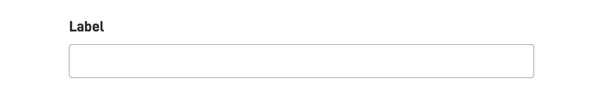

[Detaljer om komponenten](./Input)

---

### Stort tekstfelt (`TextArea`)

`TextArea` brukes når brukeren skal kunne skrive inn tekst som går over flere linjer.

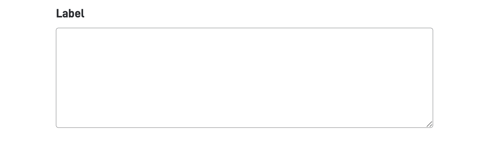

[Detaljer om komponenten](./TextArea.md)

---

### Datovelger (`Datepicker`)

`Date`-komponenten lar brukeren legge til strukturert formatert dato.

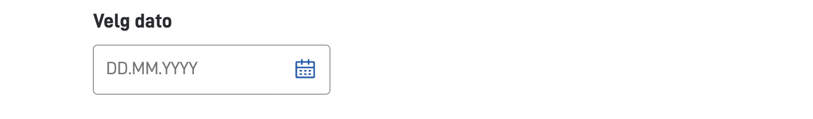

[Detaljer om komponenten](./Datepicker.md)

---

### Tidsvelger (`TimePicker`)

[Detaljer om komponenten](./TimePicker)

---

### Finn virksomhet (`OrganisationLookup`)

`OrganisationLookup`-komponenten slår opp en organisasjon i Enhetsregisteret ved hjelp av organisasjonsnummer.

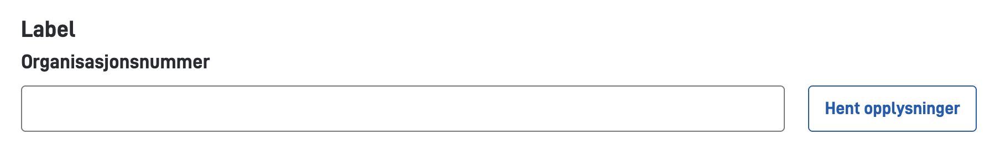

[Detaljer om komponenten](./OrganisationLookup)

---

### Finn person (`PersonLookup`)

`PersonLookup`-komponenten søker i det nasjonale folkeregisteret basert på fødselsnummer og etternavn.

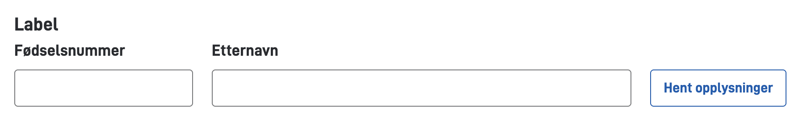

[Detaljer om komponenten](./PersonLookup)

---

## Tekst

Komponenter for å vise tekst og informasjon.

### Tittel (`Header`)

`Header` brukes til å strukturere innhold og skape hierarki på siden.

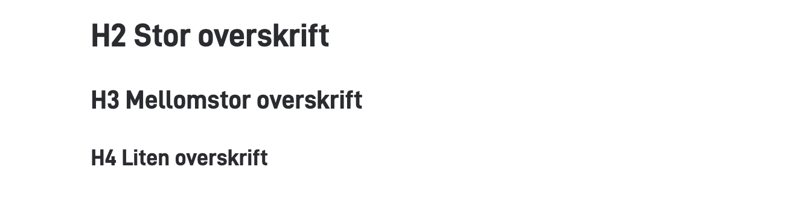

[Detaljer om komponenten](./Header)

---

### Avsnitt (`Paragraph`)

`Paragraph` brukes til løpende tekst og benyttes typisk i artikler, komponenter, hjelpetekster og lignende.

[Detaljer om komponenten](./Paragraph)

---

### Informativ melding (`Panel`)

`Panel` kan brukes til å vise viktig informasjon til brukeren i ulike varianter (info, success, warning). Komponenten
dekker hele bredden til siden.

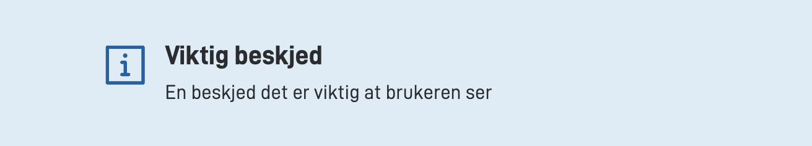

[Detaljer om komponenten](./Panel)

---

### Varsel (`Alert`)

`Alert` gir brukeren informasjon som det er ekstra viktig at de ser og forstår. Komponenten er designet for å fange
brukernes oppmerksomhet. Teksten i varselet skal være kort og tydelig.

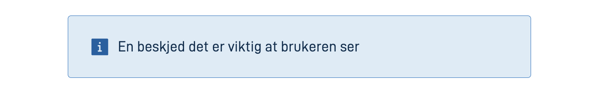

[Detaljer om komponenten](./Alert)

---

### Delelinje (`Divider`)

`Divider` brukes for å skape et visuelt skille mellom innhold. Det er en enkel horisontal linje som strekker seg over
tilgjengelig bredde.

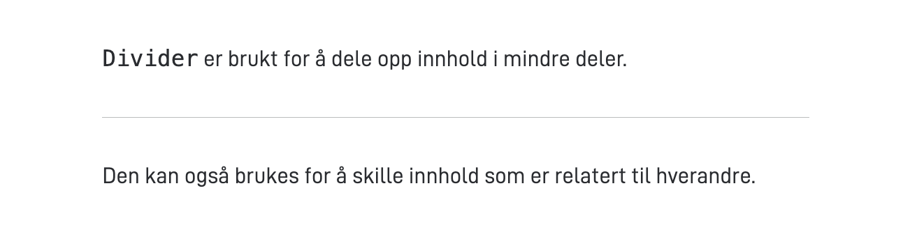

[Detaljer om komponenten](./Divider)

---

### Tekst (`Text`)

`Text`-komponenten viser tekst med eller uten ledetekst. Tekstverdien som vises kan f.eks. settes dynamisk via uttrykk.

[Detaljer om komponenten](./Text)

---

### Tall (`Number`)

[Detaljer om komponenten](./Number)

---

### Dato (`Date`)

`Date` er en komponent som viser formatert dato med eller uten ledetekst.

[Detaljer om komponenten](./Date)

---

## Flervalg

Komponenter for valg fra forhåndsdefinerte alternativer.

### Avmerkingsbokser (`Checkboxes`)
`Checkboxes` gir brukerne mulighet til å velge ett eller flere alternativer. Den kan også brukes i tilfeller der
brukeren skal bekrefte noe.

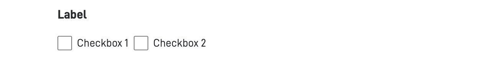

[Detaljer om komponenten](./Checkboxes)

---

### Radioknapper (`RadioButtons`)
`RadioButtons` er er ett eller fleer alternativ brukeren kan velge. Brukeren kan bytte mellom alternativene, men kan
kun velge ett.

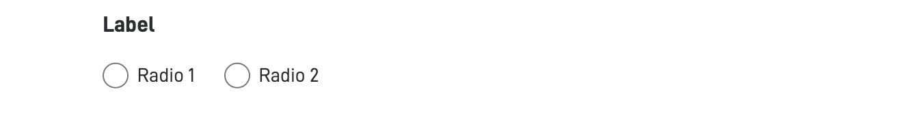

[Detaljer om komponenten](./RadioButtons)

---

### Nedtrekksliste (`Dropdown`)
`Dropdown` lar brukeren velge ett alternativ fra en liste.

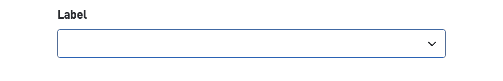

[Detaljer om komponenten](./Dropdown)

---

### Nedtrekksliste med flere valg (`MultipleSelect`)
`MultipleSelect` lar brukeren velge flere alternativer fra en liste.

[Detaljer om komponenten](./MultipleSelect)

---

### Likert-skala (Likert)

[Detaljer om komponenten]()

---

## Informasjon

Komponenter for å vise tilleggsinformasjon.

### Informasjon om eksemplaret (InstanceInformation)

[Detaljer om komponenten](./InstanceInformation)

---

### Bilde (`Image`)
`Image` viser et bilde som er lastet opp til appen eller lastet inn fra en URL.

[Detaljer om komponenten](./Image)

---

### Lyd (`Audio`)

[Detaljer om komponenten](./Audio)

---

### Video (`Video`)

[Detaljer om komponenten](./Video)

---

### Lenke (Link)
`Link` er en lenke til annet innhold. Komponenten kan vises som en klassisk lenke, eller som en knapp.

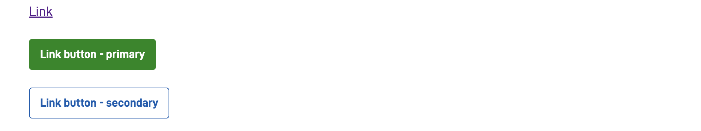

[Detaljer om komponenten](./Link)

---

### IFrame (IFrame)

[Detaljer om komponenten](./IFrame)

---

### Oppsummering (`Summary2`)
`Summary2` lar deg vise en oppsummering av enten en komponent, side eller layoutSet, enten i nåværende eller tidligere oppgaver.

Den kan tilpasses for å dekke dine behov, og brukes også for å generere PDF.

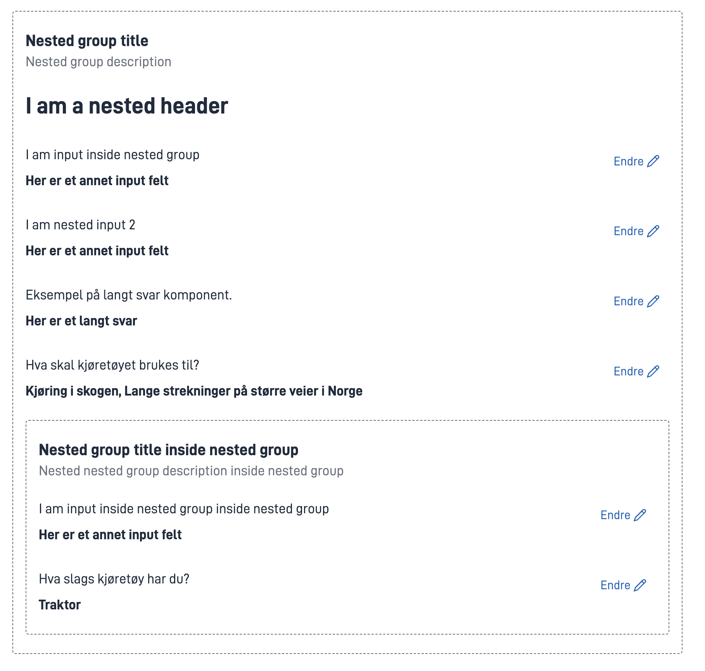

[Detaljer om komponenten](./Summary)

---

## Knapper

Handlingsknapper og navigasjon.

### Send inn (`Button`)
`Button` brukes til å sende inn data, og flytte brukeren videre i prosessen.

[Detaljer om komponenten](./Button)

---

### Egendefinert knapp (`CustomButton`)
`CustomButton` brukes til å trigge egendefinerte handlinger på serveren.

[Detaljer om komponenten](./CustomButton)

---

### Navigasjonslinje (`NavigationBar`)

[Detaljer om komponenten](./NavigationBar)

---

### Navigasjonsknapper (`NavigationButtons`)
`NavigationButtons` brukes til å navigere frem/tilbake mellom sider. Denne komponenten legges automatisk til når du
legger til en ny side i Altinn Studio verktøyet.

[Detaljer om komponenten](./NavigationButtons)

---

### Utskrift (`PrintButton`)
`PrintButton` brukes til å trigge utskriftsvisning av skjema.

[Detaljer om komponenten](./PrintButton)

---

### Forhåndsvis PDF (`PDFPreviewButton`)

[Detaljer om komponenten](./PDFPreviewButton)

---

### Start eksemplar (`InstantiationButton`)
`InstantiationButton` brukes til å starte et eksemplar av en app ved bruk av
[stateless-oppsettet.]()

[Detaljer om komponenten](./InstantiationButton)

---

### Handlingsknapp (`ActionButton`)
`ActionButton` starter en bestemt handling knyttet til den oppgaven i arbeidsflyten som brukerne er på.
Oppgaven kan for eksempel være signering, bekreftelse eller avvisning.

[Detaljer om komponenten](./ActionButton)

---

## Vedlegg

Komponenter for filopplasting.

### Liste over vedlegg (`AttachmentList`)
`AttachmentList` viser en liste over vedlegg som er lastet opp i skjemaet, for den oppgaven de jobber på. Velg om alle
vedlegg skal vises, eller kun et utvalg.

[Detaljer om komponenten](./AttachmentList)

---

### Vedlegg (`FileUpload`)
`FileUpload` lar brukeren laste opp vedlegg. Du kan styre hva slags filtyper som kan lastes opp.

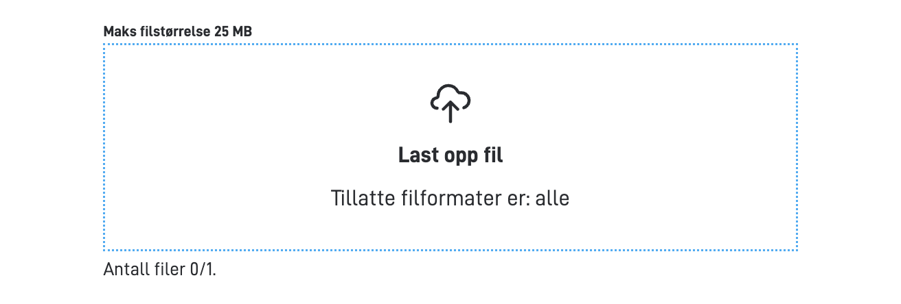

[Detaljer om komponenten](./FileUpload)

---

### Vedlegg med merking (`FileUploadWithTag`)
`FileUploadWithTag` lar brukeren laste opp vedlegg og merke vedlegg med forhåndsdefinerte tagger. Du kan styre hva slags
filtyper som kan lastes opp.

[Detaljer om komponenten](./FileUploadWithTag)

---

### Bildeopplaster (`ImageUpload`)
`ImageUpload` lar brukeren laste opp og ev. beskjære bilder.

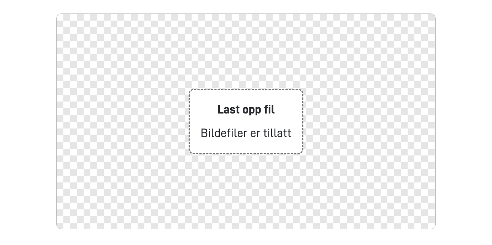

[Detaljer om komponenten](./ImageUpload)

---

## Betaling

Komponenter for betalingsflyt.

### Betaling (`Payment`)

[Detaljer om komponenten](./Payment)

---

### Betalingsdetaljer (`PaymentDetails`)

[Detaljer om komponenten](./PaymentDetails)

---

## Signering

Komponenter for signeringsflyt.

### Signatarliste (`SigneeList`)

[Detaljer om komponenten](./SigneeList)

---

### Signeringshandlinger (`SigningActions`)

[Detaljer om komponenten](./SigningActions)

---

### Signeringsdokumenter (`SigningDocumentList`)

[Detaljer om komponenten](./SigningDocumentList)

---

## Gruppering

Komponenter for å strukturere skjemaet.

### Gruppe (Group)

`Group` brukes til å gruppere komponenter visuelt eller logisk.

[Detaljer om komponenten](./Group)

---

### Rutenett (`Grid`)
`Grid` brukes til å visuelt oppstille komponenter i en tabellvisning.

[Detaljer om komponenten](./Grid)

---

### Trekkspilliste (`Accordion`)

`Accordion` er en sammenleggbar komponent som lar brukeren vise eller skjule innhold.

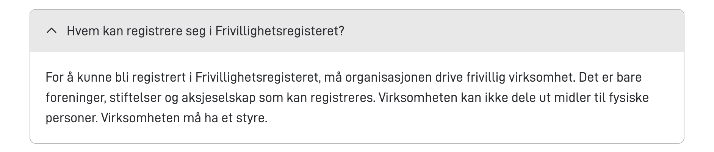

[Detaljer om komponenten](./Accordion)

---

### Nestet trekkspilliste (`AccordionGroup`)

[Detaljer om komponenten](./AccordionGroup)

---

### Knappegruppe (`ButtonGroup`)

[Detaljer om komponenten](./ButtonGroup)

---

### Liste (`List`)

`List` brukes til å presentere innholdsrike data til bruker i tabellformat. Hver rad i tabellen er velgbar. Komponenten
støtter søk, sortering og paginering.

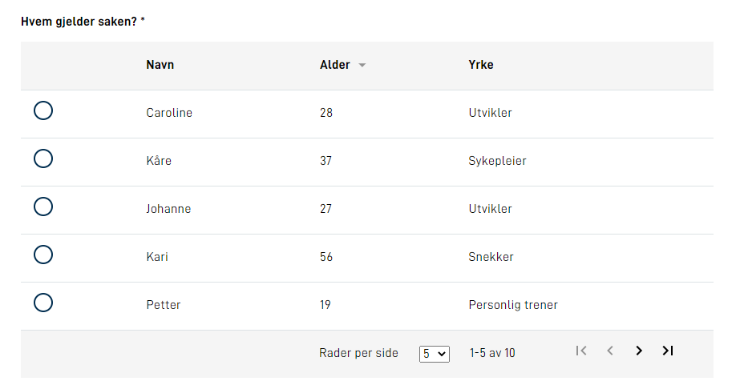

[Detaljer om komponenten](./List)

---

### Repeterende gruppe (`RepeatingGroup`)

[Detaljer om komponenten](./RepeatingGroup)

---

### Enkel tabell (`SimpleTable`)

[Detaljer om komponenten](./SimpleTable)

---

### Cards (`Cards`)
`Cards` brukes til å vise ulike typer innhold (andre komponenter), i en kort-basert layout. Den kan brukes til å vise
informasjon, bilder, lydklipp, videoer, og skjemakomponenter.

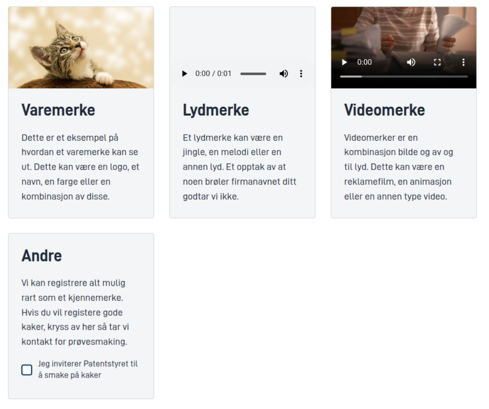

[Detaljer om komponenten](./Cards)

---

### Faner (`Tabs`)
`Tabs` lar deg organisere og bytte mellom ulike innholdsseksjoner ved å klikke på overskriftene. Dette gir en
plasseffektiv og ryddig måte å presentere informasjon på.

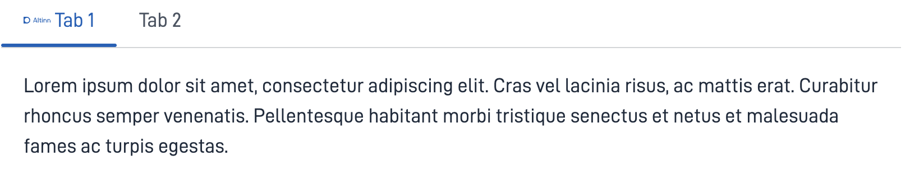

[Detaljer om komponenten](./Tabs.png)

---

## Avansert

Spesialiserte komponenter for avanserte bruksområder.

### Adresse (`Address`)

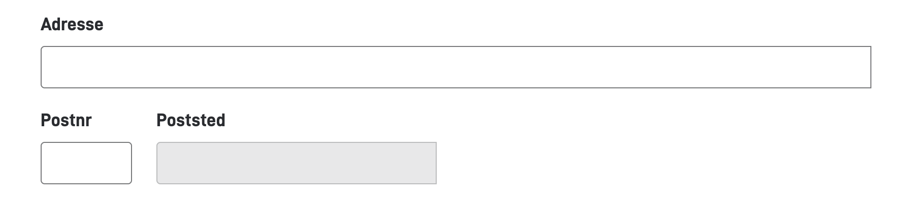

[Detaljer om komponenten](./Address)

---

### Stedfeste i kart (`Map`)

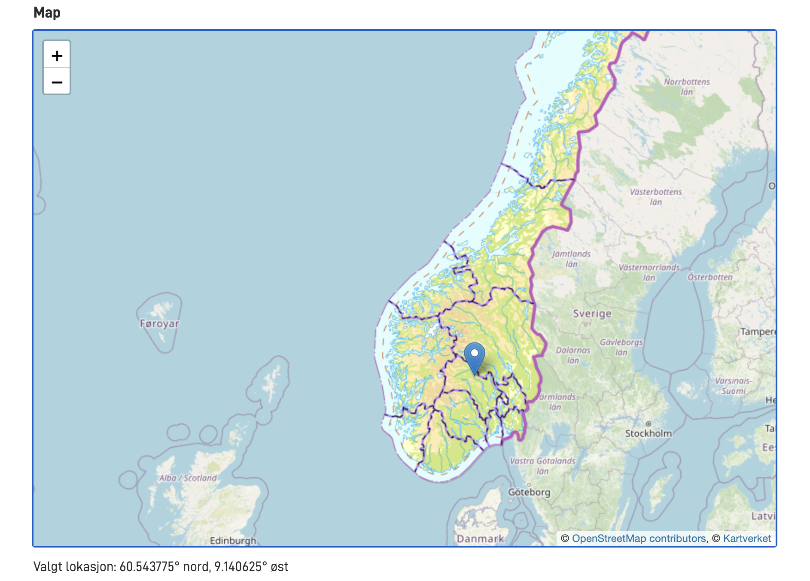

[Detaljer om komponenten](./Map)

---

### Egendefinert (Custom)

[Detaljer om komponenten]()

---

### Tabell for underskjema (`Subform`)

[Detaljer om komponenten]()

---
