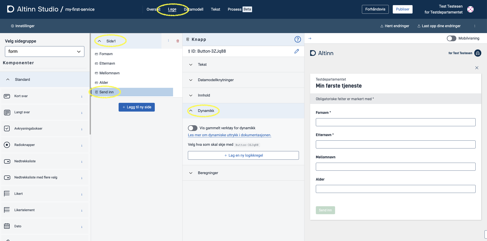
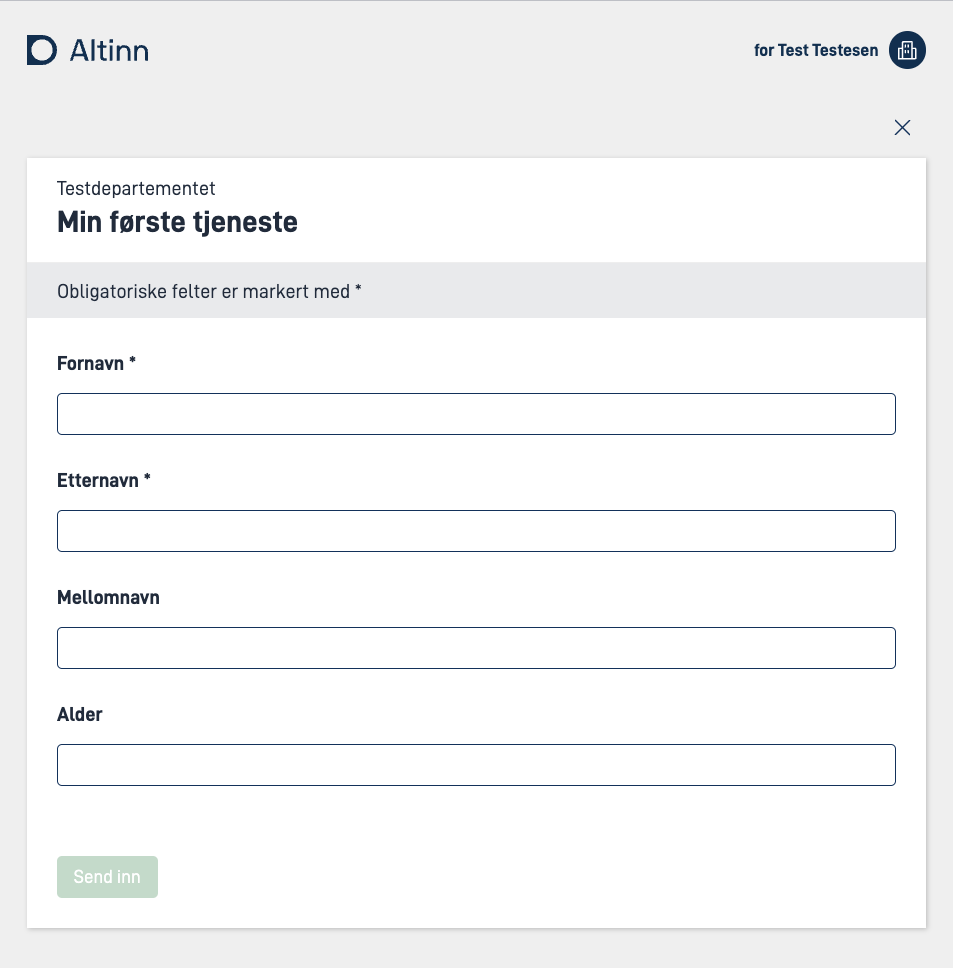
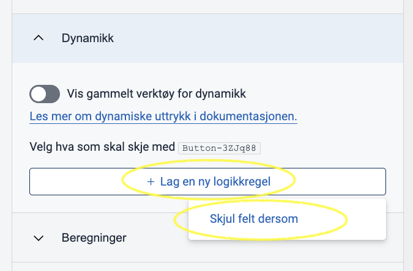
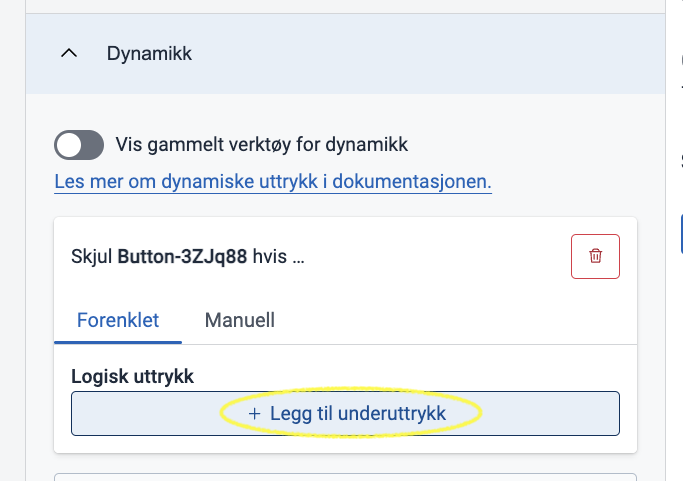
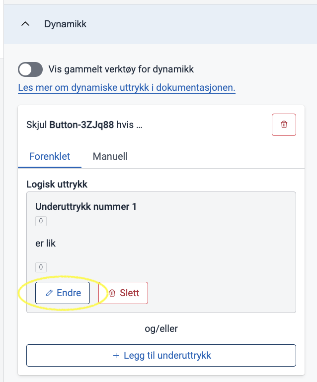
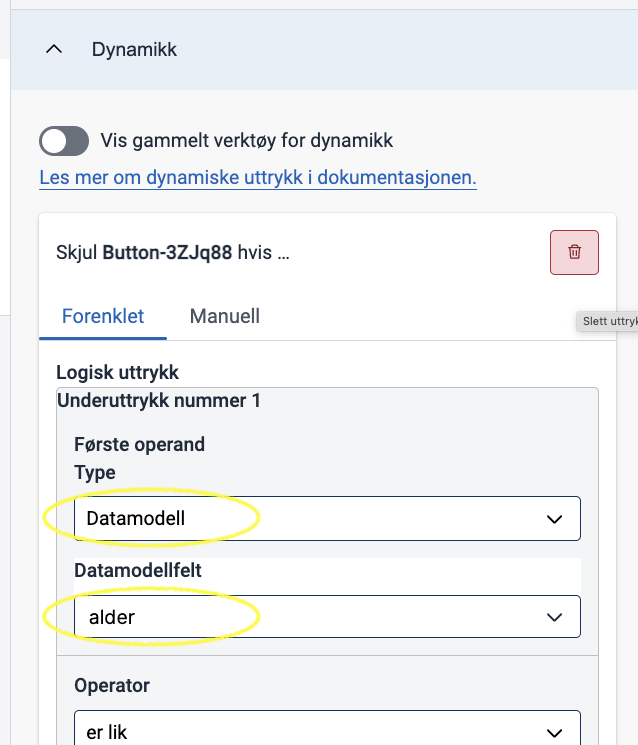
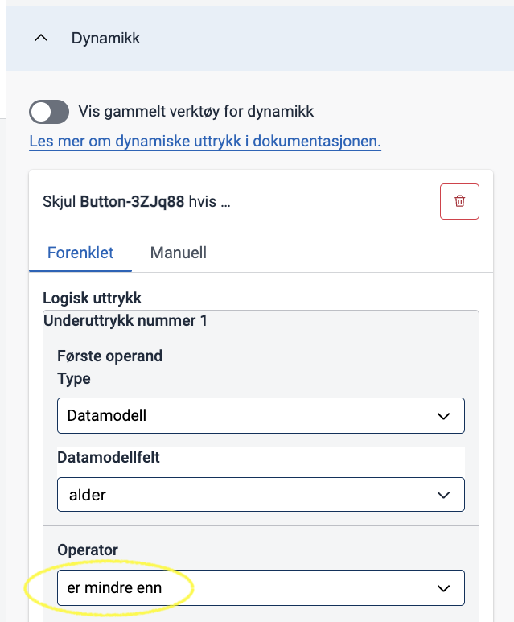
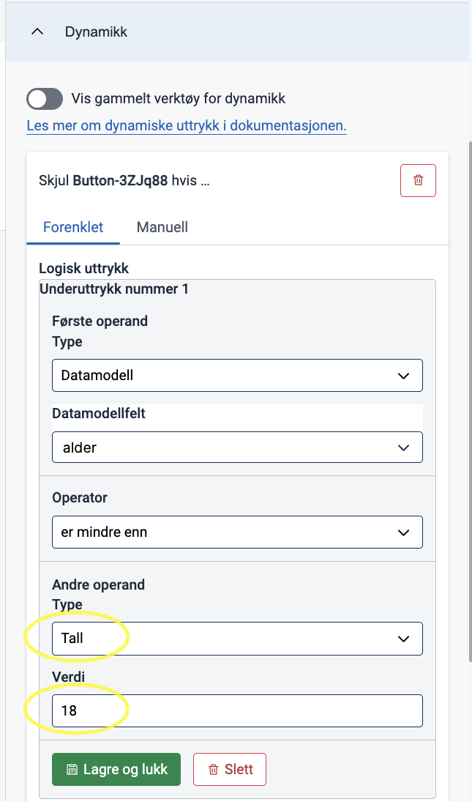
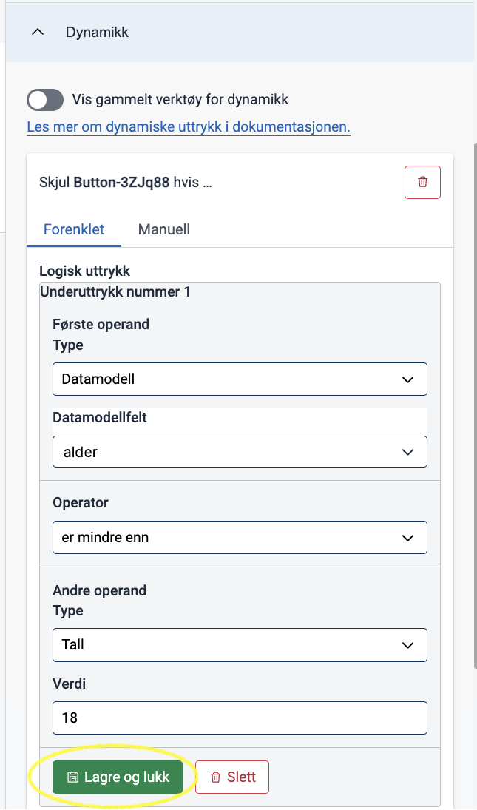
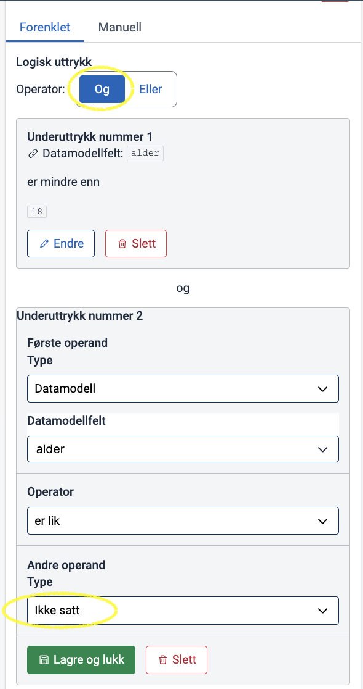

Du kan sette opp dynamikk i skjema ved å bruke uttrykk med dynamikkverktøyet i Altinn Studio.

Uttrykk er et begrep i Altinn-tjenester som lar deg dynamisk tildele verdier til ulike elementer. [Les mer om hva du kan bruke uttrykk til og hvordan syntaksen fungerer](/nb/altinn-studio/v8/reference/logic/expressions/).

## Terminologi

I Altinn Studio kalles konseptet for _logikk_, der et uttrykk omtales som en _logikkregel_.

{}
En enhet som består av et boolsk komponentfelt og det faktiske uttrykket som evalueres til en boolsk verdi når det beregnes i en kjørende app. Det enkleste uttrykket kan bestå av ett enkelt underuttrykk, mens et mer avansert uttrykk kan bestå av flere underuttrykk kombinert med en operator.
{}

{}
En komponent i et skjema har mange forskjellige egenskaper som kan konfigureres. Det er disse vi snakker om her.
Eksempler på egenskaper på en komponent som kan settes dynamisk via uttrykk:
- Feltet skal skjules (`hidden`).
- Feltet skal være skrivebeskyttet (`readOnly`).
- Det skal være påkrevd å fylle ut feltet (`required`).
{}

{}
Et begrep som brukes for å omtale den mest elementære enheten i et uttrykk. Et underuttrykk består av en funksjon og to verdier, der en verdi kan være et enkelt element eller et sammensatt element der den første delen av elementet definerer en kilde hvor den etterfulgte verdien kan bli funnet.

For eksempel:

```
["equals", "a", "b"]
```

er et underuttrykk som sjekker om verdien `"a"` og verdien `"b"` _er like_ ved hjelp av _funksjonen_ `"equals"`. Dette underuttrykket evalueres til den boolske verdien "usann" (`false`), fordi "a" og "b" er ulike.
{}

{}
Verdi som skal brukes i et underuttrykk. Kan være
  - _tall_: en fastsatt tallverdi
  - _tekst_: en fastsatt tekstverdi
  - _sann/usann_
  - _komponent_: verdi som er satt i en bestemt skjemakomponent
  - _datamodell_: verdi som er satt i et bestemt datamodellfelt
  - _instanskontekst_: verdi som er hentet fra et bestemt felt fra metadata om tjenesten
  - _ikke satt_: tomt felt, ingen verdi er satt

{}

{}
Funksjon som sier hvordan de to operandene skal sammenlignes. For eksempel:
  - Er lik
  - Er ikke lik
  - Er større enn
  - Er mindre enn
{}

{}
Brukes til å sette sammen flere underuttrykk.
- **OG**: Alle underuttrykkene må være oppfylt samtidig.
- **ELLER**: Minst ett av underuttrykkene må være oppfylt.
{}

## Bygg uttrykk i Altinn Studio

Fremgangsmåten under tar utgangspunkt i at du
- er inne på **Utforming**-siden for en tjeneste
- har åpnet en side i skjemaet og valgt en komponent du ønsker å konfigurere dynamikk for
- har åpnet **Dynamikk**-seksjonen i konfigurasjonspanelet



Eksempelet som brukes i veiledningen under, baserer seg på følgende skjema:



**Oppgaven**:
> **I dette skjemaet ønsker vi kun å tillate innsending hvis brukeren har fylt ut feltet "Alder", og verdien er større eller lik 18. I alle andre tilfeller ønsker vi derfor å skjule "Send inn"-knappen.**

### Grunnleggende uttrykk

1. Klikk på **Lag en ny logikkregel** og velg hva som skal skje med komponenten. I eksempelet med en knappe-komponent er det eneste alternativet "Skjul felt dersom":
   

2. Velg **Legg til underuttrykk** for å begynne å bygge opp uttrykket.

   

   Det blir lagt til et nytt underuttrykk.

3. Klikk på **Endre** for å redigere underuttrykket.
   

4. Sjekk om _verdien i feltet "Alder"_ er mindre enn 18:
   - I _Første operand_: Velg **Datamodell** fra listen **Type**, og feltet **alder** fra listen **Datamodellfelt**.
     
   - I _Operator_: Velg funksjonen **er mindre enn**.
     
   - I _Andre operand_: Velg **Tall** i listen **Type** og skriv inn `18` i feltet **Verdi**.
     

5. Klikk på **Lagre og lukk** for å lagre underuttrykket.
  

6. Sjekk om feltet "Alder" er tomt:
   - Klikk på **Legg til underuttrykk**.
   - Sjekk at det nye underuttrykket har en _OG_-kobling til det første uttrykket (slik at begge må oppfylles).
   - Gjenta stegene i punkt 4, men med disse endringene:
     - I _Operator_: Velg **Er lik** i stedet for **Mindre enn**.
     - I _Andre operand_: Velg **Ikke satt** i listen **Type**. Ikke sett opp noe mer på den andre operanden.
   

7. Test dynamikken i forhåndsvisningen:
   - **Send inn**-knappen er skjult når **Alder**-feltet er tomt.
   - Hvis du skriver inn for eksempel 20 i feltet **Alder**, vises **Send inn**-knappen.
   - Hvis du skriver inn for eksempel 12 i feltet **Alder**, skjules **Send inn**-knappen.


<!-- {}

Det er også mulighet for å legge til uttrykk ved å skrive dem direkte i syntaksen som forventes av konfigurasjonen
i en kjørende Altinn-applikasjon. Denne funksjonaliteten vil tilbys i Studio UI hvis uttrykket
manuelt legges til feltet gjennom gitea eller en redigerings-IDE, og hvis uttrykket er skrevet på en måte som ikke kan
tolkes av Studios uttrykksverktøy. Dette gjelder [nøstede uttrykk](#Nøsting) samt uttrykk som er skrevet på en forenklet
måte, for eksempel uten å inkludere funksjonen, der det vil bli tolket av app-frontenden implisitt.


Denne alternative uttrykksbyggingen kan også tilgjengliggjøres når som helst mens du bygger uttrykket ditt i Studio
verktøyet. Vær obs på at du ikke når som helst kan gå tilbake til å redigere i uttrykksverktøyet da switchen vil gå i
kun lese modus når uttrykket er i en tilstand hvor det ikke kan tolkes av verktøyet.

Se at switchen er tilgjengelig for å redigere i fritekst:


Trykk på switchen for å kunne redigere uttrykket ditt i fritekst:


Endringer som fører til et ugyldig (eller ikke-tolkbart) uttrykk vil gjøre switchen kun lesbar:


{} -->

## Begrensninger i Studio-verktøyet

Studio-verktøyet har noen begrensninger når du konfigurerer uttrykk.

### Tilgjengelige komponentfelter

Det er bare noen komponentfelter som Studio kan tolke og bygge tilknyttede uttrykk for. Vi jobber med å utvikle dette videre, slik at du kan bygge og tolke uttrykk knyttet til:

- tekstressursbindinger på komponenter
- prosess

### <a name="Nøsting"></a>Nøsting

Studio er begrenset til å bygge uttrykk med bare ett nivå av nøsting. Dette betyr at en verdi i et underuttrykk kun kan være enten en direkte eller indirekte verdi, og ikke et underuttrykk. Hvis verdien er et underuttrykk, vil du ende opp med et "komplekst" uttrykk som i eksempelet ovenfor.

### Eksisterende boolske egenskaper går tapt når uttrykk legges til

Hvis du har definert noen av de boolske egenskapene/feltene på komponenten til å ha en boolsk verdi (`true` eller `false`), og du kobler et uttrykk til det, vil ikke Studio huske denne verdien. Dette betyr at hvis du legger til et uttrykk på et felt som opprinnelig hadde en boolsk verdi, og deretter sletter uttrykket, vil feltet forsvinne fra komponenten og bli vurdert til sin standardverdi.

## Når kan du lagre et uttrykk?

Studio viser bare **Lagre**-knappen når disse betingelsene er oppfylt:

- Du har valgt en komponentegenskap/felt som uttrykket skal være tilknyttet til.
- Du har valgt en funksjon for det første deluttrykket i uttrykket ditt.

Når disse betingelsene er oppfylt, kan du lagre uttrykket uten å fylle inn noen av verdiene. Dette legger til et uttrykk som ser slik ut i den gitte komponentfeltet:

```json
"[KOMPONENTEGENSKAP]": [
"[FUNKSJON]",
null,
null
]
