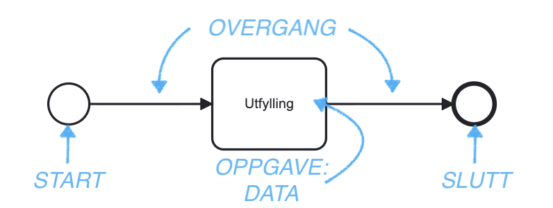

En Altinn app har en forretningsprosess, definert i [BPMN](https://www.bpmn.org/)-notasjon. Denne prosessen styrer hele 
flyten i appen, bl.a. hvilke oppgaver sluttbrukeren skal innom, hvilke oppgaver appen skal gjøre automatisk, og hvilke
sporvalg som skal tas basert på kriteriene som er satt opp.

Dersom det skal lages en instans av en app for en bruker - dvs. at brukeren får et element i sin innboks for appen, med
sine data utfylt, må det defineres minimum én oppgave i appens prosess. 

## Om prosess

Prosessen består av flere forskjellige deler. Enhver prosess må ha en *starthendelse* og en *slutthendelse*. Mellom disse
kan det ligge ulike *oppgaver* og *sporvalg*, som styrer overordnet hva som skal skje.
> Når man oppretter en ny app i Altinn Studio, følger det med en prosess som er ferdig satt 
opp med en oppgave for innsamling av data.

I *overgangene* mellom hendelser/oppgaver kjøres noe standard logikk, som f.eks. valideringer. I tillegg er det mulig
å skrive egen logikk som skal kalles f.eks. på vei ut av en oppgave. 

## Oppgavetyper

Det er definert et sett med oppgavetyper som kan brukes i en Altinn-app. Se kort oversikt under, og les mer om de 
forskjellige oppgavetypene under [📚 Referanse]()

### Datainnsamling (`data`)

### Signering (`signing`)

### Betaling (`payment`)

### Tilbakemelding (`feedback`)

### Bekreftelse (`confirmation`)
