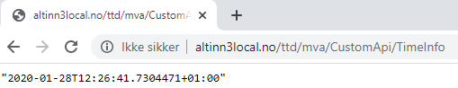

Applikasjonene som utvikles i Altinn Studio baserer seg i dag på [ASP.NET Core](https://learn.microsoft.com/en-us/aspnet/core/introduction-to-aspnet-core) for back-end.
Dette gir høy fleksibilitet til å endre applikasjonene.

## Legge til en API-kontroller

For å eksponere et nytt API i en applikasjon, må du legge til én eller flere API-kontrollere.

Nedenfor ser du et eksempel fra en API-kontroller som er lagt til i en gitt app.
Her setter du opp hvilken sti API-et skal lytte på, og logikken knyttet til dette.

```C# {linenos=false,hl_lines=[8,11]}
using System;
using System.Threading.Tasks;
using Microsoft.AspNetCore.Mvc;

namespace Altinn.App.Api.Controllers
{
    [ApiController]
    [Route("{org}/{app}/CustomApi")]
    public class CustomApiController : ControllerBase
    {
        [HttpGet("TimeInfo")]
        public async Task<ActionResult> Get()
        {
            return Ok(DateTime.Now);
        }
    }
}
```



Du kan se koden i [dette repositoriet](https://altinn.studio/repos/ttd/mva/src/branch/master/App/controllers/CustomApiController.cs).

I dokumentasjonen til ASP.NET kan du lese flere detaljer om [mulighetene for å eksponere API-er](https://learn.microsoft.com/en-us/aspnet/core/web-api/).
