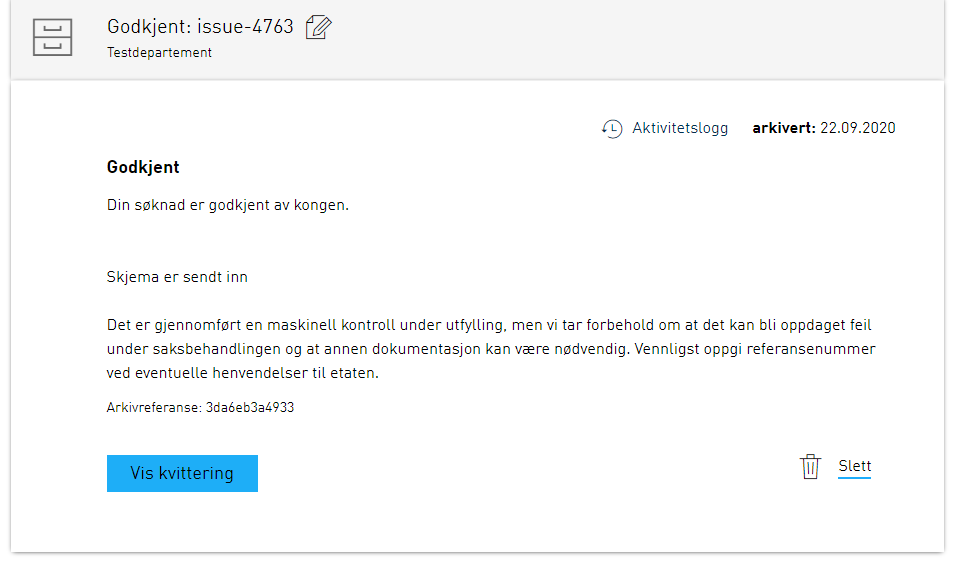
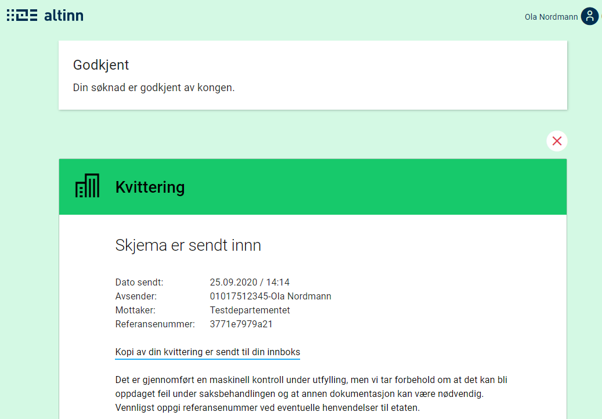

⚠️ Denne siden er foreløpig ikke fullstendig. Mer informasjon vil komme på et senere tidspunkt.

En instansiert applikasjon vil ha et tilhørende instansobjekt. Dette objektet inneholder metadata om den spesifikke instansen.

## Substatus

Som appeier kan du sette en substatus på instansen for å gi sluttbrukeren ytterligere informasjon om hvilken tilstand instansen befinner seg i.
Substatus viser seg både i meldingsboksen i Altinn og på kvitteringssiden.

Substatus er et enkelt objekt som inneholder `label` og `description`. Disse feltene kan enten inneholde ren tekst, eller en tekstnøkkel som referer til applikasjonstekstene. Merk at variabler i tekst ikke støttes for disse tekstene.
I meldingsboksen viser `label` seg i sin helhet hvis den har en lengde på inntil 25 tegn. Hvis `label` består av mer enn 25 tegn, viser den bare de 22 første tegnene, og "..." legges på til slutt.

Eksempel på et substatus-objekt:
```json
{
    "label": "some.label",
    "description": "Beskrivelse i klartekst"
}
```

Under ser du eksempel på hvordan substatus ser ut i meldingsboksen og i kvitteringen, når du setter opp substatusen slik:
```json
{
    "label": "Godkjent",
    "description": "Din søknad er godkjent av kongen."
}
```





## Slette utkast automatisk

Som applikasjonseier kan du i noen tilfeller ønske å slette sluttbrukerens utkast av en tjeneste hvis det har gått en viss tid siden instansiering.
For å oppnå dette, må du gjøre tre ting:

1. Konfigurer applikasjonen slik at tjenesteeier har lov til å slette instanser.
2. Identifiser hvilke instanser som ikke er fullført ved hjelp av spørring mot storage.
3. Slett instans via endepunkt eksponert i applikasjonen.

### Steg 1: Konfigurer applikasjonen

Som standard har ikke tjenesteeier lov til å slette instanser knyttet til en applikasjon.
For å få lov til dette, må du legge til en ny regel i `policy.xml` som finnes i `App/config/authorization`.
Du kan kopiere regelen fra [regelbiblioteket]().

### Steg 2: Identifiser hvilke instanser som ikke er fullført ved hjelp av spørring mot storage

Storage eksponerer et sett med queryparametere som du kan bruke for å hente ut et sett med instanser.
I eksempelet nedenfor får du ut alle instanser som er instansiert av en gitt applikasjon 30. september 2020 eller tidligere,
og som enda står i utfyllingssteget.

Her kan du prøve deg fram for å finne de rette queryparameterene for akkurat tjenesten din:

`HTTP GET https://platform.altinn.no/storage/api/v1/instances?appId={org}/{app}&created=lte:2020-09-30&process.currentTask=Task_1`

### Steg 3: Slett instans via endepunkt eksponert i applikasjonen

Når du har identifisert instansene som skal slettes, er det bare å sende et kall
til applikasjonen for å få slettet disse. Da må du oppgi ID-en på instansene (instanceOwner.partyId/instanceGuid).

`HTTP DELETE https://ttd.apps.altinn.no/ttd/apps-test/instances/{instanceOwner.partyId}/{instanceGuid}`
