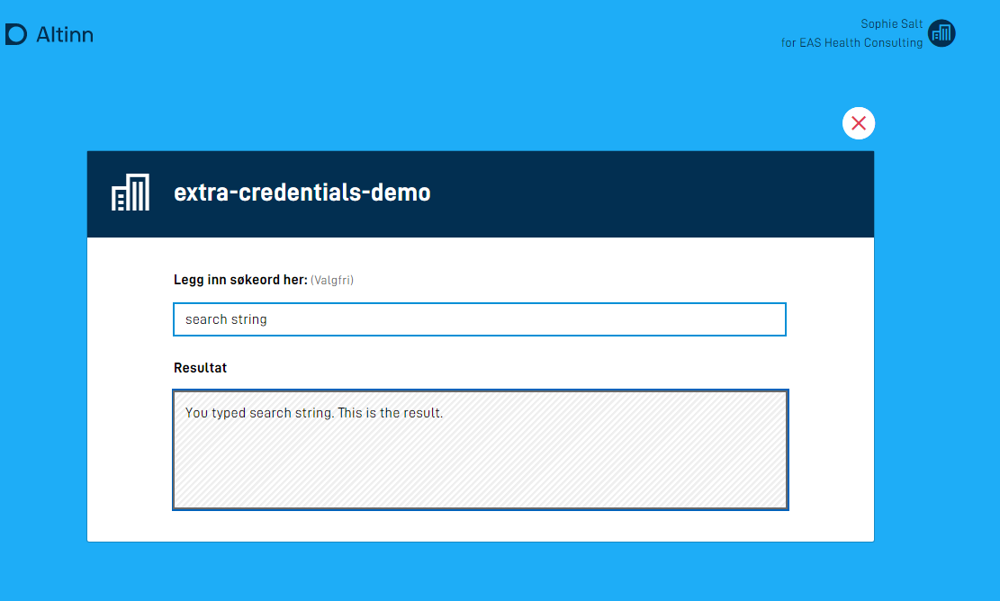
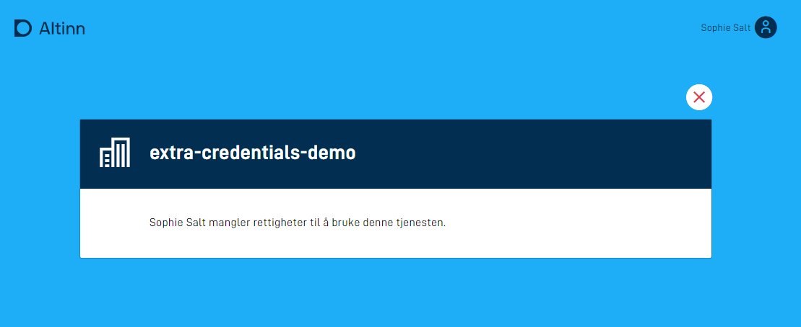
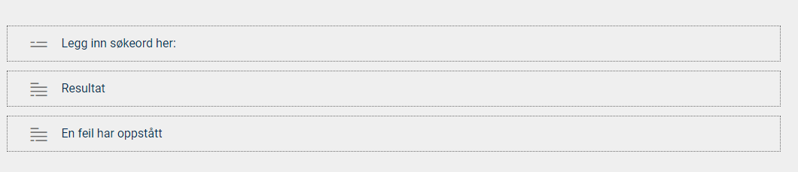

## Introduksjon til stateless apper

En stateless app, eller tilstandsløs app, skiller seg fra vanlige apper ved at den ikke lagrer noe data - hverken skjemadata eller metadata om instanser av appen. Appen havner heller ikke i innboksen til brukeren. En stateless app tilsvarer en innsynstjeneste i Altinn 2.

Stateless apper passer godt som innsynstjenester der en bruker eller et system gjør et oppslag mot en ressurs, eller presenterer data fra en tredjepart basert på identiteten til brukeren. Du kan også konfigurere en stateless-app til å tillate anonyme brukere, det vil si brukere som ikke er pålogget.

## Konfigurasjon

Du kan styre hvordan appen oppfører seg ved oppstart, og konfigurere den som en stateless app. Dette gjør du i filen `applicationmetadata.json`.

Eksempel på konfigurasjon:


App/config/applicationmetadata.json


```json{hl_lines=[31]}
{
  "id": "ttd/stateless-app-demo",
  "org": "ttd",
  "title": {
    "nb": "Stateless App Demo"
  },
  "dataTypes": [
    {
      "id": "ref-data-as-pdf",
      "allowedContentTypes": [
        "application/pdf"
      ],
      "maxCount": 0,
      "minCount": 0
    },
    {
      "id": "Stateless-model",
      "allowedContentTypes": [
        "application/xml"
      ],
      "appLogic": {
        "autoCreate": true,
        "classRef": "Altinn.App.Models.StatelessV1"
      },
      "maxCount": 1,
      "minCount": 1
    }
  ],
  ...
  "onEntry": { "show": "stateless" } // legg til denne linjen
}
```

I feltet `onEntry.show` kan du velge hvilket layoutsett som skal vises når appen starter.

Selve layoutsettet er definert i konfigurasjonsfilen `App/ui/layout-sets.json`. Hvis filen ikke eksisterer, kan du opprette den. [Les mer om layoutsett](/nb/altinn-studio/v8/reference/ux/pages/#oppsett).

Eksempel på layoutsett:


App/ui/layout-sets.json


```json
{
  "$schema": "https://altinncdn.no/toolkits/altinn-app-frontend/4/schemas/json/layout/layout-sets.schema.v1.json",
  "sets": [
    {
      "id": "stateless",
      "dataType": "Stateless-model"
    }
  ]
}
```

I eksempelet over referer layoutsettet `stateless` til datamodellen `Stateless-model`.

Eksempel appstruktur for en app som er satt opp på denne måten:

```text
├───App
    ├───config
    ├───logic
    ├───models
    │       Stateless-model.cs
    │       Stateless-model.metadata.json
    │       Stateless-model.schema.json
    │       Stateless-model.xsd
    ├───ui
        │   layout-sets.json
        │
        └───stateless
            |   RuleConfiguration.json
            │   RuleHandler.js
            │   Settings.json
            │
            └───layouts
                  {page}.json
```

`{page}.json` kan settes opp på samme måte som en vanlig side i appen, og støtter alle komponenter med unntak av:
- Filopplaster
- Knapp

Appens frontend leser konfigurasjonen fra `applicationmetadata.json` og forstår at den ikke skal opprette en instans. I stedet henter den layout-filene og tilhørende datamodeller, og presenterer dem for brukeren.

### Konfigurere tilgang uten innlogging

{}
OBS! Skjemakomponenter som påvirker prosess (knapp for innsending eller instansiering) er ikke støttet for anonyme brukere!

**MERK:** For å bruke denne funksjonaliteten må du bruke versjon >= 5.1.0 av [nuget-pakkene](/nb/altinn-studio/v8/guides/administration/maintainance/dependencies#nuget) `Altinn.App.PlatformServices`, `Altinn.App.Common` og `Altinn.App.Api`.

{}

For å tillate bruk av appen for brukere som ikke er innlogget, følger du stegene beskrevet over. _I tillegg_ må du angi at datatypen som er satt opp til å brukes for statelessvisningen, tillater anonym (ikke innlogget) bruk. Dette gjør du ved å endre det aktuelle `dataType`-elementet i `applicationMetadata.json`. Datatypens `appLogic`-objekt må få en ny innstilling: `"allowAnonymousOnStateless": true`. Se eksempel under:



App/config/applicationmetadata.json


```json{hl_lines=[24]}
{
  "id": "ttd/stateless-app-demo",
  "org": "ttd",
  "title": {
    "nb": "Stateless App Demo"
  },
  "dataTypes": [
    {
      "id": "ref-data-as-pdf",
      "allowedContentTypes": [
        "application/pdf"
      ],
      "maxCount": 0,
      "minCount": 0
    },
    {
      "id": "Stateless-model",
      "allowedContentTypes": [
        "application/xml"
      ],
      "appLogic": {
        "autoCreate": true,
        "classRef": "Altinn.App.Models.StatelessV1",
        "allowAnonymousOnStateless": true
      },
      "maxCount": 1,
      "minCount": 1
    }
  ],
  ...
  "onEntry": { "show": "stateless" } 
}
```

## Fylle ut data

Når du bruker en stateless datatype, kan du fylle ut datamodellen når app-frontend henter skjemadataen.

Første gang frontend henter data (GET), skjer dette i to steg:
1. [Forhåndsutfylling](/nb/altinn-studio/v10/develop-a-service/reference/data/prefill/)
2. [Dataprosessering](/nb/altinn-studio/v10/develop-a-service/data/dataprocessing/)

På påfølgende oppdateringer av samme skjemadata (POST) kjøres ikke prefill på nytt, men kalkuleringen trigges. Dette gjør det mulig å endre dataene basert på det brukeren skriver inn, selv i en stateless tilstand.

Eksempel på en kalkulering som fyller ut datamodellen nevnt i eksempelet over:

```c#
public async Task<bool> ProcessDataRead(Instance instance, Guid? dataId, object data)
{
    if (data.GetType() == typeof(StatelessV1))
    {
        StatelessV1 form = (StatelessV1) data;
        // Her kan du gjøre det du ønsker, for eksempel et API-kall
        // hvis tjenesten skal oppføre seg som en innsynstjeneste.
        form.Fornavn = "Test";
        form.Etternavn = "Testesten";
        return true
    }
    return false;
}
```

## Autorisasjon med tredjepartsløsninger

Tilgangsstyring for stateless apper kan løses med [standard appautorisasjon](/nb/altinn-studio/v10/develop-a-service/reference/configuration/authorization/), der du ved hjelp av Altinn-roller definerer hvem som har tilgang til å bruke tjenesten. Hvis du har behov for ytterligere sikring av tjenesten, kan du skrive logikk for autorisasjon av brukere med tredjepartsløsninger. Dette kan være API-er som er eksponert innenfor egen virksomhet, eller åpne API fra andre tilbydere.

Eksempelet nedenfor bruker Finanstilsynets API til å fastslå om virksomheten som en bruker representerer i Altinn, har tilstrekkelige lisenser til å bruke tjenesten.






[Se kildekoden til appen som eksempelet er basert på](https://altinn.studio/repos/ttd/extra-credentials-demo) (krever bruker i Altinn Studio).

Videre i eksempelet vil betegnelsen *bruker* være synonymt med en virksomhet representert av en person i Altinn.

1. **Utvid datamodellen med felter for autorisasjon**

    I tillegg til et felt for inndata fra brukeren og et felt for å vise resultatet, har vi i dette eksempelet et felt for å holde på informasjon om hvorvidt brukeren er autentisert, og et felt for å holde på en dynamisk feilmelding.

    ```xml
    <xs:sequence>
        <xs:element name="searchString" type="xs:string" />
        <xs:element name="result" type="xs:string" />
        <xs:element name="userAuthorized" type="xs:boolean" />
        <xs:element name="errorMessage" type="xs:string" />
    </xs:sequence>
    ```

    *Hopp til steg 4 hvis appen kun skal brukes via API.*
  
2. **Legg til felt for å vise feilmelding i brukergrensesnittet**

    I brukergrensesnittet til appen er det tre komponenter: Et søkefelt der brukeren skriver inn søkeord, et tekstfelt dedikert til å vise søkeresultatet, og en paragraf som er reservert for feilmeldinger.

    

    Komponentene er koblet til datamodell og tekstressurs på følgende måte i `{page}.json`:


    
    App/ui/layouts/{page}.json
    

    ```json
    "layout": [
      {
        "id": "sokeBoks",
        "type": "Input",
        "textResourceBindings": {
          "title": "SearchString"
        },
        "dataModelBindings": {
          "simpleBinding": "searchString"
        },
        "required": false,
        "readOnly": false
      },
      {
        "id": "resultatBoks",
        "type": "TextArea",
        "textResourceBindings": {
          "title": "Result"
        },
        "dataModelBindings": {
          "simpleBinding": "result"
        },
        "required": false,
        "readOnly": true
      },
      {
        "id": "errorBoks",
        "type": "Paragraph",
        "textResourceBindings": {
          "title": "ErrorMessage"
        },
        "required": false,
        "readOnly": true
      }
    ]
    ```

3. **Legg inn dynamikkregler for å vise/skjule felter**

    Vi bruker dynamikkregler til å vise/skjule felter avhengig av om en bruker er autorisert eller ikke.

    Det er lagt inn en dynamikkregel i `RuleHandler.js` som sjekker om et felt i datamodellen har verdien `false`. [Les mer om hvordan du konfigurerer dynamikkregler](/nb/altinn-studio/v10/develop-a-service/look-and-feel/dynamics/).

    I `RuleConfiguration.json` ser du hvordan regelen brukes. Hvis inputverdien fra datamodellen `userAuthorized` er false, vises errorBoks-komponenten, mens det motsatte skjer med søke- og resultatfeltene - disse skjules.

    Standard oppførsel er det motsatte, altså at søk og resultat er synlig, mens error-feltet er skjult.

    ```json
    {
      "data": {
        "ruleConnection": {},
        "conditionalRendering": {
          "e2dd8ff0-f8f1-11eb-b2bc-5b40a942c260": {
            "selectedFunction": "isFalse",
            "inputParams": {
              "value": "userAuthorized"
            },
            "selectedAction": "Show",
            "selectedFields": {
              "e2dd68e0-f8f1-11eb-b2bc-5b40a942c260": "errorBoks"
            }
          },
          "e2dd8ff0-f8f1-11eb-b2bc-5b40a942c261": {
            "selectedFunction": "isFalse",
            "inputParams": {
              "value": "userAuthorized"
            },
            "selectedAction": "Hide",
            "selectedFields": {
              "e2dd68e0-f8f1-11eb-b2bc-5b40a942c261": "sokeBoks",
              "e2dd68e0-f8f1-11eb-b2bc-5b40a942c262": "resultatBoks"
            }
          }
        }
      }
    }
    ```

4. **Legg til tekstressurser**

   I tillegg til navnet på tjenesten er det lagt inn tre tekstressurser.

   Tekstressursen for feilmelding inneholder en plassholder for navnet på brukeren. Variabelen `errorMessage` legges inn i datamodellen når det registreres at en bruker ikke er autorisert til å bruke tjenesten.

    ```json
     {
      "id": "ErrorMessage",
      "value": "{0} mangler rettigheter til å bruke denne tjenesten.",
      "variables": [
        {
          "key": "errorMessage",
          "dataSource": "dataModel.lookup"
        }
      ]
    },
    {
      "id": "Result",
      "value": "Resultat"
    },
    {
      "id": "SearchString",
      "value": "Legg inn søkeord her:"
    },
    ```
5. **Legg til autorisasjonslogikk**

    All behandling av data for stateless apper ligger i filen `App\logic\DataProcessing\DataProcessingHandler.cs`, og det er her autorisasjonslogikken skal plasseres.

    Logikk for å slå opp data og autorisere brukeren ligger i metoden `ProcessDataRead`. Denne kalles hver gang en bruker åpner appen eller sender inn inputdata.

    ```cs
     public async Task<bool> ProcessDataRead(Instance instance, Guid? dataId, object data)
     {
         lookup lookup = (lookup)data;
         
         // Check if user is authorized to use service
         Party party = await _register.GetParty(int.Parse(instance.InstanceOwner.PartyId)); 

         if (string.IsNullOrEmpty(party.OrgNumber) || !await _finanstilsynet.HasReqiuiredLicence(_settings.LicenseCode, party.OrgNumber))
         {
             lookup.userAuthorized = false;
             lookup.errorMessage = $"{party.Name}";
             return true;
         }         
          
         // logic for looking up data
         if (!string.IsNullOrEmpty(lookup.searchString))
         {
             lookup.result = $"You typed \"{lookup.searchString}\". This is the result.";
             return true;
         }

         return false;
     }
    ```

    Metoden starter med logikk for å hente ut skjemadataen slik at denne kan brukes videre i metoden.

    ```cs
    lookup lookup = (lookup)data
    ```

    Videre kommer logikken for å sjekke om brukeren er autorisert.

    ```cs
    // Check if user is authorized to use service
    Party party = await _register.GetParty(int.Parse(instance.InstanceOwner.PartyId))

    if (string.IsNullOrEmpty(party.OrgNumber) || !await _finanstilsynet.HasReqiuiredLicence(_settings.LicenseCode, party.OrgNumber))
    {
        lookup.userAuthorized = false;
        lookup.errorMessage = $"{party.Name}";
        return true;
    }
    ```

    For å vite hvem brukeren er, bruker vi identifikatoren `instance.InstanceOwner.PartyId`, som metoden mottar som parameter. Vi slår opp i Altinn sitt register for å hente ut party-objektet som representerer brukeren. Dette kan inneholde en organisasjon eller en person.

    ```cs
    Party party = await _register.GetParty(int.Parse(instance.InstanceOwner.PartyId))
    ```

    Det gjøres to sjekker for å avgjøre om en bruker er autorisert eller ikke. Først verifiseres det at party-objektet har definert et organisasjonsnummer. Hvis dette ikke er tilfellet, er brukeren en person, og dermed ikke autorisert.

    Den andre sjekken kaller `_finanstilsynet.HasReqiuiredLicence()`, en metode som slår opp i Finanstilsynets API for å avgjøre om organisasjonen har en gitt lisens. Implementasjonen av servicen er tilgjengelig [her](https://altinn.studio/repos/ttd/extra-credentials-demo/src/branch/master/App/services/FinanstilsynetService.cs).

    Hvis ingen av sjekkene er vellykkede, fyller metoden to felter i datamodellen:
    - en indikator på at brukeren ikke er autorisert
    - en feilmelding, her kun navnet til brukeren

    og metoden returnerer `true` for å indikere at dataverdiene er oppdatert.

    ```cs
    lookup.userAuthorized = false;
    lookup.errorMessage = $"{party.Name}";
    return true;
    ```

    Helt til slutt kommer logikken for å vise et resultat basert på søkestrengen.

    ```cs
    // logic for looking up data
    if (!string.IsNullOrEmpty(lookup.searchString))
    {
        lookup.result = $"You typed \"{lookup.searchString}\". This is the result.";
        return true;
    }

    return false;
    ```

    `lookup.result` fylles med verdien av oppslaget. I dette tilfellet skriver vi bare søkestrengen tilbake til brukeren. Igjen returnerer metoden `true` for å indikere at en dataverdi er endret, og `false` hvis dette ikke er tilfellet.

## Starte instans fra et stateless skjema

{}

Dette er helt ny funksjonalitet. Oppsett må gjøres manuelt inntil videre og vil ikke være støttet i Altinn Studio.

**MERK:** For å bruke denne funksjonaliteten må du bruke versjon >= 4.17.2 av [nuget-pakkene](/nb/altinn-studio/v8/guides/administration/maintainance/dependencies#nuget) `Altinn.App.PlatformServices`, `Altinn.App.Common` og `Altinn.App.Api`.

{}

Fra en stateless app kan du bruke `InstantiationButton`-komponenten til å starte en instans. Foreløpig støtter vi kun å starte en instans innad i samme appen som statelessskjemaet vises i. Muligheten til å starte en instans i en annen app kommer senere.

Det er laget en eksempelapp som er satt opp som en innsynstjeneste hvor brukeren kan velge å starte en instans på den aktuelle appen. Denne kan brukes til inspirasjon for videre utvikling. [Se appen med kildekode](https://altinn.studio/repos/ttd/start-from-stateless).

### Instansiere med prefill

Et bruksområde for å starte en instans fra en stateless visning kan være at du først ønsker at appen skal oppføre seg som en innsynstjeneste der brukeren blir presentert for aktuelle data. Fra disse dataene kan brukeren velge å gå videre, og appen går da over til en vanlig innsendingstjeneste.

For å få til en slik flyt må du først sette opp appen som en stateless app som beskrevet under [konfigurasjon](#konfigurasjon). Når dette er gjort, kan du utvide statelessvisningen til å inkludere `InstantiationButton`, som starter en ny instans når brukeren klikker på knappen. Standard oppførsel for denne knappen er å sende inn hele datamodellen som brukeren har brukt, som en del av instansieringen under feltet `prefill`. Hvis du ønsker å velge ut deler av datamodellen som er brukt i det statelesssteget, kan du også gjøre det ved å legge til `mapping` på `InstantiationButton`-komponenten. For eksempel:

```json
 {
    "id": "instantiation-button",
    "type": "InstantiationButton",
    "textResourceBindings": {
      "title": "Start instans"
    },
    "mapping": {
      "some.source.field": "name",
      "some.other.field": "id"
    }
  }
```

Når brukeren velger å starte en instans, henter app-frontend ut feltene `some.source.field` og `some.other.field` fra datamodellen i det statelesssteget, og mapper disse mot feltene `name` og `id` som sendes med i instansieringskallet for appen. Eksempel på request som går mot backend, som du kan mappe over datamodellen du bruker i innsendingsdelen av appen:

```json
{
    "prefill": {
        "name": "Ola Nordmann",
        "id": "12345"
    },
    ...
}

```

Denne prefill-verdien kan du bruke i metoden `DataCreation` i `InstantiationHandler.cs` for å mappe mot feltene du trenger som en del av innsendingsdelen av appen under instansieringen. Eksempel:

```c#
public async Task DataCreation(Instance instance, object data, Dictionary<string, string> prefill)
  {
      if (data.GetType() == typeof(MessageV1))
      {
          string name = "";
          string id = "";
          if (prefill.ContainsKey("name")) {
              name = prefill["name"];
          }
          if (prefill.ContainsKey("id")) {
              id = prefill["id"];
          }
          MessageV1 skjema = (MessageV1)data;
          skjema.Sender = name;
          skjema.Reference = id;
      }            
      await Task.CompletedTask;
  }
```

#### Instansiere fra en repeterende gruppe

Hvis du i det statelesssteget ønsker at brukeren for eksempel velger et element fra en repeterende gruppe og jobber videre på et gitt element, kan du sette opp `InstantiationButton`-komponenten som en del av den repeterende gruppen. Her kan du konfigurere instansieringsknappen til å mappe felter fra den gitte indeksen brukeren velger å starte en instans fra. Dette krever at du setter opp mapping-feltene med en indeks på den aktuelle gruppen. Eksempel:

```json
 {
    "id": "instantiation-button",
    "type": "InstantiationButton",
    "textResourceBindings": {
      "title": "Start ny instans"
    },
    "mapping": {
      "people[{0}].name": "name",
      "people[{0}].age": "age"
    }
  }
```

I den repeterende gruppen blir `{0}` erstattet med den aktuelle indeksen på gruppen brukeren ønsker å starte fra.
