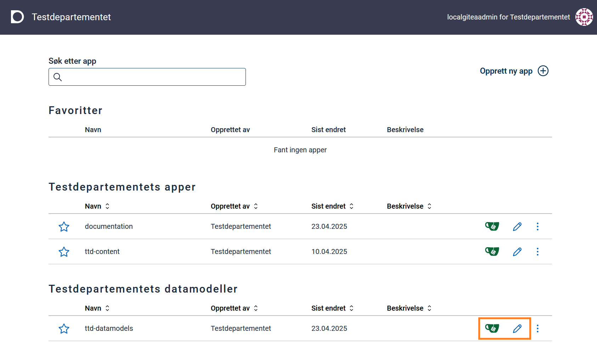
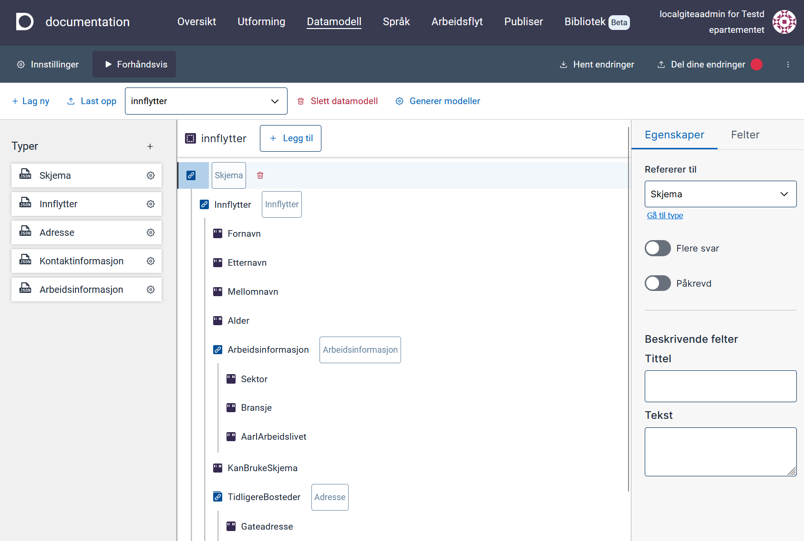
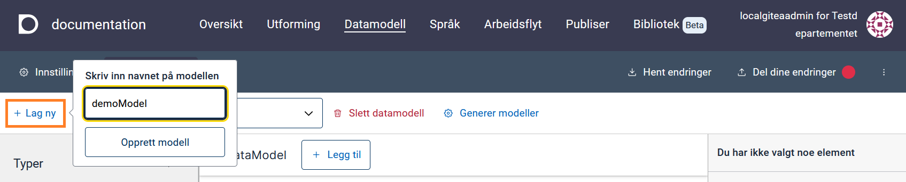
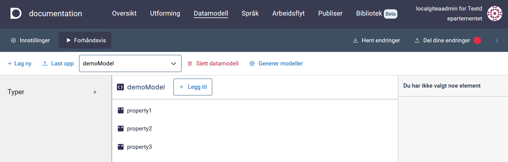
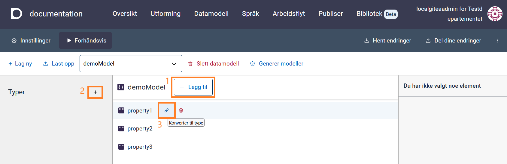
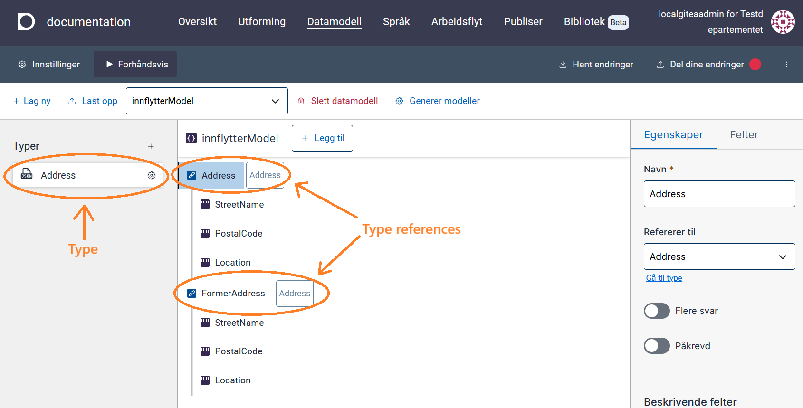

## Datamodeller

### Datamodeller for applikasjoner

Datamodeller for applikasjoner ligger lagret i [Altinn Studio repository](https://altinn.studio/repos) under `App/models` i filstrukturen til appen.

En applikasjon har fire modellfiler:

- **C# datamodell** (`<model>.cs`): Datamodell som brukes av applikasjonens backend og API-er til å behandle og validere data.
- **JSON schema** (`<model>.schema.json`): Datamodell i JSON schema-format som brukes av applikasjonen på klientsiden (frontend) til å validere data fortløpende. Dette er filen du jobber med i datamodelleringsverktøyet.
- **XSD datamodell** (`<model>.xsd`): Datamodell i XML-format som definerer hvilke elementer som kan brukes i et dokument. Denne brukes ikke direkte av applikasjonen, men kan lastes opp for å generere de andre modellfilene i Altinn Studio, eller lastes ned ved behov til for eksempel mottakssystemer.
- **JSON-metadata** (`<model>.metadata.json`): Brukes av Altinn Studio til å generere `<model>.cs`-filen. Denne filen lagres ikke i applikasjonen og genereres kun ved behov.

### Datamodeller for organisasjoner

Datamodeller for organisasjoner ligger i Altinn Studio sin [repos-løsning](https://altinn.studio/repos). For å få tilgang til disse må du logge inn med Altinn Studio-bruker. Hvis du bruker Altinn Studio for første gang, må du [lage en bruker]().

Datamodellene ligger i `<org>-datamodels`-repoet, hvor `<org>` er organisasjonen du tilhører. For eksempel ligger datamodellene til organisasjonen Testdepartementet (ttd) under
https://altinn.studio/repos/ttd/ttd-datamodels.

Du finner lenken til dette repoet i [Altinn Studio Dashboard](). Velg **Rediger** (blått blyant-ikon) for å komme til Altinn Studio-verktøyet for datamodellering. Velg **Gitea** (grønt kopp-ikon) for å se filene direkte i repoet.

#### Tilgang til datamodellene

Alle kan se datamodellene til en organisasjon som standard. For å få tilgang til å redigere datamodellene må brukeren være del av Datamodels-teamet i organisasjonen. Se [tilgangsstyring]() for mer informasjon.

#### Laste opp XSD til repo

Du kan laste opp XSD direkte i [datamodelleringsverktøyet](#laste-opp-og-vise-datamodell).

Hvis du kun skal laste opp XSD for lagring og ikke skal redigere modellen i verktøyet, kan du laste opp XSD-filer direkte til `<org>-datamodels`-repoet:

1. Naviger til ønsket mappe.
2. Velg **Add file** → **Upload file**.
3. Skriv inn mappenavn du ønsker å bruke (valgfritt) i tekstfeltet som dukker opp øverst.
4. Last opp filen.
5. Scroll ned og skriv eventuelt en melding om hva slags fil det er.
6. Klikk på **Commit changes** for å bekrefte.

## Datamodelleringsverktøyet

Datamodelleringsverktøyet i Altinn Studio bruker datamodeller i JSON schema-format. Ut fra dette kan verktøyet generere XSD- og C#-modeller (se [datamodeller for applikasjoner](#datamodeller-for-applikasjoner)).

{}

- [Registrerte feil og mangler for datamodelleringsverktøyet](https://github.com/orgs/Altinn/projects/1/views/10)
- [Planlagt ny funksjonalitet for datamodelleringsverktøyet](https://github.com/orgs/Altinn/projects/1/views/6)
- [Utvikling av datamodell for Altinn 2](/altinn-studio/v8/guides/altinn-2/altinn-2-datamodel/)
- [Overgang fra Seres til Altinn Studio]()
{}

### Åpne datamodelleringsverktøyet

1. Logg inn i Altinn Studio. Hvis du ikke er i [Altinn Studio Dashboard](), klikk på logoen øverst i venstre hjørne eller gå til [altinn.studio/dashboard](https://altinn.studio/dashboard).
2. Velg **Rediger** (blått blyant-ikon) ved enten en app under «Mine applikasjoner», eller datamodellerings-repoet for organisasjonen din.
3. Velg fanen **Datamodell** i toppmenyen.

## Laste opp og vise datamodell

Datamodellen definerer hvilke data som kan sendes inn via appen, og hvilket format dataene skal ha. Verktøyet støtter opplasting av XSD-datamodell. Når du laster opp en XSD-modell (`<model>.xsd`), genererer verktøyet følgende filer: `<model>.cs` og `<model>.schema.json` (se [datamodell-filer](#datamodeller-for-applikasjoner)).

{}
Du må være medlem av en organisasjon for å laste opp datamodeller.
{}

Slik laster du opp en datamodell:

1. Klikk på **Last opp datamodell** fra Datamodell-siden hvis det ikke finnes noen eksisterende datamodeller, eller **Last opp** fra verktøylinjen øverst i verktøyet.
2. Velg en XSD-datamodell-fil i filvelgeren.
3. Klikk på **Last opp**.

Etter at datamodellen er prosessert, finner du de genererte filene under `App/models/` i app-repositoryet.

Typer som er definert i datamodellen vises i panelet på venstre side. Du kan åpne trevisning av datamodellen for å se en visuell representasjon av datamodellen og feltene som er tilgjengelige.

## Velge modell fra nedtrekkslisten

Nedtrekkslisten har to kategorier:

- **XSD**: Viser XSD-modeller uten tilhørende JSON schema-modellfil. Når du velger en modell fra XSD-listen, importeres den automatisk inn i verktøyet, og en JSON schema-fil genereres. Deretter kan du jobbe videre med modellen i verktøyet.
- **JSON Schema**: Modeller generert etter prosessering av opplastede XSD-filer.

{}
Kun datamodeller som ligger i `App/models` i repositoriet vises i nedtrekkslisten.
{}

## Lage ny datamodell

Slik lager du en ny datamodell fra bunnen:

1. Klikk på **Lag ny** til venstre på verktøylinjen.
2. Skriv inn navnet på datamodellen.
3. Klikk på **Opprett modell**.

Datamodellen opprettes med noen eksempelfelt som du kan jobbe videre med eller slette:

- `property1` (tekst, påkrevd)
- `property2` (tekst, påkrevd)
- `property3` (tekst)

## Redigere datamodell

Velg modellen du ønsker å redigere fra nedtrekkslisten på verktøylinjen.

{}
JSON schema-modellen lagres automatisk mens du jobber med den. For å generere andre modellfiler i XSD- og C#-format må du klikke på knappen **Generer modeller** på verktøylinjen (se [Generere modellfiler](#generere-og-laste-ned-modellfiler-xsd-og-c)).
{}

### Legge til felt

For å legge til felt på øverste nivå (rot-node), klikk **Legg til** (**1** i bildet under).

Du kan legge til underfelt på felter av type Objekt ved å klikke på **+**-knappen til høyre for feltnavnet, eller ved å klikke på feltet og velge fanen **Felter** i panelet til høyre.

### Legge til type

Klikk på **+**-tegnet i «Typer»-panelet på venstre side (**2** i bildet under).

### Konvertere felt til type

Et felt kan konverteres til en type ved å klikke på referanse-ikonet til høyre for feltet (**3** i bildet under).

### Redigere type

1. Klikk på typen du ønsker å redigere. En trevisning for typen vises i midten.
2. Rediger egenskaper for typen i panelet til høyre.
3. Klikk **Legg til** øverst for å legge til felter på typen.
4. Velg felter fra typen for å redigere egenskaper for disse i høyre-panelet.
5. Lukk redigering av typer ved å klikke på **Tilbake til datamodell** øverst i modell-panelet.

### Slette type

1. Velg ønsket type fra panelet på venstre side.
2. Klikk på **Slett**-knappen ved det øverste feltet (rot-noden) på typen.

Du kan ikke slette typer som er i bruk.

### Typereferanser

En typereferanse er et felt som følger strukturen til en egendefinert type. For eksempel, hvis du har typen `Adresse` med feltene `Gateadresse`, `Postnummer` og `Sted`, vil en referanse til denne typen automatisk legge til disse feltene. Typen vises ved siden av feltnavnet i trevisningen.

### Legge til typereferanse

Dra og slipp en type fra panelet på venstresiden inn i trevisningen (midtseksjonen). Dette oppretter et nytt felt med den valgte typen.

Du kan også legge en typereferanse til et underordnet felt ved å dra typen inn i det overordnede feltet.

{}
For å legge til elementer under et felt (node) må feltet være av typen Objekt.
{}

### Slette felt

Klikk på **Slett**-knappen til høyre for feltnavnet.

### Redigere egenskaper for felt

1. Klikk på noden eller feltet du ønsker å redigere for å få opp egenskaper i høyre-panelet.
2. Rediger egenskapene for noden eller feltet som ønsket. Tilgjengelige egenskaper for feltet varierer basert på basistypen for feltet.

### Redigere eller legge til XSD-attributter, namespaces og dataFormatId/dataFormatVersion

Dette støttes ikke direkte i verktøyet og må gjøres manuelt. Beskrivelser for hvordan dette gjøres finnes i lenkene under:

- [dataFormatId og dataFormatVersion]()
- [XSD-attributter generelt]()
- [XSD namespaces]()

## Generere og laste ned modellfiler (XSD og C#)

Når modellen er klar kan du generere modellfiler:

1. Klikk på knappen **Generer modeller** over det høyre panelet. Både XSD- og C#-modellfiler genereres.
2. Klikk på **Del dine endringer** til høyre i hovedmenyen til Altinn Studio for å lagre endringene dine.

Slik laster du ned en generert XSD-fil:

1. Klikk på person-ikonet øverst til høyre på siden.
2. Velg **Åpne repository**.
3. Naviger til ønsket fil i `App/models/`.
4. Klikk på nedlastingsikonet.

