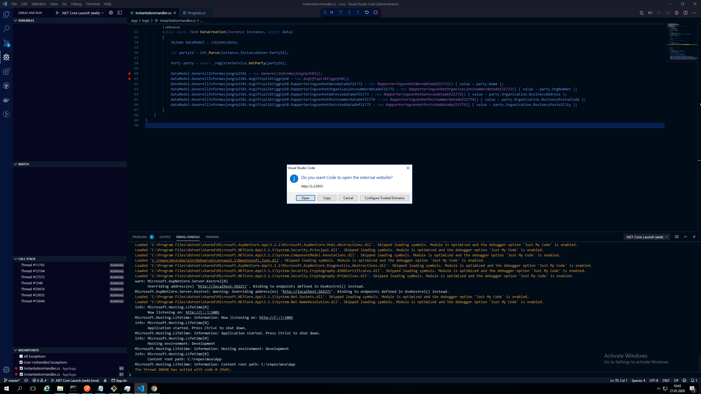
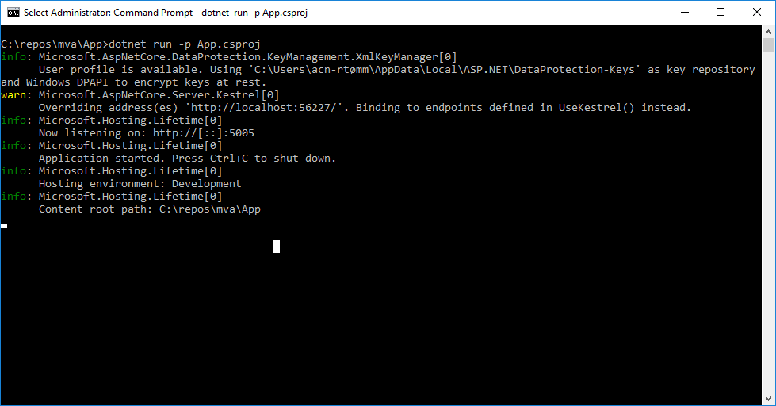
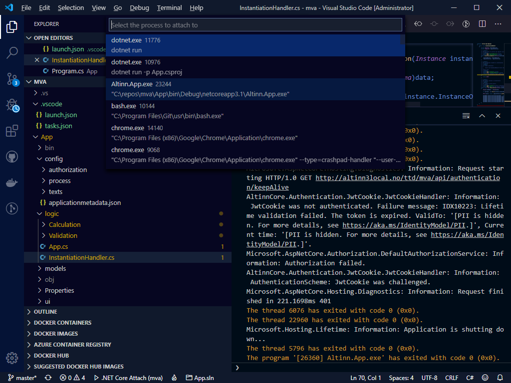
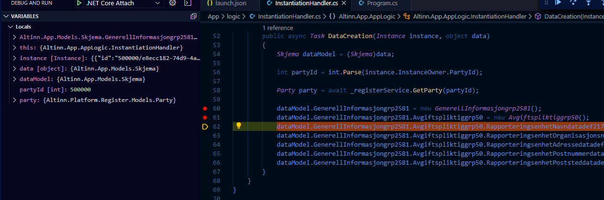
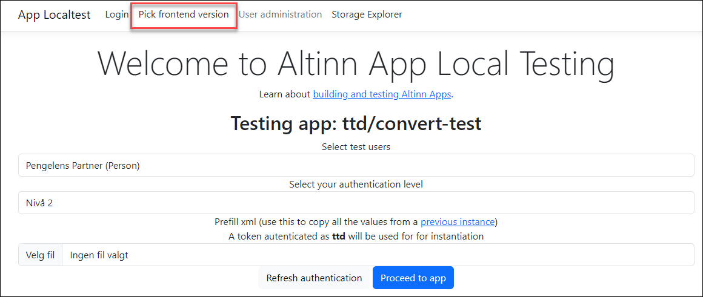

Følgende beskrivelse forutsetter at du har klonet applikasjonen fra Altinn Studio Repositories og har filene liggende på lokal harddisk.

## Debugging i Visual Studio Code

For å debugge applikasjonen lokalt må du åpne applikasjonsprosjektet i Visual Studio Code.
Velg åpne mappe og bla deg frem til hvor repositoriet er lagret på maskinen din.

Velg debugging-knappen til venstre i den vertikale menyen.

Det er to måter å starte debugging av en applikasjon lokalt:

### Starte appen fra Visual Studio Code (.NET Core Launch)

Denne metoden er den enkleste. Her vil Visual Studio Code starte applikasjonen og koble seg til i én og samme prosess.

Velg .NET Core Launch og klikk på den grønne "play"-knappen.

Applikasjonen vil da starte og den vil spørre om du skal starte en nettleser. Velg bare close.

Åpne et nettleservindu og gå til http://local.altinn.cloud (forutsetter at du har startet lokal utviklingsplattform).

### Starte appen fra kommandovindu

Dette forutsetter at du har startet applikasjonen allerede.
Gå til mappen hvor applikasjonen ligger og kjør kommando for å starte dotnet-prosessen.

I Visual Studio Code, åpne mappen med applikasjonsprosjektet. Koble deg til prosessen som heter Altinn.App.exe

## Legge til breakpoints og analysere kode

Sett breakpoints i koden der du vil at debuggeren skal stoppe.

Der debuggeren stopper kan du analysere lokale verdier på objekter for å finne ut hvordan koden fungerer og eventuelt finne feil.

Les mer om debugging i Visual Studio Code i [dokumentasjonen til code](https://code.visualstudio.com/docs/editor/debugging).

## Endre frontend-versjon

Hvis du har et lokalt utviklingsmiljø for [frontend-applikasjonen](https://github.com/Altinn/app-frontend-react/), eller hvis du ønsker å teste med en spesifikk versjon av frontend, kan dette gjøres ved å endre den kjørende frontend-versjonen fra lenken på forsiden av local.altinn.cloud:

{}
**MERK:** Dette virker bare hvis du har beholdt standardstien for lasting av frontend-applikasjonens JavaScript-fil i `Index.cshtml`-filen i appen du jobber med. Hvis du har endret til å bruke en annen sti, vil dette overstyre eventuelle endringer du gjør via local.altinn.cloud.
{}
