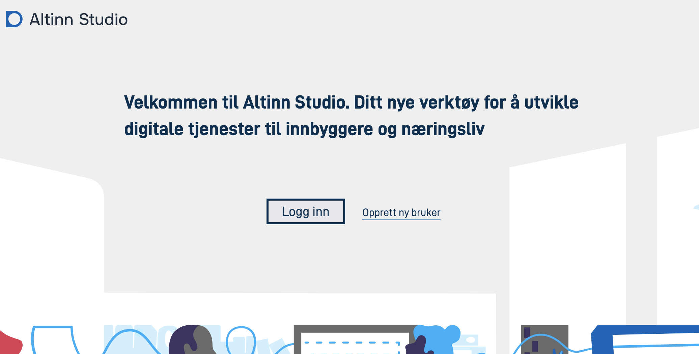
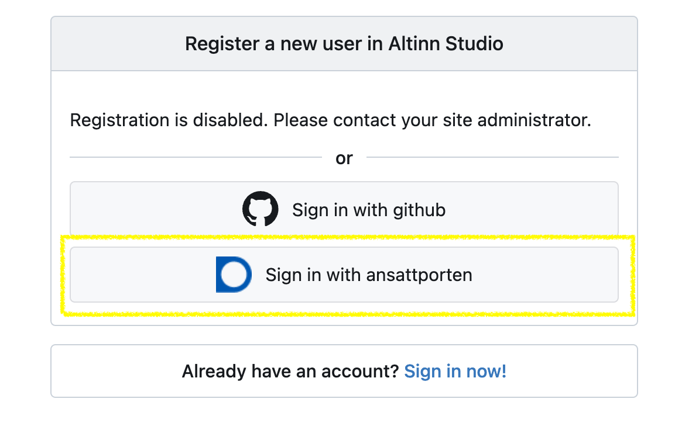
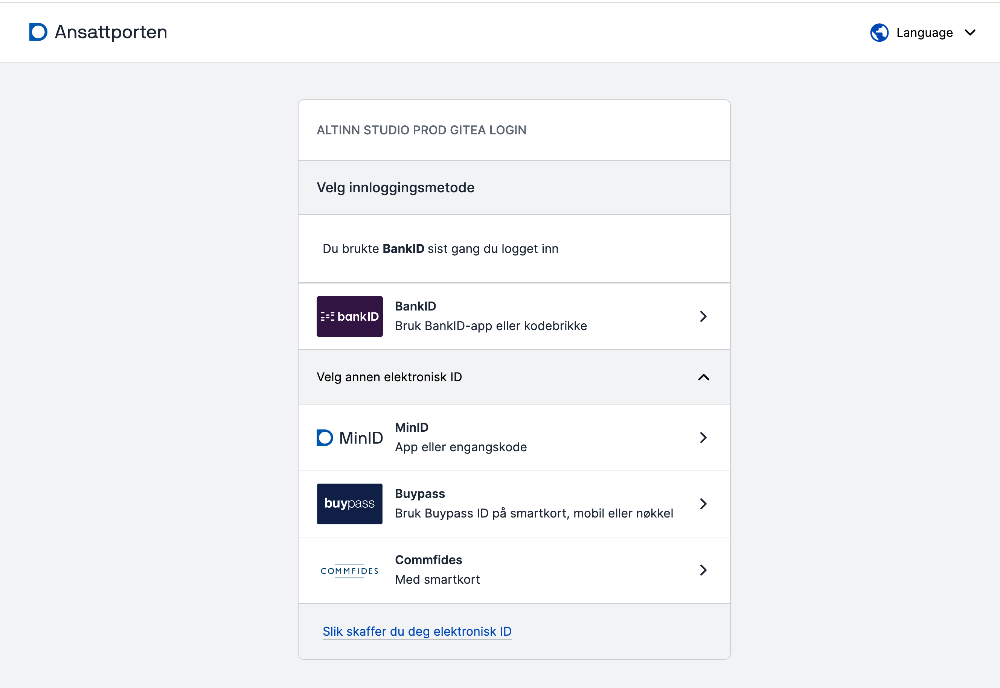
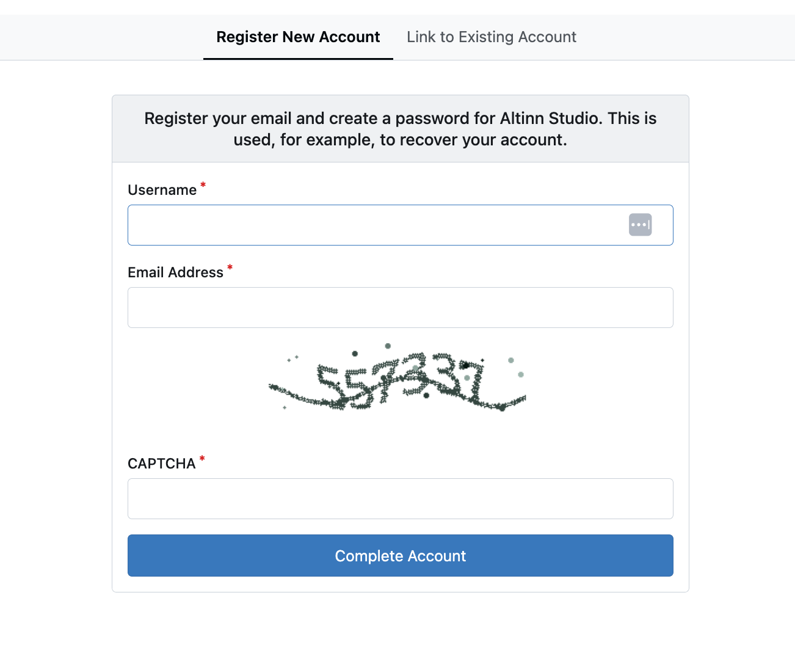
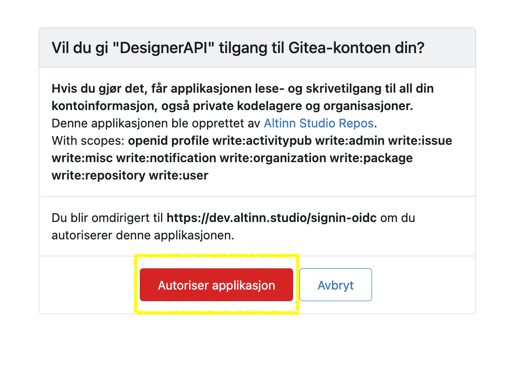

## Create a user in Altinn Studio

Your Altinn Studio user is personal to you and can be linked to one or more organisations to collaborate with others and access existing applications.

### Create a user with Ansattporten
{.floating-bullet-numbers-sibling-ol}

1. Go to [altinn.studio](https://altinn.studio) and click on "Opprett ny bruker".
   

2. Register via Ansattporten.
   - *Registration via email address only is no longer supported. For security reasons, we are in the process of removing
      all registration options except Ansattporten. We therefore recommend that you choose Ansattporten.*

   

3. Log in through Ansattporten.
   - *You can use Ansattporten for login/registration if you can log in to ID-porten. There is no requirement for a connection
      to an organisation in the public sector.*

   

4. Create an Altinn Studio user by filling in username, email, password and a confirmation that you are human. Then click on **Fullfør**.
   The user in Altinn Studio will be linked to your Ansattporten user.
   

5. Activate your account by confirming the email address you registered with.
   - *An email has been sent to the email address you provided with a link. Copy the link and paste it into the browser window.*

   {}
   If you get an error message that the link has expired, try logging in again (via Ansattporten). The account should be activated.
   {}

6. Give the Altinn Studio application access to your user account.
   

After the account is activated, click on the logo at the top left of the page to go to your service dashboard.
You are now ready to create your first service.

## Join an organisation

Organisations in Altinn Studio own the applications and enable collaboration between people within the same organisation.

To join an organisation, an administrator for your organisation must grant you access.
If you are unsure who the administrator is or you do not know if your organisation is set up in Altinn Studio,
you can ask [Altinn Servicedesk](mailto:tjenesteeier@altinn.no) for help.

_Are you an administrator for your organisation and need to add users? See the guide for how to do this [here](/en/altinn-studio/v8/guides/administration/access-management/studio/)._

## Create an organisation

It is Digdir that creates organisations in Altinn Studio.

To get an organisation in Altinn Studio, your organisation must

- be a service owner and have an agreement with Altinn, or
- offer service development in Altinn Studio on behalf of public sector organisations

Organisations that are not service owners will not get access to their own test or production environment.

To create a new organisation, send an email to [Altinn Servicedesk](mailto:tjenesteeier@altinn.no) with the name of the organisation and who should be the administrator.
It may take a few days, and you will receive a reply by email as soon as it is done.
