Veiledningen er delt opp i flere moduler:
- [Oppsett](./#oppsett) hjelper deg med å sette opp alt du trenger for å komme i gang med veiledningen.
- [Lage skjema](./#lage-skjema) vil vise gi deg den grunnleggende kunnskapen du trenger for å lage et enkelt skjema.
- [Tilganger](./#tilganger) vil hjelpe deg å forstå hvordan du kan styre tilgang til tjenesten din.
- [Publiser og test](./#publiser-og-test) vil vise deg hvordan du tilgjengeliggjør tjenesten og tester den i et testmiljø.

### Hva skal vi lage?

Vi skal lage et enkelt skjema i Altinn Studio, der brukeren blir bedt om å fylle ut informasjon om seg selv og sende 
det inn. Vi baserer oss på et fiktivt case for Sogndal kommune, der kommunen ønsker å samle inn nyttig informasjon om nye
tilflyttere, for å kunne tilpasse tjenestetilbudet.

Når du er ferdig, vil du ha en fullstendig tjeneste kjørende i testmiljø, med et skjema som kan fylles ut og sendes inn.

## Oppsett

### Lag en bruker i Altinn Studio

Du trenger en bruker i Altinn Studio for å følge denne veiledningen. For å kunne følge alle stegene, må denne brukeren 
være en del av en organisasjon som har tilgang til et testmiljø. 
Om du ikke har tilgang til en slik organisasjon, kan du ikke følge den siste modulen ([Publiser og test](./#publiser-og-test)).

[Følg oppskriften for å opprette en bruker i Altinn Studio](../../create-user/).

### Naviger i Altinn Studio

Når du er logget inn får du opp en oversiktsside som viser dine tjenester.
Her ser du:
- _Dine favoritter_: Tjenester du har markert som favoritter.
- _Dine apper_: En oversikt over alle appene (tjenestene) du har lagd i Altinn Studio
- _Profilmeny og aktørvelger_: Her kan du velge om du skal representere deg selv, eller en organisasjon du har tilgang til.
  - Velger du å representere en organisasjon, vil det være organisasjonens apper som vises i oversikten.
- _Knapp for å lage ny tjeneste_: Denne skal vi bruke for å lage en ny tjeneste.

---
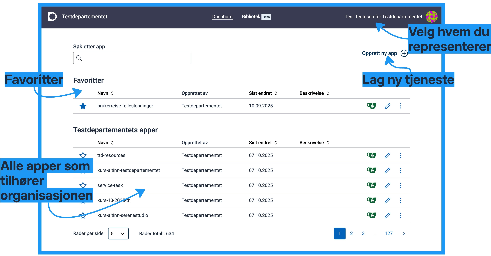

## Lage skjema

Nå er vi klare til å lage en tjeneste med et skjema.

### Opprette ny tjeneste

1. Klikk på knappen "Opprett ny app" for å lage en ny app som skal inneholde skjemaet.
2. Velg din organisasjon som eier av appen om du er tilknyttet en organisasjon
3. Skriv inn identifiserende navn på appen
   >*Navnet må være unikt innenfor din organisasjon. Det brukes også i URL til tjenesten når den er publisert.*
4. Klikk på knappen "Opprett app" og vent på at appen er opprettet.

---

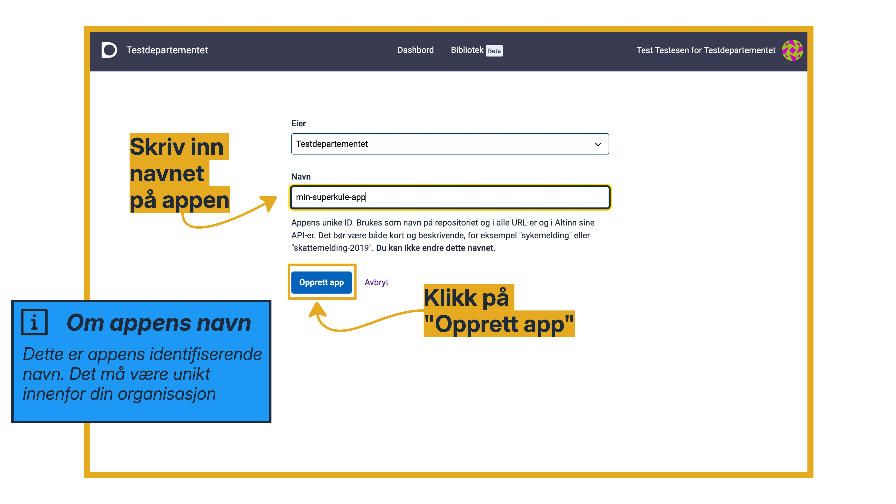

### Redigere informasjon om tjenesten

Når appen er opprettet og lastet, kommer du til en oversiktsside for appen. Her kan du se:
- Menylinje:  Hvor du kan navigere til ulike verktøy, og åpne siden for innstillinger.
- Appens tittel: Denne vises til sluttbrukeren når de er inne i appen, og i innboksen i Altinn.
- Tilgjengelige miljøer: Viser hvilke miljøer din organisasjon har tilgjengelig for å publisere en app. Vanligvis et testmiljø (TT02) og et produksjonsmiljø.
  >*Hvis du har lagd appen på din egen bruker, og ikke på noen organisasjon, har du ingen miljøer tilgjengelig.*
- Lenke til dokumentasjonen
- Nyheter: Her publiserer vi informasjon om ny funksjonalitet fortløpende.

---

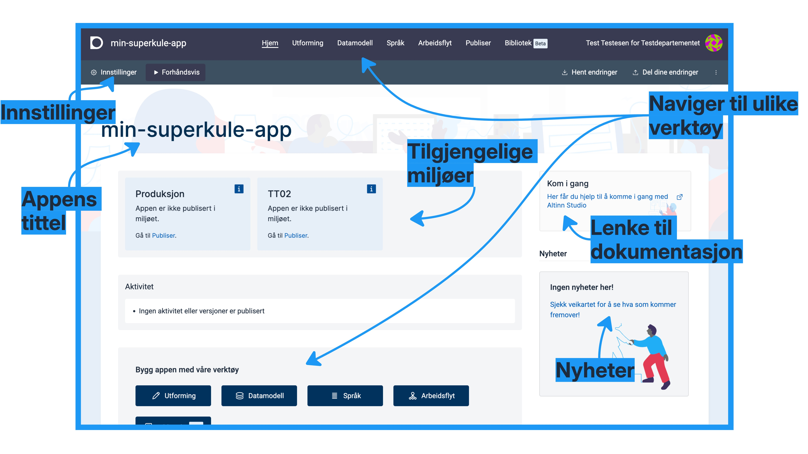

#### Endre informasjon om appen
1. Klikk på "Innstillinger" i menylinjen.
2. Skriv inn appens tittel - en beskrivende overskrift.
3. Skriv inn en beskrivelse om appen - hvem skal bruke den, og hva brukes den til?
4. Klikk på "Lagre"-knappen for å lagre endringene.
5. Naviger tilbake til oversikten ved å klikke på "Til hjem" i menylinjen.

---

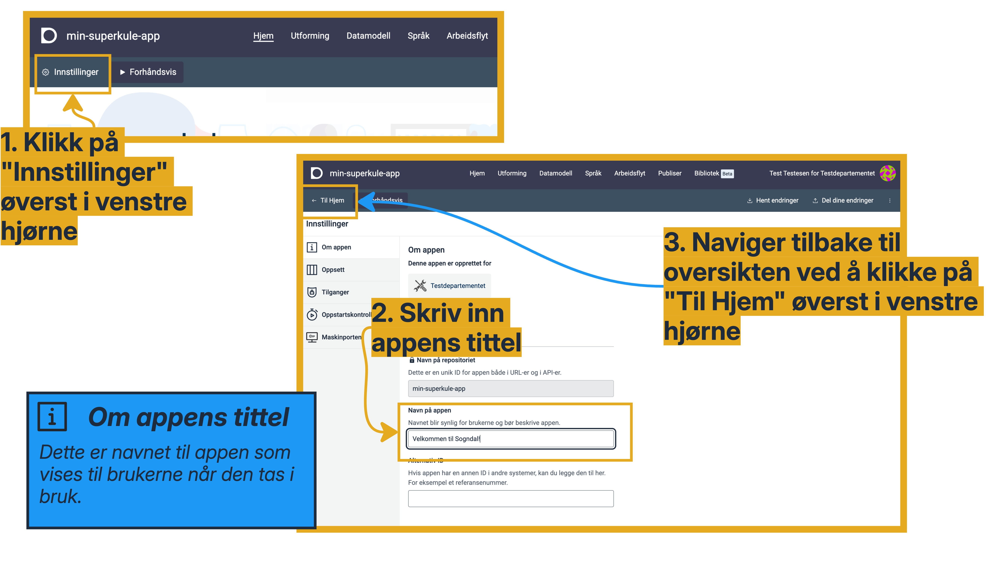

---

Appens tittel bør legges inn på bokmål og nynorsk

Når du kommer tilbake til oversiktssiden vil du se at appens tittel har oppdatert seg der og.

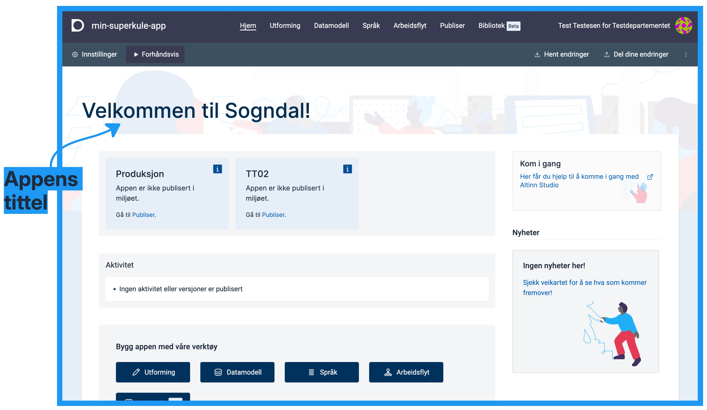

### Lagre og dele endringer

Når du jobber med en app i Altinn Studio er det to hovedområder:
- Din brukers område: Alle endringer du gjør i en app lagres hit automatisk. Andre kan ikke se disse endringene.
- Appens sentrale område: Dette området er tilgjengelig for alle. Når du publiserer tjenesten, brukes dette området som 
  utgangspunkt. 

Endringer fra brukerens område må deles til appens sentrale område for at endringene skal bli tilgjengelig for publisering.

---

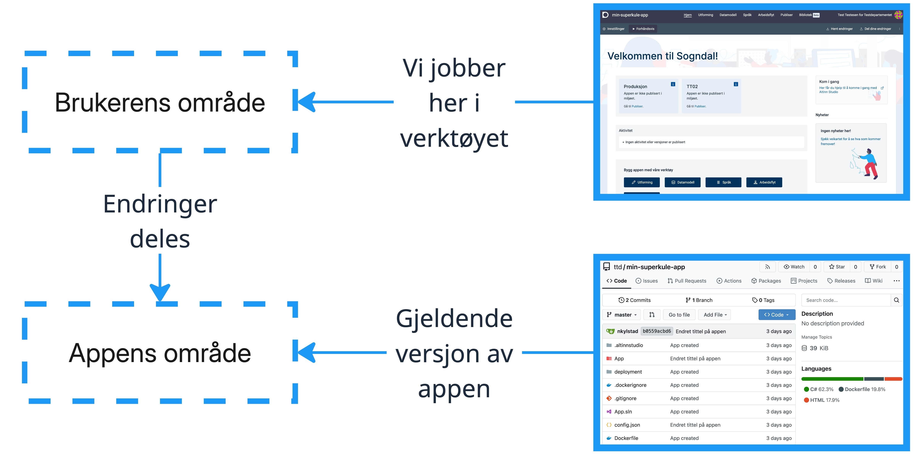

---

Nå som du har gjort en endring i appens overskrift, kan du dele den endringen til appens sentrale område.
1. Klikk på "Del dine endringer" i menylinjen.
2. Klikk på "Se siste endringer" for å se en oversikt over endringer som er gjort.
3. Se på endringene, og klikk på "X" for å lukke vinduet og komme tilbake til vindu for å dele endringer.
4. Beskriv endringene i tekstboksen og klikk på "Del endringer". 

---
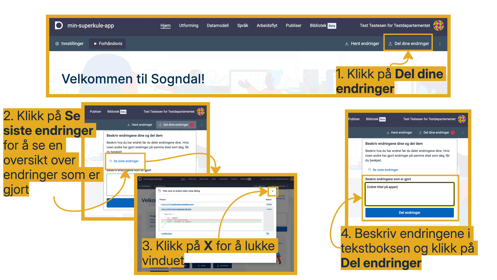

### Informasjonsside
Vi skal starte med å lage en informasjonsside, som skal inneholde bilde og tekst.

#### Naviger til utforming
1. Klikk på "Utforming" i toppmenyen.
2. Klikk på "Form" for å utforme første del av skjema

#### Om utformings-siden
Utforming er satt opp med tre kolonner:
- Selve skjema-oppsettet, der du legger inn sider og komponenter.
- Konfigurasjonskolonnen, der du kan konfigurere valgt side/komponent.
- Forhåndsvisningen, der du ser det du har satt opp.

---

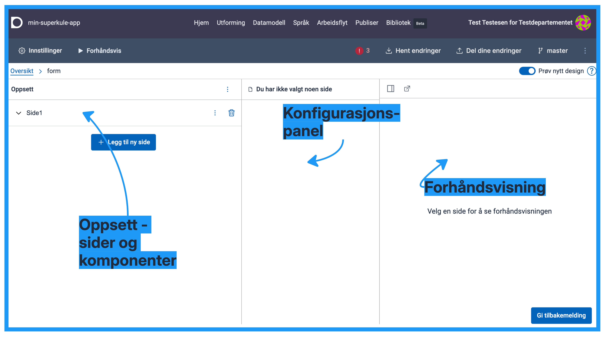

#### Legg til komponenter på infosiden
1. Åpne siden "Side1" ved å klikke på den og klikk på "Legg til komponent".
2. Klikk på "Vis alle", søk etter "Bilde" og klikk på "Bilde"-komponenten under "Informasjon". Klikk på "Legg til" i 
  høyrepanelet for å legge til bildekomponenten på siden.
4. Under "Valg for bilde" i konfigurasjonskolonnen, klikk på "Lim inn en URL" og lim inn https://docs.altinn.studio/nb/altinn-studio/v8/getting-started/app-dev-course/resources/kommune-logo.png
5. Legg til ny komponent på siden: "Avsnitt".
6. Under "Ledetekst", legg inn en tekst. F.eks. "Vi har registrert at du har meldt flytting til Sogndal kommune - velkommen til oss!".

---

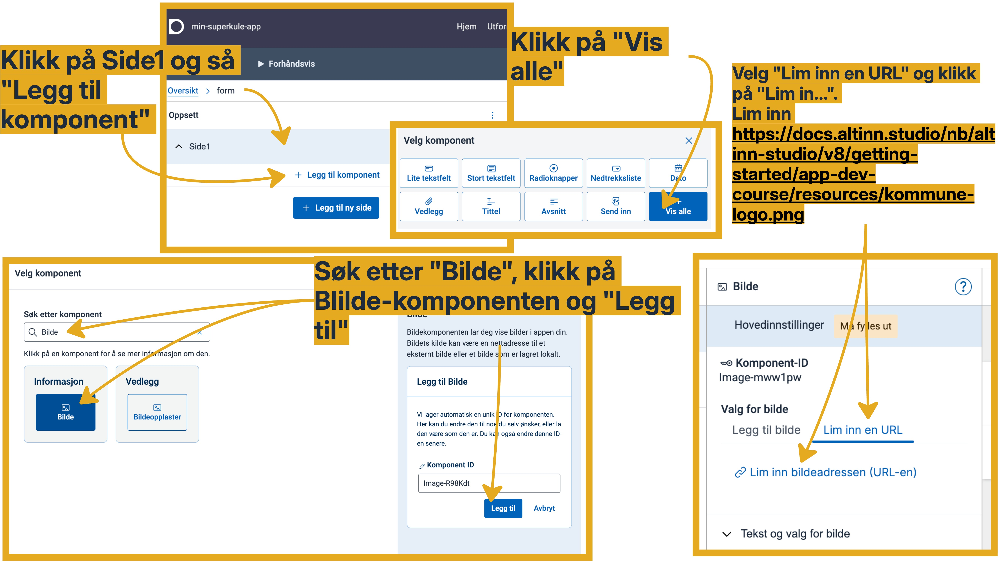

---

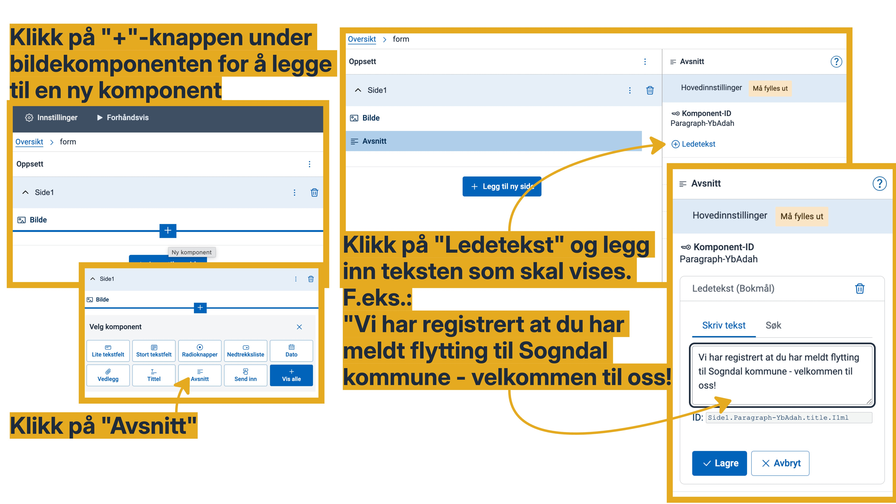

---

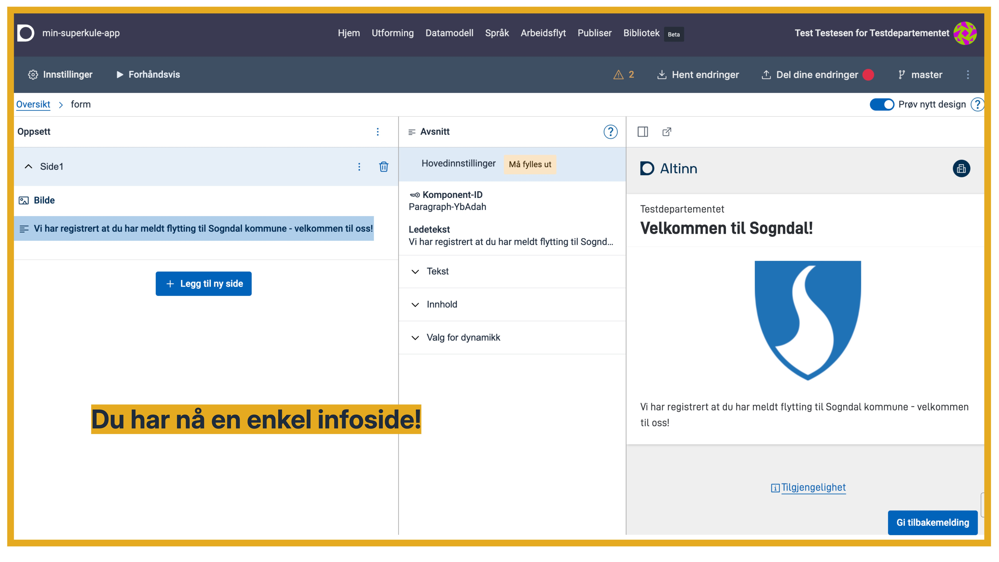

### Datamodell
Før du kan starte å lage skjema må du ta stilling til hvilke data du ønsker å samle inn. Dette gjør du ved hjelp av en 
datamodell.

[Les mer om datamodeller.](../../../../v8/concepts/data-model/)

---

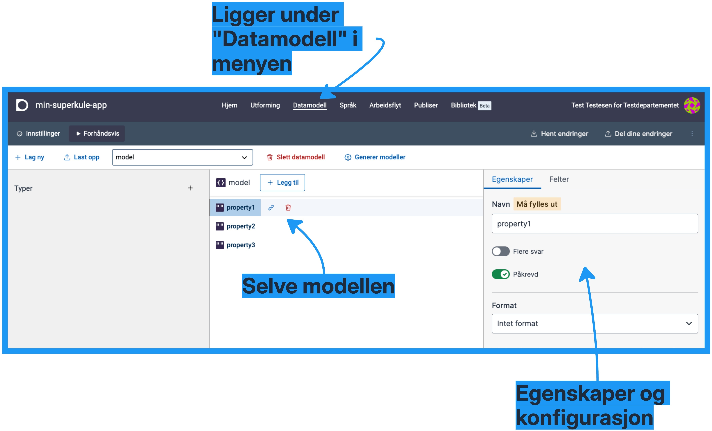

---

### Utforme skjema

## Tilganger

### Om: Tilgangsstyring

### Konfigurere tilganger til skjema

## Publiser og test

### Bygge og publisere tjenesten

### Teste tjenesten i testmiljø