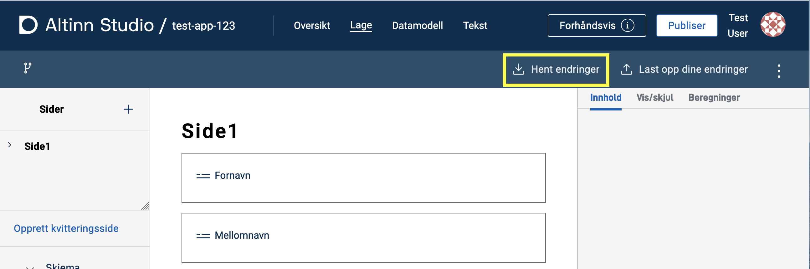

Når du utvikler en app, jobber du både i Altinn Studio og i et lokalt utviklingsmiljø.
Her er en oversikt over hvordan du kommer i gang med lokal utvikling. 

## Slik kloner du appen til et lokalt utviklingsmiljø

{}

{}
{}
{}

{}

{}

1. Finn appen du vil jobbe med lokalt i Dashboardet i Altinn Studio
2. Åpne repositoriet. Klikk på **Repository**-knappen
    
    *Bytt ut dette bildet.*
3. Kopier lenken til repoet (den blå firkanten), enten manuelt eller ved å klikke på knappen markert med en rød sirkel.
    
    *Vurder å bytte dette bildet.*
4. Åpne en terminal i ditt lokale utviklingsmiljø:
    - Gå til ønsket lokasjon for applikasjonsrepoet.
    - Skriv kommandoen `git clone` og lim inn URLen du kopierte i forrige steg.
    ```cmd
    $ git clone https://altinn.studio/repos/<org>/<app-name>.git
    ```
    -  Hvis du har logget inn i Altinn Studio uten å lage passord (f. eks. Github login), kan du [lage et personlig access token i Gitea](https://altinn.studio/repos/user/settings/applications) som kan brukes som passord ved kloning:
    ```cmd
    $ git clone https://<brukernavn>:<access-token>@altinn.studio/repos/<org>/<app-name>.git
    ```
    - I terminalen skal du se et resultat som likner dette:
    ```cmd
    Cloning into 'app-name'...
    remote: Enumerating objects: 982, done.
    remote: Counting objects: 100% (982/982), done.
    remote: Compressing objects: 100% (950/950), done.
    remote: Total 982 (delta 600), reused 0 (delta 0), pack-reused 0
    Receiving objects: 100% (982/982), 166.38 KiB | 1.51 MiB/s, done.
    Resolving deltas: 100% (600/600), done.
    ```

Systemet oppretter en mappe med samme navn som appen og kopierer innholdet i app-repoet inn i mappen.
Nå kan du åpne ditt foretrukne utviklingsverktøy og komme i gang med utviklingen.

{}

## Slik synkroniserer du endringer i lokalt utviklingsmiljø

Du må laste opp (*pushe*) endringer som du gjør lokalt til repoet koden ble klonet fra.
Hvis du gjør endringer i Altinn Studio Designer (og laster disse opp til repoet), må du hente dem ned (*pull*) for å oppdatere den lokale koden.

Du kan synkronisere endringer i det lokale utviklingsmiljøet på flere måter.
Mange utviklingsverktøy har gode integrasjoner for nettopp dette, så sjekk gjerne om ditt verktøy har den typen støtte.

Under kan du lese mer om hvordan du synkroniserer endringer fra kommandolinjen.

### Laste opp endringer

1. Gå til app-repoet ditt i en terminal.
2. Legg til filene du ønsker å laste opp endringer for (*pushe*) med kommandoen `git add <sti til filen>`. Du kan kjøre kommandoen for enkeltfiler, flere filer samtidig eller en mappe.
3. Lagre (*commit*) endringene med en fornuftig melding med kommandoen `git commit -m <commit-melding>`.
4. Last opp (*push*) endringene til master med kommandoen `git push`.

### Laste ned endringer

Gå til app-repoet ditt i en terminal og kjør kommandoen `git pull`.

[Les mer om _git pull_ her](https://git-scm.com/docs/git-pull)

## Slik synkroniserer du endringer i Altinn Studio

I Altinn Studio må du synkronisere endringer på samme vis som ved lokale endringer.

### Last ned endringer
1. Klikk på **Hent endringer** på Utforming-siden til appen i Altinn Studio.
   
   *Bytt dette bildet.*

   Du får en bekreftelse på at appen din er oppdatert.

### Last opp endringer

1. Klikk på **Last opp dine endringer** på Utforming-siden til appen i Altinn Studio.
   
   *Bytt dette bildet.*
2. Legg inn en beskrivende tekst for endringen(e) og klikk på **Valider endringer**.
    
    *Bytt dette bildet.*

   Systemet validerer endringene. Oppstår det en konflikt, klikker du på **Løs konflikt** og følger instruksjonene.

3. Klikk på **Lagre** for å laste opp endringene til repoet (master).
    
    *Bytt dette bildet.*

   Du får en bekreftelse på at endringene er lastet opp.

## Lokal testing

{}
{}

### Se endringer fortløpende

- Hvis du endrer JSON-filer, holder det å laste inn siden på nytt.
- Hvis du endrer forhåndsutfylling, må du starte en ny instans av appen (gå til [http://local.altinn.cloud:8000](http://local.altinn.cloud:8000) og logg inn igjen).
- Hvis du endrer C#-filer, må du stoppe appen (`ctrl+C`) og starte den på nytt (`studioctl run`).

Du kan oppdatere automatisk ved endring i C#-filer ved å starte appen med `dotnet watch`.
Denne kommandoen vil enten starte appen eller laste den på nytt ([hot reload](https://learn.microsoft.com/en-us/dotnet/core/tools/dotnet-watch#hot-reload)) ved endringer i kildekoden.

{}

{}

{}

{}
