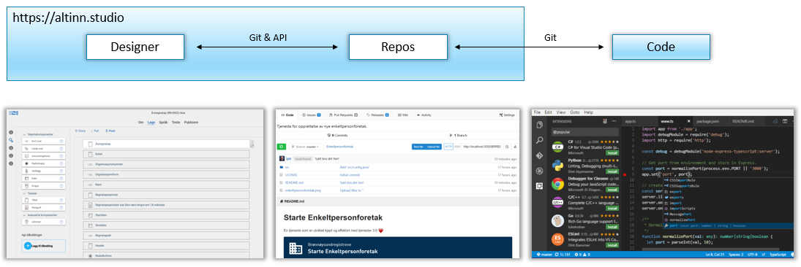

Altinn Studio offers different tools, depending on your prior knowledge, what you prefer and how complex what you are developing is.
You can use the designer to get started and create simple forms or apps. You can also use the repository and the code if you prefer, for example if you want to develop more advanced functionality.


