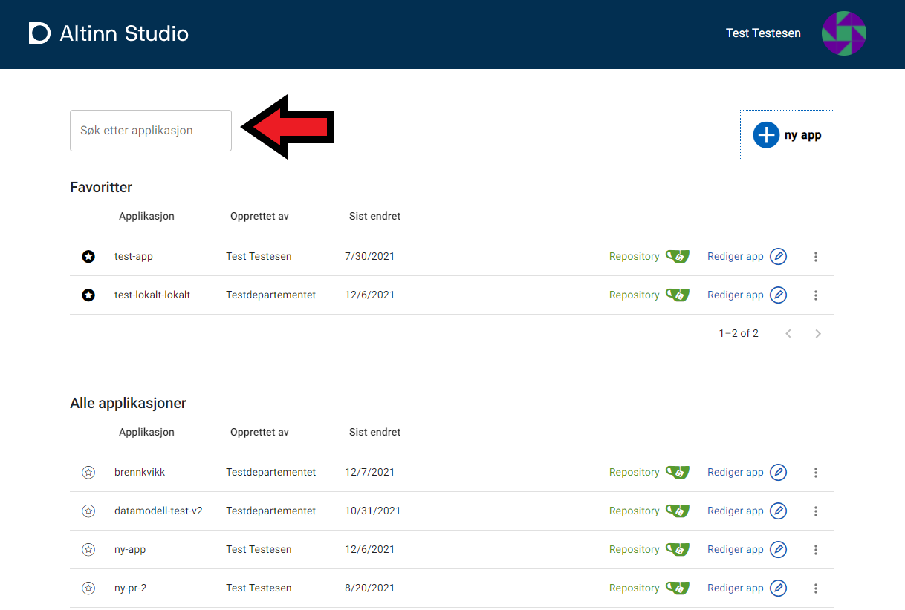

## Kontekst
I dashboardet kan du velge hvilken kontekst du vil filtrere applikasjoner på. Klikk på profilikonet til høyre i dashboardet.

Da får du opp en meny over hvilke kontekster du kan filtrere på. Konteksten kan være en organisasjon du er del av, alle, eller deg selv.

Når du velger en organisasjon, vises bare appene fra den organisasjonen i listen.

## Favoritter
Fra dashboardet har du enkel tilgang til favorittene dine. Favorittene gjenspeiler «star»-konseptet i Gitea. Hvis du markerer et repositorium som starred i Gitea, dukker det opp som favoritt i dashboardet.
Favorittene ligger alltid øverst i dashboardet og vises uavhengig av hvilken kontekst du har valgt.

For å legge til eller fjerne en favoritt, klikk på stjerneikonet.

## Søk
Fra dashboardet kan du søke blant applikasjonene du har tilgang til. Søk i søkefeltet, så dukker resultatet opp i listen under.

