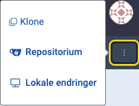
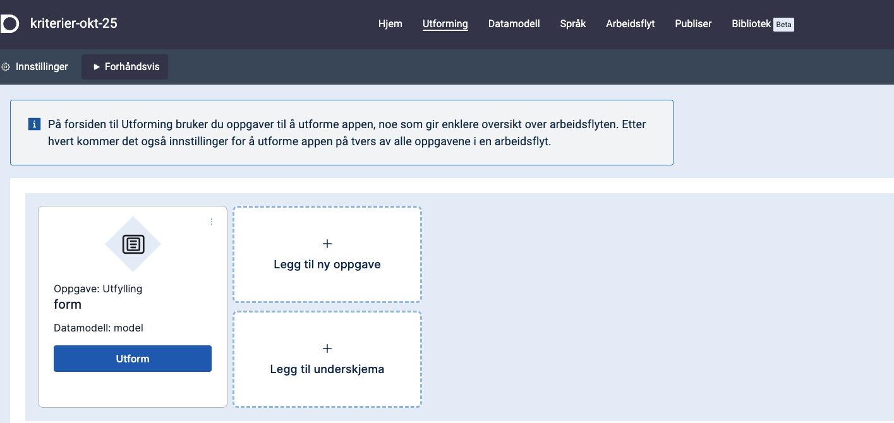

Designer is the tool you start in after logging in to
https://altinn.studio.
It is a tool for designing, setting up and publishing apps.

## Open an App
You can see all the apps you have access to on the dashboard.
Click on the app you want to use to open it.

If you want to go to the repository for the app whilst working in the designer, you can go to the three dots at the top right and select **Repositorium**.

## Edit an App

Use the top menu to build and modify your app. In the top menu, you select the areas of the app you want to work on.

- _Hjem_
  - Provides an overview of which apps you have access to and which environments they are running in. You also have direct access to the various functions in the designer from here.
- _Utforming_
  - Here you choose which components you want to include, for example in a form you are creating. You set up, amongst other things, the order and criteria for how the fields in the form should be displayed and behave for end users.
- _Datamodell_
  - Here you can choose to use existing data models or create new ones.
- _Språk_
  - Here you can manage texts in your service and translate them.
- _Arbeidsflyt_
  - Workflow gives you an overview of the processes you want to include in your service, for example payment and receipt.
- _Publiser_
  - Use Publish to build versions of your app and publish it to an environment.
- _Bibliotek_
  - In the library you will find both resources you have saved for your own apps and resources that are shared in the organisation, for example code lists and images.


