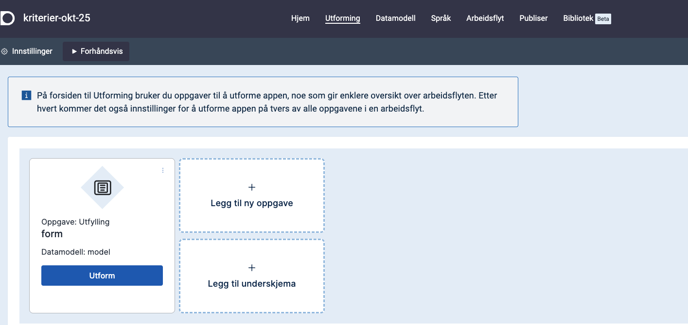

Designer er verktøyet du starer i etter å ha logget inn på https://altinn.studio.
Det er et verktøy for å utforme, sette opp og publisere apper.

## Åpne en app
Du ser alle de appene du har tilgang til, på på dashboardet.
Klikk på den appen du vil bruke for å åpne den.

Hvis du vil gå til repositoriet for appen mens du jobber i designeren, kan du gå til de tre prikkene øverst til høyre og velge __Repositorium__.

## Redigere en app

Det er to navigasjonsmenyer - en toppmeny og en venstremeny.  
I **toppmenyen** kan du navigere mellom ulike funksjonelle områder av applikasjonen.
I **venstremenyen** kan du navigere innad i området.

- _Om_
  - Om appen
- _Lage_
  - Datamodell
  - UI-Editor
  - Tilgangsstyring
- _Språk_
  - Tekster
- Deploy

