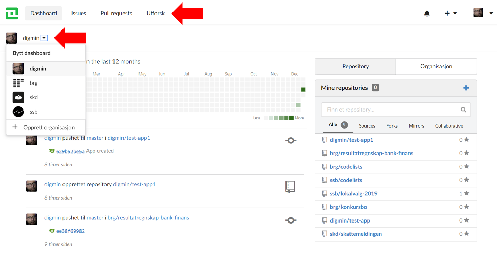
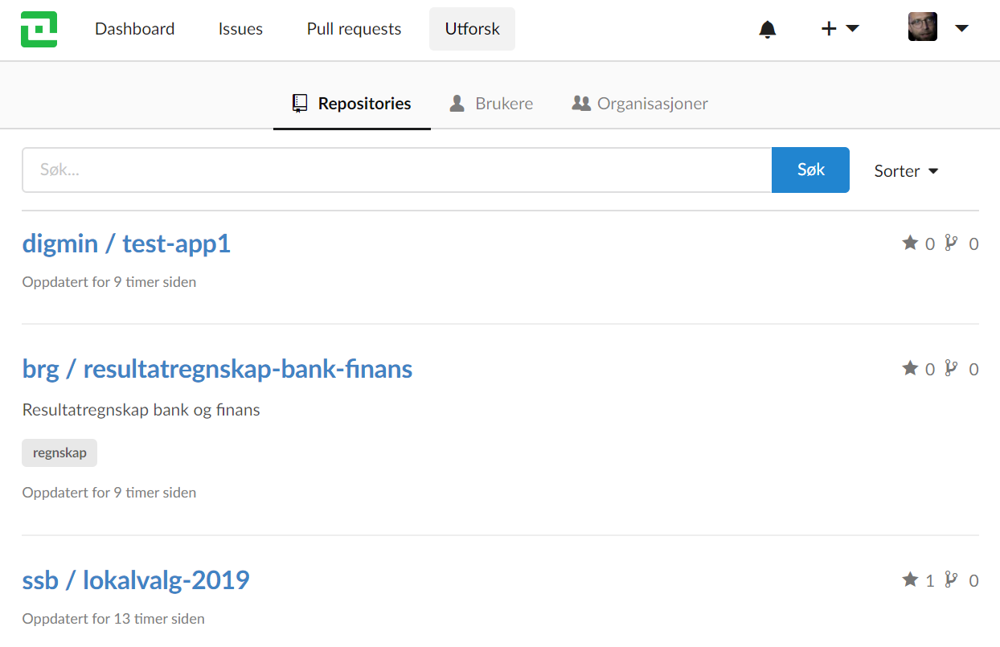
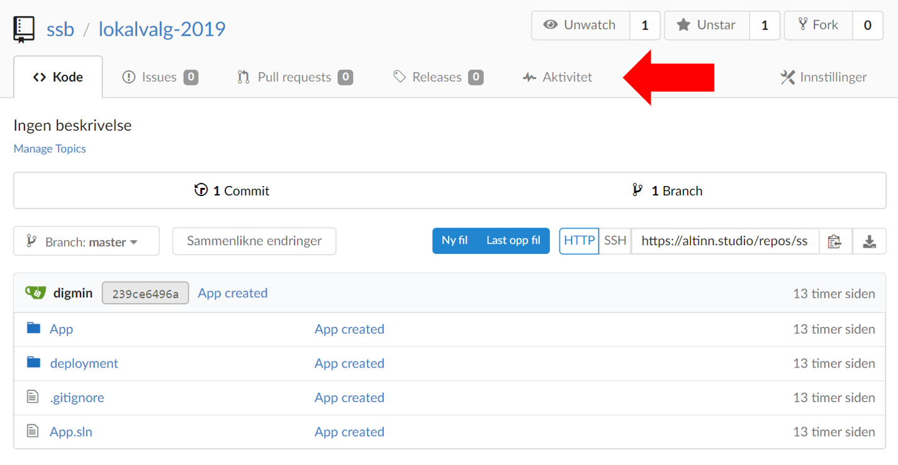
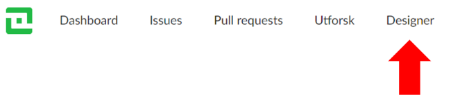

Repositoriet er det verktøyet der appene er lagret som Git-repositorier. Du finner det på
https://altinn.studio/repos.

## Hovedmeny

Hovedmenyen øverst inneholder disse elementene:

- Altinn-logoen - tar deg tilbake til Altinn Studio-kontrollpanelet.
- **Dashboard** - viser dine aktiviteter og repositoriene og organisasjonene du har tilgang til. Du kan også se kontrollpanelet for den enkelte organisasjonen.
- **Issues** - viser åpne og lukkede saker som er relevante for deg.
- **Pull requests** - viser åpne og lukkede endringsforespørsler som er relevante for deg.
- **Utforsk** - her kan du se alle repositorier, brukere og organisasjoner

## Navigere innad i et repositorium
Når du har navigert til et repositorium dukker det opp et nytt sett menyvalg som er relevant for repositoriet.

- **Kode** - innholdet, alle filer appen består av
- **Issues** - saker for repositoriet
- **Pull Requests** - endringsforespørsler for repositoriet
- **Releases** - opprettet for repositoriet
- **Aktivitet** - hva har skjedd i repositoriet

Hvis du vil til Designer for det aktuelle repositoriet, er det et valg for dette i toppmenyen:

