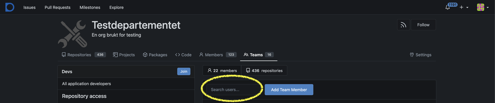
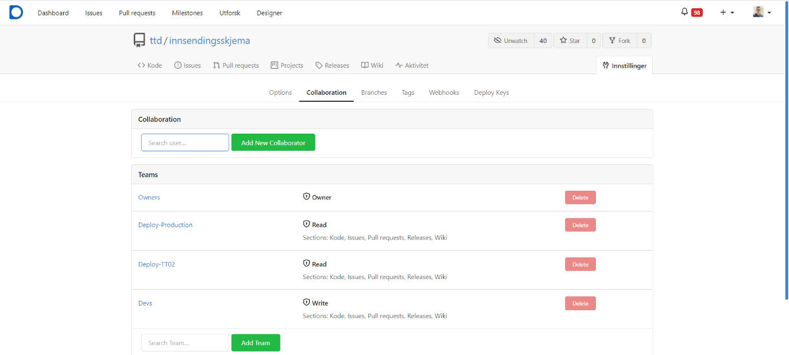

## Tilgangsstyring for organisasjonen

Som eier av en organisasjon i Altinn Studio kan du konfigurere tilgangene til de øvrige brukerne som er knyttet til organisasjonen.

Gå til `https://altinn.studio/repos/org/{org}/teams/` (erstatt `{org}` med din organisasjonskode).

Det er definert fire standard-team som legger føringer for hva en bruker har tillatelse til å gjøre i organisasjonen i Altinn Studio. Ved behov kan du som eier legge til eller fjerne brukere i team, opprette nye team og endre konfigurasjon på eksisterende team.

[Se oversikt over standard-team og tilgangene de gir](/nb/altinn-studio/v8/reference/access-management/studio/).

### Legge til bruker i et team

Disse stegene må gjøres av en bruker som er lagt inn som eier av organisasjonen.

1. Gå til `https://altinn.studio/repos/org/{org}/teams/` (erstatt `{org}` med din organisasjonskode).
2. Åpne ønsket team ved å klikke på navnet eller på knappen **View**.
3. Skriv inn brukerens Altinn Studio-brukernavn i tekstfeltet over listen av eksisterende brukere i teamet.
4. Velg bruker fra listen som dukker opp når du skriver.
5. Klikk på knappen **Add Team Member**.

Brukeren er nå lagt til i teamet.

## Tilgangsstyring for enkelt repository

Som administrator for organisasjonen kan du også styre hvem som har tilgang til det enkelte repositoriet. Du kan gi tilgang til både hele team og til enkeltbrukere.

1. Gå til det aktuelle repositoriet: `https://altinn.studio/repos/{org}/{app}/` (erstatt `{org}` og `{app}` med din organisasjonskode og appnavn).
   - Alternativt: Gå til `https://altinn.studio/repos/explore/repos` og søk etter appen din.
2. Klikk på **Innstillinger** på høyre side av toppmenyen for repositoriet.
3. Velg **Collaboration** i venstremenyen.
4. Gi tilgang til en spesifikk bruker i «Collaboration»-seksjonen ved å skrive inn brukernavn og klikke på **Add Collaborator**.
5. Gi tilgang til spesifikke grupper i «Teams»-seksjonen ved å skrive inn navnet på en gruppe og klikke på **Add Team**.

For å holde oversikt anbefaler vi primært å sette opp team for tilgangsstyring.

## Fjerne en bruker fra et team

Du trenger brukernavnet til brukeren som skal fjernes.

1. Gå til teamene for din organisasjon: `https://altinn.studio/repos/org/{org}/teams/` (erstatt `{org}` med din organisasjonskode).
2. Velg teamet du skal fjerne brukeren fra ved å klikke på **View**.
3. Velg brukeren fra listen over medlemmer og velg **Remove**.

Merk at en bruker selv kan forlate et team ved å gå til samme visning og klikke på **Leave**-knappen øverst til venstre ved siden av teamnavnet.

## Fjerne en bruker fra organisasjonen

Du trenger brukernavnet til brukeren som skal fjernes. Se beskrivelsen over for hvordan du fjerner en bruker fra enkeltteam.

1. Gå til teamene for din organisasjon: `https://altinn.studio/repos/org/{org}/teams/` (erstatt `{org}` med din organisasjonskode).
2. Fjern brukeren fra teamene brukeren er medlem i for din organisasjon.
   - Typiske team er `devs` for skrivetilgang til tjenestene, `Deploy-<miljø>` for publiseringstilgang for tjenestene, og `Resources-Publish-<miljø>` for tilgang til å publisere ressurser.
   - Hvis organisasjonen din har satt opp en annen team-struktur, må du sjekke alle team brukeren kan være medlem av.
3. Verifiser at brukeren ikke lenger tilhører organisasjonen din ved å gå til `https://altinn.studio/repos/{brukernavn}` og sjekke at organisasjonen din (med logo) ikke lenger vises under brukerens profilbilde på venstre side.
