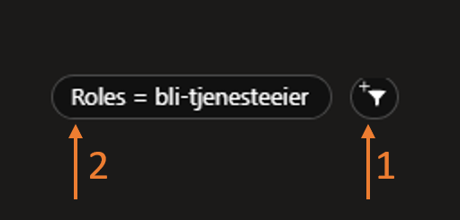
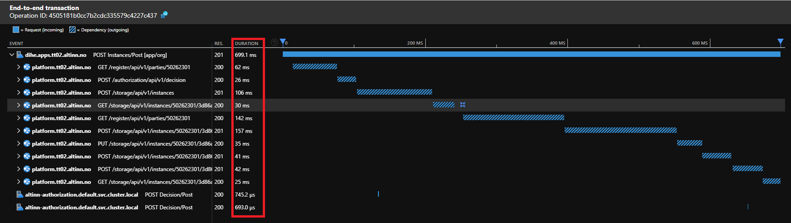

{}
Do you have any useful tips or questions you need answered?

Please contribute to this page by using the __Edit page on GitHub__ function at the bottom of this page!
{}

[//]: <> (Section: How can I set up alerts based on what is logged to AI?)

{}
Unfortunately, there is no resource group where application owners can store alerts.
We know that this is functionality that many service owners desire,
and the Altinn team is working to make this available.

**Explanation:** A resource group in Azure is a collection of related resources (such as apps, databases and alerts) that belong together. When you need to set up alerts, you require such a resource group to store them in.
{}

[//]: <> (Section: What does Altinn monitor on our behalf?)
{}

Altinn also has access to the telemetry that is logged by the apps and made available to the service owners in Application Insights (AI).
In addition, we monitor the infrastructure of each service owner, such as Kubernetes clusters, storage accounts and key vaults.

The main rule is that the Altinn team responds to alarms related to the infrastructure required to run an app,
for example if there is too little CPU available in the app cluster or if a pod is in an error status in the cluster.

**Explanation:**
- **Kubernetes cluster:** A system that runs and manages container-based apps
- **Pod:** A running instance of an app in Kubernetes
- **Key vault:** A secure storage location for secrets such as passwords and API keys

__Altinn does not actively monitor the performance or error rate of the individual app.__
{}

[//]: <> (Section: What are the three most useful functions in AI?.)
{}


- **Failures:** Get an overview of all failed requests in a time period and drill down into the stack trace
   to investigate which request in the chain is producing an undesired response.

   **Explanation:** A stack trace is a detailed overview of which functions were called when the error occurred, which helps you to find out exactly where the problem lies.

- **Performance:** Get an overview of all requests in a time period.
  Identify the slowest requests and examine the stack trace to determine which part
  of the chain is negatively affecting performance.

- **Logs:** Run queries on logs and trace data to find exceptions
  or identify custom data points related to a specific request.

  **Explanation:** An exception is an error that occurs when the programme is running, for example when it tries to divide by zero or read a file that does not exist.
{}


[//]: <> (Section: How can I see who performed the request?)
{}
The app template logs identity telemetry when this information is available to the app.
Data points include authentication level (authLevel), partyId, userId and organisation number (orgNumber).

**Explanation of data points:**
- **authLevel:** How high a security level the user has logged in with (level 3 or 4)
- **partyId:** A unique ID for the user or organisation in Altinn
- **userId:** A unique ID for the person who is logged in
- **orgNumber:** The organisation number of the business performing the action


When you query the logs, you use the property `customDimensions` to retrieve the custom telemetry data.
Here is an example of how you can list the URL and userId of the person who sent the request.

```
requests
| project url, customDimensions["userId"]
```

**Explanation:** `customDimensions` is a field in Application Insights where you can add custom data that is specific to your application.
{}

[//]: <> (Section: We have many apps in my organisation, but I am only interested in one of them)
{}
All logs and dashboards in Application Insights can include filters. Use a _role filter_ to filter out data related to your app.
The role (_role_ or _cloud role name_) for your app is your app name (i.e. the repository name in Altinn Studio).

**Explanation:** The role name is used to distinguish between different apps in the same Azure environment. This allows you to see data only for your app, even if there are many apps in the same Application Insights resource.



When working with the user interface, look for the **Filter** icon (1) and add or adjust the role filter (2).

If you are working with logs, the following _where_ clause is used to filter out the data for your app.

```
where cloud_RoleName == <insert app name>
```

To retrieve all requests for the app _bli-tjenesteeier_, the query would look like this:

```
requests
| where cloud_RoleName == "bli-tjenesteeier"
```
{}


[//]: <> (Section: An end user reports that they are experiencing an error)
{}
When end users report errors, this may be an error that affects all users, and it often
becomes clear which request is failing in the **Failures** tab.
But if the error affects a single or very few users, the instanceId can be a useful tool.

**Explanation:** An instanceId is a unique ID for a specific completion of a form or a process in Altinn. Each time a user starts a new completion, it receives its own instanceId.

End users should always include the instanceGuid or archive reference (the last 12 characters in an instanceId).
This GUID can be included in a filter on the **Performance** page to get an overview of all
incoming requests related to the instance. Perhaps this can provide a clear picture of what has happened.

Alternatively, you can run a query in the log tool for requests linked to the instance.

```
requests
| where url contains "165dc739-0f55-4a4c-9b0b-781340a68cd8"
| order by timestamp desc
```

{}

[//]: <> (Section: My app shows unknown error...)
{}
... but I do not know what is causing it.

_Unknown error_ in the app is caused by the app returning an unexpected response code to requests from
the client (app-frontend). To investigate such error situations, it is often wise to start in the **Failures** tab.

**Explanation:** A response code is a number that the server sends back to indicate whether the request was successful or not. For example, 200 means "OK", whilst 404 means "not found" and 500 means "server error".


1. Based on the scenario when things fail, you may be able to identify the correct
   request in **Operation overview**. Mark this request.
2. In the summary section you will see the three most common response codes and exceptions related to the failing request.
3. If further investigation is necessary, you can look more closely at **Request samples**.
4. Instances of the request are listed, and you can sort based on relevance or date.
   Click on one of the entries to proceed to the transaction log.


When reviewing the transactions, all requests with an unsuccessful response code will be marked in red.
To see additional details for a specific request, mark it and review the panel on the right-hand side of the screen.
{}

[//]: <> (Section: How can I identify what is making a request slow? )
{}
Use the **Performance** page to investigate slow requests.


1. Identify the request you are interested in.
2. Click the **Drill into x samples** button.
3. Select one of the requests in the list to see the transaction details.



From this point, you can investigate each dependency and the time it takes to receive a response.

**Explanation:** A dependency is an external service or database that your app calls. If a request is slow, it may be due to one of these dependencies taking a long time to respond.
{}
