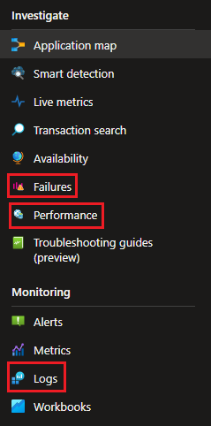

{}
Har du noen gode tips eller spørsmål som du trenger svar på?

Vennligst bidra til denne siden ved å bruke __Edit page on GitHub__-funksjonen nederst på denne siden!
{}

[//]: <> (Section: Hvordan kan jeg sette opp varsler basert på hva som logges til AI?)

{}
Dessverre er det ingen ressursgruppe der applikasjonseiere kan lagre varsler.
Vi vet at dette er funksjonalitet som mange tjenesteeiere ønsker,
og Altinn-teamet jobber med å gjøre dette tilgjengelig.

**Forklaring:** En ressursgruppe i Azure er en samling av relaterte ressurser (som apper, databaser og varsler) som hører sammen. Når du skal sette opp varsler, trenger du en slik ressursgruppe å lagre dem i.
{}

[//]: <> (Section: Hva monitorerer Altinn på våre vegne?)
{}

Altinn har også innsyn i telemetrien som logges av appene og gjøres tilgjengelig for tjenesteeierene i Application Insights (AI).
I tillegg overvåker vi infrastrukturen til hver tjenesteeier, som Kubernetes-cluster, lagringskontoer og key vault.

Hovedregelen er at Altinn-teamet reagerer på alarmer knyttet til infrastrukturen som kreves for å kjøre en app,
for eksempel hvis det er for lite CPU tilgjengelig i app-clusteret eller at en pod står i en feilstatus i clusteret.

**Forklaring:**
- **Kubernetes-cluster:** Et system som kjører og administrerer containerbaserte apper
- **Pod:** En kjørende instans av en app i Kubernetes
- **Key vault:** Et sikkert lagringssted for hemmeligheter som passord og API-nøkler

__Altinn overvåker ikke aktivt ytelsen eller feilraten til den individuelle appen.__
{}

[//]: <> (Section: Hva er de tre nyttigste funksjonene i AI?.)
{}


- **Failures:** Få en oversikt over alle feilede forespørsler i et tidsrom og gå i dybden på stack trace
   for å undersøke hvilken forespørsel i kjeden som produserer uønsket respons.

   **Forklaring:** En stack trace er en detaljert oversikt over hvilke funksjoner som ble kalt da feilen oppstod, som hjelper deg å finne ut nøyaktig hvor problemet ligger.

- **Performance:** Få oversikt over alle forespørsler i et tidsrom.
  Identifiser de tregeste forespørslene og undersøk stack trace for å avgjøre hvilken del
  av kjeden som påvirker ytelsen negativt.

- **Logs:** Kjør spørringer på logger og sporingsdata for å finne exceptions
  eller identifisere egendefinerte datapunkter relatert til en spesifikk forespørsel.

  **Forklaring:** En exception er en feil som oppstår når programmet kjører, for eksempel når det prøver å dele på null eller lese en fil som ikke finnes.
{}


[//]: <> (Section: Hvordan kan jeg se hvem som utførte requesten?)
{}
Appmalen logger identitetstelemetri når denne informasjonen er tilgjengelig for appen.
Datapunkter inkluderer autentiseringsnivå (authLevel), partyId, userId og organisasjonsnummer (orgNumber).

**Forklaring av datapunkter:**
- **authLevel:** Hvor høyt sikkerhetsnivå brukeren har logget inn med (nivå 3 eller 4)
- **partyId:** En unik ID for brukeren eller organisasjonen i Altinn
- **userId:** En unik ID for personen som er logget inn
- **orgNumber:** Organisasjonsnummeret til virksomheten som utfører handlingen


Når du gjør spørringer mot loggene, bruker du propertyen `customDimensions` for å hente fram den egendefinerte telemetridataen.
Her er et eksempel på hvordan du kan liste opp URL og userId på den som sendte forespørselen.

```
requests
| project url, customDimensions["userId"]
```

**Forklaring:** `customDimensions` er et felt i Application Insights hvor du kan legge til egendefinerte data som er spesifikke for din applikasjon.
{}

[//]: <> (Section: Vi har mange apper i organisasjonen min, men jeg er bare interessert i én av dem)
{}
Alle logger og dashbord i Application Insights kan inkludere filtre. Bruk et _rollefilter_ for å filtrere ut data relatert til appen din.
Rollen (_role_ eller _cloud role name_) for appen din er appnavnet ditt (dvs. repo-navnet i Altinn Studio).

**Forklaring:** Rollenavnet brukes for å skille mellom ulike apper i samme Azure-miljø. Dette gjør at du kan se data bare for din app, selv om det er mange apper i samme Application Insights-ressurs.


Når du arbeider med brukergrensesnittet, se etter **Filter**-ikonet (1) og legg til eller juster rollefilteret (2).

Hvis du arbeider med logger, brukes følgende _where_-klausul for å filtrere ut dataene for appen din.

```
where cloud_RoleName == <sett inn appnavn>
```

For å hente alle forespørsler for appen _bli-tjenesteeier_ vil spørringen se slik ut:

```
requests
| where cloud_RoleName == "bli-tjenesteeier"
```
{}


[//]: <> (Section: En sluttbruker rapporterer at de opplever en feil)
{}
Når sluttbrukere rapporterer feil, kan dette være en feil som påvirker alle brukere, og det kommer ofte
tydelig frem hvilken forespørsel som feiler i **Failures**-fanen.
Men hvis feilen påvirker en enkelt eller svært få brukere, kan instanceId være et nyttig hjelpemiddel.

**Forklaring:** En instanceId er en unik ID for en spesifikk utfylling av et skjema eller en prosess i Altinn. Hver gang en bruker starter en ny utfylling, får den en egen instanceId.

Sluttbrukere bør alltid inkludere instanceGuid eller arkivreferanse (de siste 12 tegnene i en instanceId).
Denne GUID-en kan inkluderes i et filter på **Performance**-siden for å få en oversikt over alle
innkommende forespørsler relatert til instansen. Kanskje kan dette gi et klart bilde av hva som har skjedd.

Alternativt kan du kjøre en spørring i loggverktøyet for forespørsler knyttet til instansen.

```
requests
| where url contains "165dc739-0f55-4a4c-9b0b-781340a68cd8"
| order by timestamp desc
```

{}

[//]: <> (Section: Appen min viser ukjent feil...)
{}
... men jeg vet ikke hva som forårsaker det.

_Ukjent feil_ i appen er forårsaket av at appen returnerer en uventet responskode på forespørsler fra
klienten (app-frontend). For å undersøke slike feilsituasjoner er det ofte lurt å starte i **Failures**-fanen.

**Forklaring:** En responskode er et tall som serveren sender tilbake for å indikere om forespørselen var vellykket eller ikke. For eksempel betyr 200 "OK", mens 404 betyr "ikke funnet" og 500 betyr "serverfeil".


1. Basert på scenariet når ting feiler, kan du kanskje identifisere riktig
   forespørsel i **Operation overview**. Marker denne forespørselen.
2. I sammendragsseksjonen vil du se de tre vanligste responskodene og exceptions relatert til den feilende forespørselen.
3. Hvis det er nødvendig med ytterligere undersøkelser, kan du se nærmere på **Request samples**.
4. Tilfeller av forespørselen er listet opp, og du kan sortere basert på relevans eller dato.
   Klikk på ett av innslagene for å gå videre til transaksjonsloggen.


Når du ser gjennom transaksjonene, vil alle forespørsler med en ikke-vellykket responskode være merket med rødt.
For å se tilleggsdetaljer for en spesifikk forespørsel, marker den og se gjennom panelet på høyre side av skjermen.
{}

[//]: <> (Section: Hvordan kan jeg identifisere hva som gjør at en forespørsel går tregt? )
{}
Bruk **Performance**-siden for å undersøke trege forespørsler.


1. Identifiser forespørselen du er interessert i.
2. Klikk på knappen **Drill into x samples**.
3. Velg en av forespørslene i listen for å se transaksjonsdetaljene.


Fra dette punktet kan du undersøke hver avhengighet og tiden det tar å få et svar.

**Forklaring:** En avhengighet er en ekstern tjeneste eller database som appen din kaller. Hvis en forespørsel er treg, kan det skyldes at en av disse avhengighetene bruker lang tid på å svare.
{}
