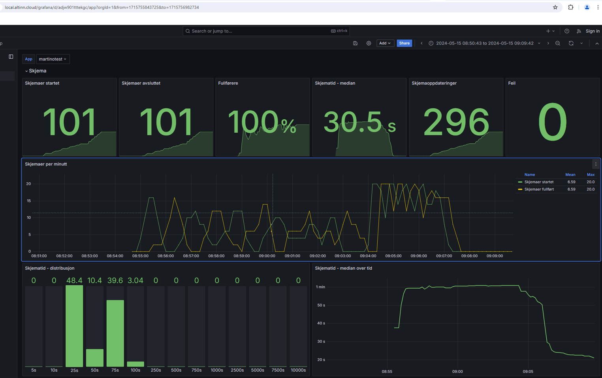
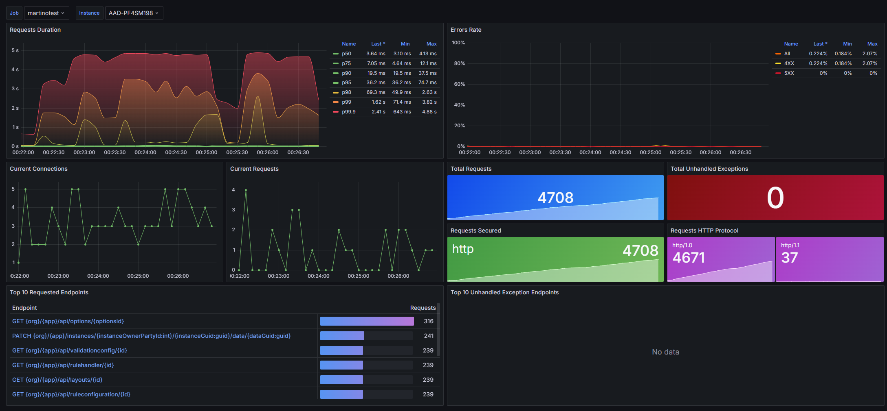
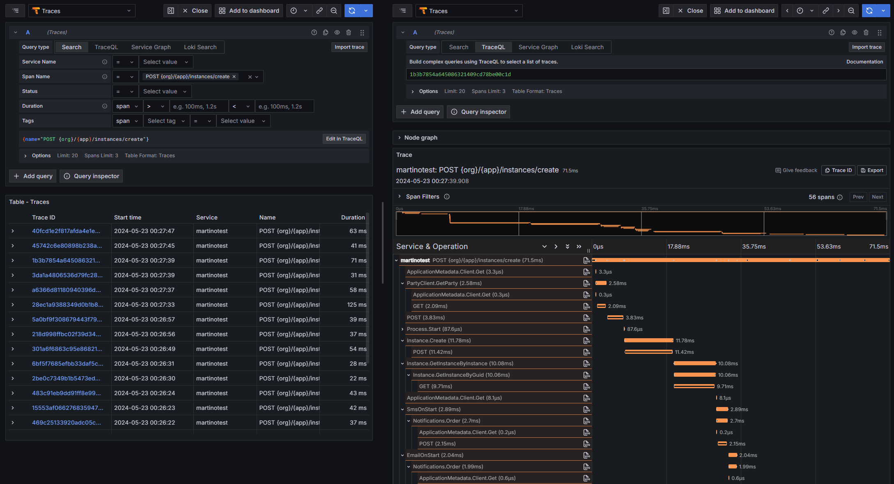
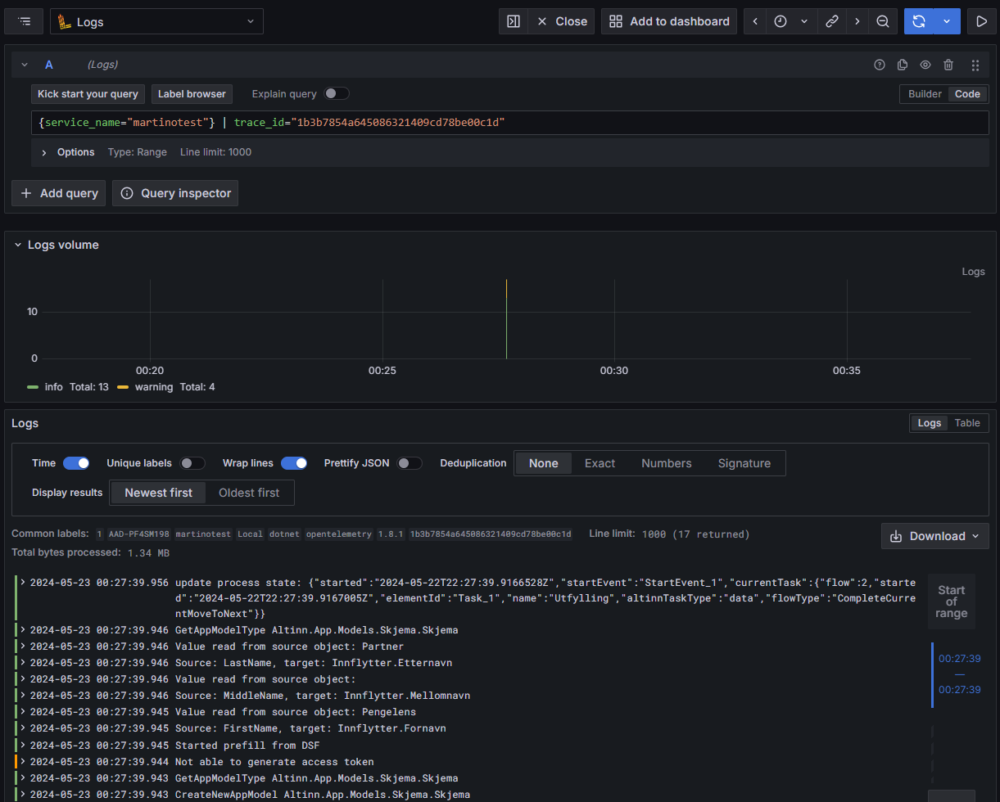

{}
This page refers to configuration when [OpenTelemetry (OTel)](https://opentelemetry.io/) is enabled in the app from v8 and newer.
The existing Application Insights SDK setup is obsolete and will be removed in the next major version of the Altinn.App libraries.
{}

## Azure Monitor

Azure Application Insights (AI) is an extension of
[Azure Monitor](https://learn.microsoft.com/en-us/azure/azure-monitor/overview) and is the tool we
use in Altinn to provide monitoring functionality for apps.

**Explanation:** Azure Monitor is Microsoft's cloud monitoring platform, whilst Application Insights is the part specifically designed to monitor applications.

### What can Application Insights do for you?

Application Insights can provide you as an app developer with valuable insights into the health, performance, and usage of your app.
With real-time monitoring and performance analysis, developers can identify and resolve problems before they impact
an end user's experience. Debugging and alerting make Application Insights a valuable tool in operations as well.

**Example:** If your app suddenly starts responding more slowly than usual, Application Insights can show you exactly when the problem started, which requests are affected, and where in the code the delay occurs.


### Prerequisites for using Application Insights

- **Test Developer or Production Developer role in Azure.**
    The Test Developer role grants access to Application Insights for apps in TT02, and the Production Developer role grants access
    to apps in production.

    [See here how to request the role](/nb/altinn-studio/v8/guides/administration/access-management/apps/)

- **General overview of Application Insights features**
    Application Insights has several features available.

    [Check Microsoft's official documentation](https://learn.microsoft.com/en-us/azure/azure-monitor/app/app-insights-overview?tabs=net)
    for a quick overview.

- **Basic knowledge of Kusto Query Language (KQL)**

    Queries in Application Insights are written using KQL. The possibilities within data visualisation and exploration are many with KQL,
    but you will get far with the most basic skills to identify data points of interest.

    **Explanation:** KQL is a query language somewhat similar to SQL. You use it to search, filter, and analyse data in Application Insights.

    **Example KQL query:**
    ```
    requests
    | where timestamp > ago(1h)
    | where resultCode != 200
    | summarize count() by resultCode
    ```
    This query shows all requests in the last hour that were not successful, grouped by response code.

    [Find an overview of KQL and sample queries on Microsoft's website.](https://learn.microsoft.com/en-us/azure/data-explorer/kusto/query/)

## Grafana

Grafana is a visualisation tool where you can explore telemetry and design dashboards for your organisation's monitoring needs.
Each app cluster has a Grafana instance that service owners can use.

**Explanation:** Grafana is an open-source tool for creating graphs and dashboards. It is more flexible than Application Insights for creating custom visualisations.

### What will you get with Grafana in the future?

Grafana is new in Altinn. In the future, service owners will get the following out of the box:

* Free exploration of telemetry
* ASP.NET Core dashboard
* .NET runtime dashboard
* Altinn app dashboard
* Alerts

**Explanation of dashboard types:**
- **ASP.NET Core dashboard:** Shows standard metrics for web applications, such as number of requests, error rates, and response times
- **.NET runtime dashboard:** Shows how the app uses system resources such as memory, CPU, and garbage collection
- **Altinn app dashboard:** Shows Altinn-specific metrics such as number of instances, processes, and data elements

### Preview in local-test

A preview of the Altinn app dashboard and ASP.NET Core dashboard is available in local-test.

**Explanation:** Local-test is the local development environment where you can test your app on your own machine before publishing it.








