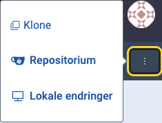
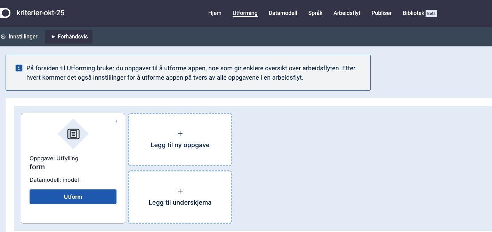

Designer er verktøyet du starer i etter å ha logget inn på https://altinn.studio.
Det er et verktøy for å utforme, sette opp og publisere apper.

## Åpne en app
Du ser alle de appene du har tilgang til, på på dashboardet.
Klikk på den appen du vil bruke for å åpne den.

Hvis du vil gå til repositoriet for appen mens du jobber i designeren, kan du gå til de tre prikkene øverst til høyre og velge __Repositorium__.

## Redigere en app

Bruk toppmenyen til å bygge og endre appen din. I toppmenyen velger du de områdene i appen du vil jobbe på.

- _Hjem_
  - Gir oversikt over hvilke apper du har tilgang til og hvilke miljøer de kjører i. Du har også direkte tilgang til de ulike funksjonene i designeren herfra.
- _Utforming_
  - Her velger du hvilke komponenter du vil ha med, for eksempel i et skjema du skal lage. Du setter blant annet opp rekkefølgen og kriteriene for hvordan feltene i skjemaet skal vises og oppføre seg for sluttbrukerne.
- _Datamodell_
  - Her kan du velge å bruke eksisterende datamodeller eller lage nye.
- _Språk_
  - Her kan du håndtere tekster i tjenesten din og oversette dem.
- _Arbeidsflyt_
  - Arbeidsflyt gir deg oversikt over prosessene du vil ha med i tjenesten din, for eksempel betaling og kvittering.
- _Publiser_
  - Bruk Publiser til å bygge versjoner av appen din og publisere den til et miljø. 
- _Bibliotek_
  - I biblioteket finner du både ressurser du har lagret for dine egne apper og ressurser som er delt i organisasjonen, for eksempel kodelister og bilder. 


