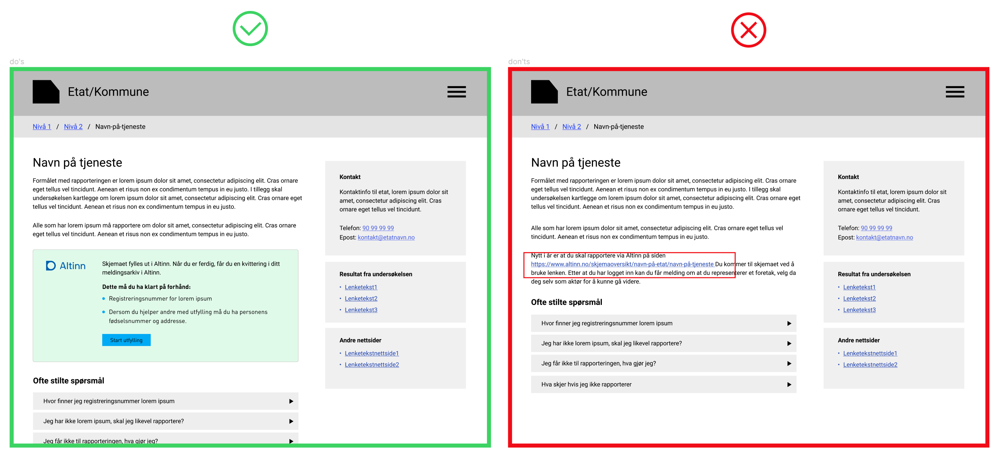

Brukertester har vist at når brukerne starter på etaten/kommunens sider for å fylle ut et skjema og så blir sendt 
videre til Altinn, får de ofte opplevelsen av at «plutselig var jeg i altinn». Innganger til skjema bør derfor 
presenteres slik at det er tydelig at man går til Altinn, men samtidig slipper å gå innom unødvendige mellomledd. 
"Start innsending" bør lenke direkte til skjemaet. Opplevelsen til bruker vil da også i større grad bli at man får 
løst oppgaven i konteksten man er i, men at Altinn er brukt som løsning for innsending og historikk. 

{}
**Integrerte komponenter** 

I tett samarbeid med sentrale tjenesteeiere planlegger vi på sikt å kunne tilby komponenter som kan benyttes på 
etatens nettsider, slik at brukerne kan løse oppgaven i den konteksten de er i. 

Altinns brukere ønsker både løsning der de er og en samlet oversikt. Og de bør få begge deler. Men behovene dekkes 
best på litt forskjellige måter.

{}
