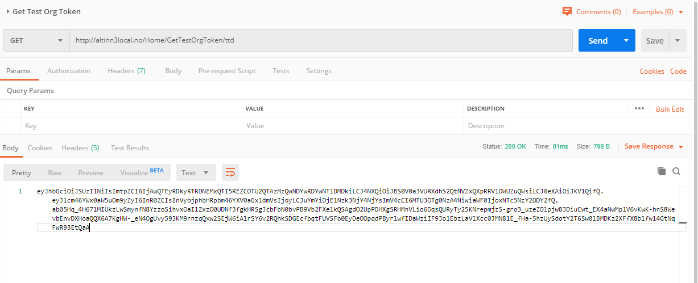
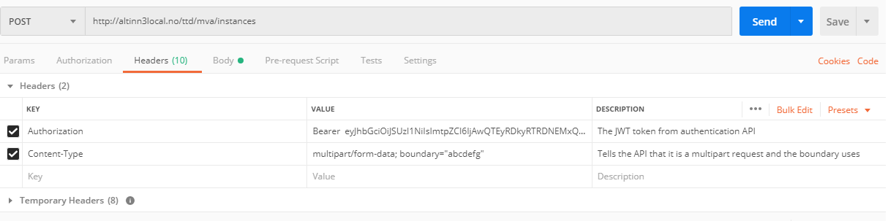

{}
**Må oppdateres:** Sjekk lenkene til local.altinn.cloud.
{}

Appen har en rekke API-er som applikasjonseier/tjenesteeier kan bruke.
Beskrivelsen du finner her er laget for [Postman](https://www.getpostman.com/) hvor vi har brukt testapplikasjonen [MVA testapp](https://dev.altinn.studio/repos/ttd/mva).

[Postman-eksempler for Altinn](https://github.com/Altinn/postman-examples).

## Autentisere en tjenesteeierorganisasjon

I testmiljø og produksjon bruker systemet Maskinporten for å autentisere organisasjoner som eier apper.

Testplattformen for lokal testing tilbyr et enkelt API for å autentisere organisasjonen som er ansvarlig.

Du trenger bare å oppgi tjenesteeierkode (som f.eks brg, skd osv).

[Hent testtoken for organisasjonen](http://local.altinn.cloud/Home/GetTestOrgToken/ttd) (erstatt `ttd` i URL-en med organisasjonen du vil autentisere).

Responsen er et JWT-token som skal brukes som en Authorization-header.



## Multipart-instansiering

Applikasjonene støtter at du oppretter instanser for aktører (personer eller organisasjoner).

[Opprett en instans](http://local.altinn.cloud/ttd/mva/instances) (erstatt `ttd/mva` i URL-en med din org og app).

Metode: POST

**Headers:**

- Authorization: Bearer + jwttoken
- Content-Type: multipart/form-data; boundary="abcdefg"



**Eksempel body:**

```http {linenos=false,hl_lines=["1-3","11-13"]}
--abcdefg
Content-Type: application/json; charset=utf-8
Content-Disposition: form-data; name="instance"

{
    "instanceOwner": {
    	"organisationNumber" : "897069650"
    }
}

--abcdefg
Content-Type: application/xml
Content-Disposition: form-data; name="RF0002"

<?xml version="1.0"?>
<Skjema xmlns:xsi="http://www.w3.org/2001/XMLSchema-instance" xmlns:xsd="http://www.w3.org/2001/XMLSchema" skjemanummer="212" spesifikasjonsnummer="10420" blankettnummer="RF-0002" tittel="Alminnelig omsetningsoppgave" gruppeid="20">
	<GenerellInformasjon-grp-2581 gruppeid="2581">
		<Avgiftspliktig-grp-50 gruppeid="50">
			<RapporteringsenhetNavn-datadef-21771 orid="21771">DDG Fitness</RapporteringsenhetNavn-datadef-21771>
			<RapporteringsenhetAdresse-datadef-21773 orid="21773">Sofies Gate 1</RapporteringsenhetAdresse-datadef-21773>
			<RapporteringsenhetPostnummer-datadef-21774 orid="21774">0170</RapporteringsenhetPostnummer-datadef-21774>
            <RapporteringsenhetPoststed-datadef-21775 orid="21775">By</RapporteringsenhetPoststed-datadef-21775>
            <RapporteringsenhetOrganisasjonsnummer-datadef-21772 orid="21772">897069650</RapporteringsenhetOrganisasjonsnummer-datadef-21772>
        </Avgiftspliktig-grp-50>
    </GenerellInformasjon-grp-2581>
</Skjema>

--abcdefg--
```

### Eksempelrespons

Responsen nedenfor viser hvordan en instans ble opprettet for en gitt organisasjon.

```json {linenos=inline,hl_lines=[6,44]}
{
    "id": "500000/b4a42747-882f-47fa-bcd3-94029fdbc918",
    "instanceOwner": {
        "partyId": "500000",
        "personNumber": null,
        "organisationNumber": "897069650"
    },
    "appId": "ttd/mva",
    "org": "ttd",
    "selfLinks": {
        "apps": "https://local.altinn.cloud/ttd/mva/instances/500000/b4a42747-882f-47fa-bcd3-94029fdbc918",
        "platform": "https://localhost:5101/storage/api/v1/instances/500000/b4a42747-882f-47fa-bcd3-94029fdbc918"
    },
    "dueBefore": null,
    "visibleAfter": null,
    "title": {
        "nb": "RF-0002"
    },
    "process": {
        "started": "2020-01-24T06:37:48.6026647Z",
        "startEvent": "StartEvent_1",
        "currentTask": {
            "flow": 2,
            "started": "2020-01-24T06:37:48.6027116Z",
            "elementId": "Task_1",
            "name": "Utfylling",
            "altinnTaskType": "data",
            "ended": null,
            "validated": null
        },
        "ended": null,
        "endEvent": null
    },
    "status": null,
    "appOwner": {
        "labels": null,
        "messages": null,
        "canBeDeletedAfter": null
    },
    "data": [
        {
            "id": "54d868aa-5bc9-47fb-9525-67ba4c2e595c",
            "instanceGuid": "b4a42747-882f-47fa-bcd3-94029fdbc918",
            "dataType": "RF0002",
            "filename": null,
            "contentType": "application/xml",
            "blobStoragePath": "ttd/mva/b4a42747-882f-47fa-bcd3-94029fdbc918/data/54d868aa-5bc9-47fb-9525-67ba4c2e595c",
            "selfLinks": {
                "apps": "https://local.altinn.cloud/ttd/mva/instances/500000/b4a42747-882f-47fa-bcd3-94029fdbc918/data/54d868aa-5bc9-47fb-9525-67ba4c2e595c",
                "platform": "https://localhost:5101/storage/api/v1/instances/500000/b4a42747-882f-47fa-bcd3-94029fdbc918/data/54d868aa-5bc9-47fb-9525-67ba4c2e595c"
            },
            "size": 1009,
            "locked": false,
            "refs": [],
            "created": "2020-01-24T06:37:48.641997Z",
            "createdBy": null,
            "lastChanged": "2020-01-24T06:37:48.641997Z",
            "lastChangedBy": null
        }
    ],
    "created": "2020-01-24T06:37:48.6068671Z",
    "createdBy": null,
    "lastChanged": "2020-01-24T06:37:48.6068671Z",
    "lastChangedBy": null
}
```
