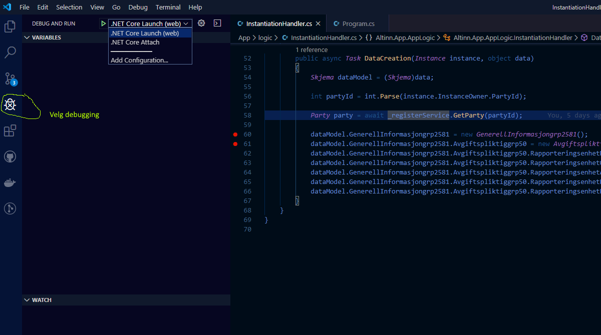
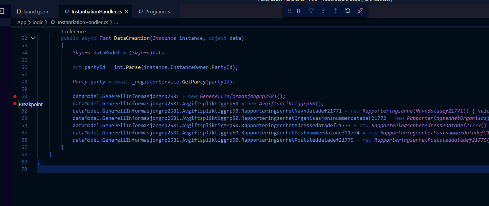

Følgende beskrivelse forutsetter at du har klonet appen fra Altinn Studio Repositories og har filene liggende på lokal harddisk.

## Feilsøke i Visual Studio Code

### Alternativ 1: Starte appen fra Visual Studio Code (.NET Core Launch)

Denne metoden er den enkleste. Her vil Visual Studio Code starte appen og koble seg til i én og samme prosess.

1. Åpne applikasjonsprosjektet i Visual Studio Code.
2. Velg **Åpne mappe** og gå til der repositoriet er lagret på maskinen din.
3. Velg Feilsøkingsikonet (Debugging-ikonet) til venstre i den vertikale menyen.

   

4. Velg **.NET Core Launch** fra nedtrekkslisten.
5. Klikk på den grønne **Play**-knappen.
6. Applikasjonen starter og spør om du vil starte en nettleser. Velg **Close**.

   

7. Åpne et nettleservindu og gå til http://local.altinn.cloud (forutsetter at du har startet lokal utviklingsplattform).

### Alternativ 2: Starte appen fra kommandovindu

Dette forutsetter at du allerede har startet appen.

1. Gå til mappen der appen ligger.
2. Kjør kommando for å starte dotnet-prosessen.

   

3. Åpne mappen med applikasjonsprosjektet i Visual Studio Code.
4. Koble deg til prosessen som heter **Altinn.App.exe**.

   

## Legge til breakpoints og analysere kode

1. Sett breakpoints i koden der du vil at feilsøkeren skal stoppe.

   

2. Der feilsøkeren stopper kan du analysere lokale verdier på objekter for å finne ut hvordan koden fungerer og eventuelt finne feil.

   

[Les mer om feilsøking i Visual Studio Code i dokumentasjonen](https://code.visualstudio.com/docs/editor/debugging).

## Endre frontend-versjon

Hvis du har et lokalt utviklingsmiljø for [frontend-appen](https://github.com/Altinn/app-frontend-react/), eller hvis du ønsker å teste med en spesifikk versjon av frontend, kan dette gjøres ved å endre den kjørende frontend-versjonen fra lenken på forsiden av local.altinn.cloud:

{}
**MERK:** Dette virker bare hvis du har beholdt standardstien for lasting av frontend-appens JavaScript-fil i `Index.cshtml`-filen i appen du jobber med. Hvis du har endret til å bruke en annen sti, vil dette overstyre eventuelle endringer du gjør via local.altinn.cloud.
{}
