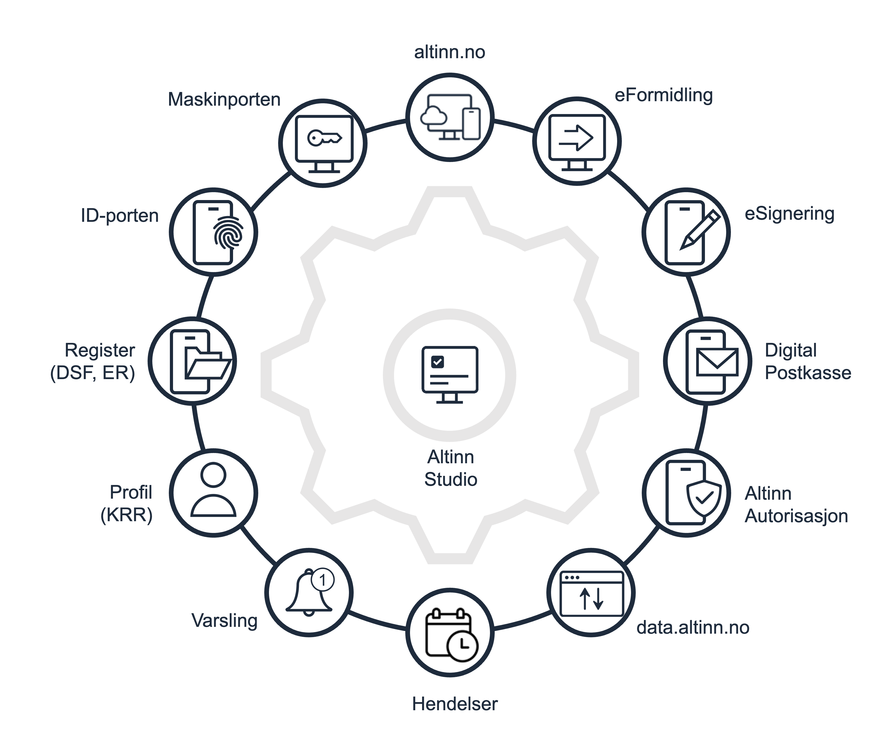
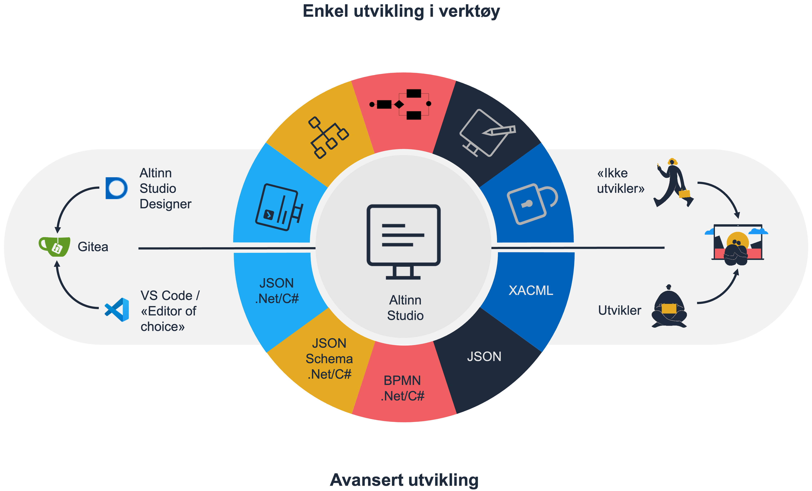

Plattformen kjører på en sikker, isolert og skalerbar infrastruktur, og er ferdig integrert mot en rekke fellesløsninger og åpne API-er.
Altinn Studio støtter både brukergrensesnitt for manuell innsending av data og API-er for maskin-til-maskin innsending.

## Hva kan jeg lage med Altinn Studio?
Med Altinn Studio kan du utvikle digitale tjenester som dekker et bredt spekter av bruksområder - fra enkle skjematjenester 
og innsynsløsninger til komplekse arbeidsflyter med betalings- og signeringsfunksjonalitet. Plattformen støtter alt fra 
tradisjonelle skjemaer til skreddersydde applikasjoner med avanserte integrasjoner.

Se [detaljert oversikt over bruksområder](./usecases) for en oversikt over mulighetene.

## Altinn Studio er "bindemiddelet"
Et skjema er sjelden bare datafelter som skal sendes inn, det trengs mer for å lage en god tjeneste – f.eks. kobling 
mot ID-porten, innsending til saksbehandlingssystem eller kobling mot nasjonale registre.

Altinn Studio har ferdig utviklet integrasjoner mot flere av Digdir sine fellestjenester og nasjonale registre, og vil 
fortsette å utvikle disse og legge til flere.

## Lavkode og tradisjonell kode
Altinn Studio er en hybrid mellom lavkode og tradisjonell koding. Det betyr at du kan starte med lavkode i Altinn Studio
Designer, og bytte over til dedikerte utviklingsverktøy som Visual Studio Code om du har avanserte behov som trenger
koding.

Vårt mål er å kunne gjøre mest mulig med lavkode, men beholde mulighet for tradisjonell koding og den fleksibiliteten 
det gir. Dette gjør at ikke-tekniske ressurser kan designe og publisere tjenester uten at man må hente inn utviklere.
Samtidig kan man hente inn en utvikler for å lage f.eks. mer avansert funksjonalitet som krever koding.

## Prinsipper som Altinn Studio bygger på
Her lister vi noen av prinsippene som ligger til grunn for vår utvikling av Altinn Studio.
- **Fri og åpen kildekode** fordi vi genuint tror at åpenhet og mulighet for andre til å bidra er veien å gå for utvikling av tjenester i offentlig sektor. 
- **Basert på åpne standarder** fordi lukket kode binder deg til leverandør og medfører ofte ekstra kostnader. 
- **Skybasert infrastruktur** hvor man tilstreber løse koblinger uten binding mot en spesifikk skyleverandør. 
- **Bygges på moderne og populære rammeverk/produkter** fordi det gjør det lettere både for oss og våre kunder å skaffe tekniske ressurser og fordi det er noe man ønsker å jobbe med/lære seg.
- **Innebygd sikkerhet** hvor hvert lag i arkitekturen autoriserer bruken uavhengig av hvor kallene kommer fra.
- **Isolasjon** – Tjenesteeiere får sine egne miljøer, for test og produksjon.

### Åpen kildekode og samarbeid
Altinn Studio er ikke perfekt, men det tar deg et langt stykke på vei for å lage gode digitale tjenester - og vi legger 
kontinuerlig til ny funksjonalitet.

I stedet for å lage noe eget eller kjøpe noe – hvorfor ikke bidra til åpen kildekode prosjektet der det ev. er mangler 
og på den måten gi noe tilbake til samfunnet?
Altinn Studio teamene håndterer kvalitetssikring og videre forvaltning av koden.

Det å skape et miljø rundt utviklingen av tjenester er viktig for oss, og vi har nå en et godt antall bidragsytere fra 
mange offentlige etater som bidrar til å løfte produktet videre sammen med oss.
Bidrag er alt fra retting av skrivefeil som tar sekunder å fikse til store komponenter som har tatt måneder.

En viktig del av det å skape et miljø er den utviklerkontakten vi har via Altinn Slack. Hver tjenesteeier har sin egen 
kanal hvor man kan stille spørsmål.
Vi ser også at tjenesteeiere hjelper hverandre og deler erfaring på tvers.
Backlog, brukerhistorier, planer og veikart – alt ligger åpen tilgjengelig på GitHub og gir mulighet for både innsikt 
og kommentarer.

#### Forvaltning

Studio-produktet består av flere komponenter. 
Her er viktige tjenester og biblioteker som eies og forvaltes av Studio-teamet:

* [Studio Designer](https://altinn.studio/)
  * Nye funksjoner og feilrettinger publiseres kontinuerlig
  * Utvikling og arbeid organiseres [i Altinn/altinn-studio GitHub-repo](https://github.com/Altinn/altinn-studio)
* App-biblioteker - [Altinn.App.Api, Altinn.App.Core](https://github.com/Altinn/app-lib-dotnet) og [frontend](https://github.com/Altinn/app-frontend-react)
  * Biblioteker hostet på NuGet.org. Alle Studio-apper refererer til disse bibliotekene
  * Versjonert ved bruk av [SemVer 2.0](https://semver.org/). Forhåndsversjoner består av `preview`- og `rc` (release candidate)-stadier. Når `rc`-stadiet er nådd, har vi som mål kun å gjøre feilrettinger og patching frem til stabilisering.
  * HTTP APIer beskrevet i appen via OpenAPI spesifikasjon følger egen versjonering. API endringer her skjer i takt med major versjonsendring i resten av appen (bibliotekene). Merk at det kan være APIer som _ikke_ er beskrevet i OpenAPI spesifikasjoner, disse er ment til internt bruk og vi kan gjøre endringer på disse uten noe kommunikasjon.
  * Utvikling og arbeid organiseres [i Altinn/app-lib-dotnet](https://github.com/Altinn/app-lib-dotnet) og [Altinn/app-frontend-react](https://github.com/Altinn/app-frontend-react) GitHub-repo.
* Localtest - [lokal kopi av kjerne-APIene i Altinn-plattformen](https://github.com/Altinn/app-localtest)
  * Nye funksjoner og feilrettinger publiseres kontinuerlig ved behov
  * Utvikling og arbeid organiseres [i Altinn/app-localtest GitHub-repo](https://github.com/Altinn/app-localtest)

Appene i seg selv eies og forvaltes av tjenesteeierorganisasjonene.
